# 🐙 Octopus Trading Platform

<div align="center">


**Advanced AI-Powered Trading Platform with Real-Time Analytics**

[](https://www.typescriptlang.org/)
[](https://nextjs.org/)
[](https://www.python.org/)
[](https://fastapi.tiangolo.com/)
[](https://www.postgresql.org/)

[Features](#-features) • [Demo](#-live-demo) • [Workflow](#-system-architecture--workflow) • [Installation](#-installation) • [Documentation](#-documentation) • [Contributing](#-contributing)

</div>

---

## 🎯 Overview

Octopus Trading Platform is a comprehensive, AI-powered trading system designed for professional traders and institutions. It combines real-time market data, advanced analytics, machine learning models, and automated trading capabilities in a unified, modern interface.

## 📊 System Architecture & Workflow

### Visual Architecture Overview


### System Architecture Flow

```mermaid
graph TB
    subgraph "👤 User Interface Layer"
        A[🌐 Next.js Frontend] --> B[📊 Dashboard]
        A --> C[💹 Trading Center]
        A --> D[📈 Analytics]
        A --> E[🤖 AI Models]
    end
    
    subgraph "🔒 API Gateway Layer"
        F[API Gateway<br/>Rate Limiting<br/>Authentication]
    end
    
    subgraph "⚡ Backend Services"
        G[FastAPI Backend]
        H[WebSocket Server]
        I[Celery Workers]
        J[ML/AI Services]
    end
    
    subgraph "🗄️ Data Layer"
        K[(PostgreSQL<br/>TimescaleDB)]
        L[(Redis Cache)]
        M[Message Queue]
    end
    
    subgraph "🌐 External Services"
        N[📈 Market Data APIs]
        O[🏦 Trading Brokers]
        P[☁️ Cloud Services]
    end
    
    B --> F
    C --> F
    D --> F
    E --> F
    
    F --> G
    F --> H
    
    G --> K
    G --> L
    G --> I
    G --> J
    
    H --> L
    I --> K
    I --> M
    
    G --> N
    G --> O
    J --> P
    
    style A fill:#3b82f6,stroke:#1e40af,color:#fff
    style F fill:#10b981,stroke:#059669,color:#fff
    style G fill:#8b5cf6,stroke:#6d28d9,color:#fff
    style K fill:#f59e0b,stroke:#d97706,color:#fff
    style J fill:#ec4899,stroke:#be185d,color:#fff
```



### Trading Workflow Sequence

```mermaid
sequenceDiagram
    participant U as 👤 User
    participant F as 🌐 Frontend
    participant A as 🔒 API Gateway
    participant B as ⚡ Backend
    participant M as 🧠 AI Engine
    participant D as 🗄️ Database
    participant E as 📈 Market Data
    participant T as 🏦 Trading Broker
    
    U->>F: Login & Access Dashboard
    F->>A: Authenticate Request
    A->>B: Forward Request
    B->>D: Fetch User Data
    D-->>B: User Profile
    B-->>F: Dashboard Data
    F-->>U: Display Portfolio
    
    U->>F: Create Trading Strategy
    F->>A: Submit Strategy
    A->>B: Process Strategy
    B->>M: Analyze with AI
    M->>E: Fetch Market Data
    E-->>M: Real-time Prices
    M-->>B: Strategy Recommendations
    B->>D: Save Strategy
    B-->>F: Strategy Created
    F-->>U: Confirmation
    
    U->>F: Execute Trade
    F->>A: Trade Request
    A->>B: Validate Trade
    B->>D: Check Balance
    B->>M: Risk Assessment
    M-->>B: Risk Score
    B->>T: Execute Order
    T-->>B: Order Confirmed
    B->>D: Update Portfolio
    B-->>F: Trade Executed
    F-->>U: Notification
```



### Data Processing Pipeline

```mermaid
flowchart LR
    A[📥 Market Data<br/>Ingestion] --> B[🔄 Data<br/>Normalization]
    B --> C[✅ Data<br/>Validation]
    C --> D[💾 Store in<br/>TimescaleDB]
    D --> E[⚡ Cache in<br/>Redis]
    E --> F[🧠 ML Model<br/>Processing]
    F --> G[📊 Generate<br/>Insights]
    G --> H[📡 WebSocket<br/>Broadcast]
    H --> I[🌐 Frontend<br/>Display]
    
    style A fill:#3b82f6,stroke:#1e40af,color:#fff
    style D fill:#f59e0b,stroke:#d97706,color:#fff
    style E fill:#ef4444,stroke:#dc2626,color:#fff
    style F fill:#ec4899,stroke:#be185d,color:#fff
    style H fill:#10b981,stroke:#059669,color:#fff
```



### Component Architecture

```mermaid
graph TB
    subgraph "Frontend Components"
        FC1[📊 Dashboard]
        FC2[💹 Trading Interface]
        FC3[📈 Charts & Analytics]
        FC4[🤖 AI Dashboard]
        FC5[⚙️ Settings]
    end
    
    subgraph "Backend Services"
        BS1[🔐 Auth Service]
        BS2[📊 Market Data Service]
        BS3[💼 Trading Service]
        BS4[🧠 AI/ML Service]
        BS5[📈 Analytics Service]
        BS6[🛡️ Risk Service]
    end
    
    subgraph "Data Infrastructure"
        DI1[(🗄️ PostgreSQL)]
        DI2[(⚡ Redis)]
        DI3[📊 TimescaleDB]
        DI4[🔄 Message Queue]
    end
    
    FC1 --> BS1
    FC1 --> BS2
    FC2 --> BS3
    FC3 --> BS5
    FC4 --> BS4
    FC5 --> BS1
    
    BS1 --> DI1
    BS2 --> DI2
    BS2 --> DI3
    BS3 --> DI1
    BS3 --> DI4
    BS4 --> DI1
    BS5 --> DI3
    BS6 --> DI1
    
    style FC1 fill:#3b82f6,stroke:#1e40af,color:#fff
    style BS3 fill:#8b5cf6,stroke:#6d28d9,color:#fff
    style BS4 fill:#ec4899,stroke:#be185d,color:#fff
    style DI1 fill:#f59e0b,stroke:#d97706,color:#fff
```



> 📖 **For more detailed workflow diagrams**, see [Complete Workflow Infographic Documentation](docs/workflow-infographic.md)

### Key Highlights

- 🤖 **AI-Powered**: Machine learning models for market prediction and strategy optimization
- 📊 **Real-Time Analytics**: Live market data, orderbook, and sentiment analysis
- 🎯 **Multi-Asset Trading**: Stocks, options, crypto, and derivatives
- 🔒 **Risk Management**: Advanced risk assessment and portfolio optimization
- 🚀 **Automated Trading**: Bot framework with backtesting and paper trading
- 📈 **Advanced Visualization**: Interactive charts and data visualization tools

---

## ✨ Features

### Core Trading Features

- **📊 Dashboard**: Comprehensive trading overview with portfolio analytics
- **💹 Real-Time Market Data**: Live price feeds, orderbook, and tick data
- **🎯 Options Trading**: Advanced options chain analysis and strategies
- **🤖 Trading Bots**: Automated trading with customizable rules and strategies
- **📈 Portfolio Management**: Multi-asset portfolio tracking and optimization
- **🔍 Market Analysis**: Technical, fundamental, and on-chain analysis tools

### AI & Machine Learning

- **🧠 AI Models**: Pre-trained models for price prediction and sentiment analysis
- **📊 ML Training**: Custom model training with your data
- **🎯 Strategy Optimization**: AI-powered strategy backtesting and optimization
- **💡 Insights Generation**: Automated market insights and recommendations

### Risk & Analytics

- **🛡️ Risk Assessment**: VaR, stress testing, and portfolio risk analysis
- **📈 Backtesting**: Historical strategy performance testing
- **📊 Reports**: Comprehensive trading reports and analytics
- **🔍 Data Explorer**: Advanced data querying and exploration tools

### Developer Tools

- **🔌 API Playground**: Interactive API testing and documentation
- **📡 WebSocket Support**: Real-time data streaming
- **🔐 Security**: API key management and session control
- **📝 Audit Logs**: Comprehensive activity logging

---

## 🚀 Live Demo

<div align="center">

### 🎬 Interactive Product Demo

[](http://localhost:3002)
[](http://localhost:8000/docs)
[](docs/demo-showcase.md)

</div>

### 🎯 Quick Demo Overview

```mermaid
graph LR
    A[👤 User] -->|Access| B[🌐 Frontend<br/>localhost:3002]
    B -->|API Calls| C[⚡ Backend<br/>localhost:8000]
    C -->|WebSocket| D[📡 Real-time Data]
    C -->|Query| E[🗄️ Database]
    C -->|Process| F[🧠 AI Models]
    
    style B fill:#3b82f6,stroke:#1e40af,color:#fff
    style C fill:#8b5cf6,stroke:#6d28d9,color:#fff
    style D fill:#10b981,stroke:#059669,color:#fff
    style F fill:#ec4899,stroke:#be185d,color:#fff
```



### 🚀 Start the Demo

```bash
# Terminal 1: Start Backend
cd Modules
uvicorn src.main_refactored:app --reload

# Terminal 2: Start Frontend  
cd Modules/frontend-nextjs
npm run dev

# Access:
# Frontend: http://localhost:3002
# API Docs: http://localhost:8000/docs
# WebSocket: ws://localhost:8000/ws
```

### 📊 Demo Features Showcase

> 💡 **Full Demo Guide**: See [Interactive Demo Showcase](docs/demo-showcase.md) for detailed examples and code snippets

#### 1. **Dashboard** (`/`)
- Real-time portfolio overview
- Market watchlists
- Quick actions and shortcuts
- Performance metrics and charts

#### 2. **Real-Time Market Data** (`/realtime`)
- Live price feeds
- Orderbook visualization
- Streaming sentiment analysis
- AI-powered predictions

#### 3. **Trading Center** (`/trades`)
- Order entry and management
- Open orders tracking
- Trade history
- Position management

#### 4. **Portfolio Analytics** (`/portfolio`)
- Multi-asset portfolio tracking
- Performance analytics
- Allocation charts
- Portfolio optimizer

#### 5. **Trading Bots** (`/trading-bots`)
- Bot creation and management
- Strategy rules configuration
- Performance monitoring
- Automated execution

#### 6. **AI Models** (`/ai-models`)
- Model marketplace
- Custom model training
- Prediction insights
- Model performance metrics

#### 7. **Risk Management** (`/risk`)
- Portfolio risk analysis
- VaR calculations
- Stress testing scenarios
- Risk metrics dashboard

#### 8. **Backtesting** (`/backtesting`)
- Strategy backtesting
- Historical performance analysis
- Parameter optimization
- Results visualization

---

## 📸 Screenshots

### Dashboard


### Trading Interface


### Portfolio Analytics


### AI Models


---

## 🛠️ Installation

### Prerequisites

- Node.js 18+ and npm
- Python 3.10+
- PostgreSQL 14+
- Redis (optional, for caching)

### Quick Start

1. **Clone the repository**
   ```bash
   git clone https://github.com/yourusername/octopus-trading-platform.git
   cd octopus-trading-platform
   ```

2. **Backend Setup**
   ```bash
   cd Modules
   python -m venv venv
   source venv/bin/activate  # On Windows: venv\Scripts\activate
   pip install -r requirements.txt
   ```

3. **Frontend Setup**
   ```bash
   cd frontend-nextjs
   npm install
   ```

4. **Environment Configuration**
   ```bash
   # Copy example env files
   cp .env.example .env
   # Edit .env with your configuration
   ```

5. **Database Setup**
   ```bash
   # Run migrations
   cd Modules
   alembic upgrade head
   ```

6. **Start the Application**
   ```bash
   # Terminal 1: Start backend
   cd Modules
   uvicorn src.main_refactored:app --reload

   # Terminal 2: Start frontend
   cd Modules/frontend-nextjs
   npm run dev
   ```

7. **Access the Platform**
   - Frontend: http://localhost:3002
   - Backend API: http://localhost:8000
   - API Docs: http://localhost:8000/docs

---

## 📚 Documentation

### API Documentation

- **Swagger UI**: `http://localhost:8000/docs`
- **ReDoc**: `http://localhost:8000/redoc`

### Key Endpoints

- `/api/market-data` - Market data endpoints
- `/api/trades` - Trading operations
- `/api/portfolio` - Portfolio management
- `/api/risk` - Risk analysis
- `/api/ai-models` - AI model endpoints
- `/api/websocket` - WebSocket connections

### Architecture

```
Octopus Trading Platform
├── Frontend (Next.js 15)
│   ├── Dashboard & Analytics
│   ├── Trading Interface
│   ├── Portfolio Management
│   └── AI/ML Integration
│
├── Backend (FastAPI)
│   ├── Market Data Service
│   ├── Trading Engine
│   ├── Risk Management
│   ├── AI/ML Services
│   └── WebSocket Server
│
└── Database (PostgreSQL)
    ├── Market Data
    ├── User Data
    ├── Trading History
    └── ML Models
```

---

## 🎨 Tech Stack

### Frontend
- **Framework**: Next.js 15 (App Router)
- **Language**: TypeScript
- **Styling**: Tailwind CSS
- **UI Components**: Shadcn UI, Radix UI
- **Charts**: Recharts, TradingView Charts
- **State Management**: React Query, Zustand

### Backend
- **Framework**: FastAPI
- **Language**: Python 3.10+
- **Database**: PostgreSQL (TimescaleDB)
- **Caching**: Redis
- **ML/AI**: PyTorch, TensorFlow, scikit-learn
- **WebSockets**: FastAPI WebSockets

### Infrastructure
- **Containerization**: Docker
- **Deployment**: Vercel (Frontend), Railway/Heroku (Backend)
- **Monitoring**: Prometheus, Grafana
- **Logging**: Structured logging with Python logging

---

## 🔐 Security

- 🔒 API key authentication
- 🛡️ Session management
- 🔐 Two-factor authentication support
- 📝 Comprehensive audit logging
- 🚫 IP whitelisting
- 🔒 Encrypted data storage

---

## 🤝 Contributing

We welcome contributions! Please see our [Contributing Guidelines](CONTRIBUTING.md) for details.

1. Fork the repository
2. Create your feature branch (`git checkout -b feature/AmazingFeature`)
3. Commit your changes (`git commit -m 'Add some AmazingFeature'`)
4. Push to the branch (`git push origin feature/AmazingFeature`)
5. Open a Pull Request

---

## 📄 License

This project is licensed under the MIT License - see the [LICENSE](LICENSE) file for details.

---

## 🙏 Acknowledgments

- Built with [Next.js](https://nextjs.org/)
- Powered by [FastAPI](https://fastapi.tiangolo.com/)
- UI components from [Shadcn UI](https://ui.shadcn.com/)
- Charts by [TradingView](https://www.tradingview.com/)

---

## 📞 Support

- 📧 Email: support@octopus-trading.com
- 💬 Discord: [Join our community](https://discord.gg/octopus-trading)
- 📖 Documentation: [docs.octopus-trading.com](https://docs.octopus-trading.com)
- 🐛 Issues: [GitHub Issues](https://github.com/yourusername/octopus-trading-platform/issues)

---

<div align="center">

**Made with ❤️ by the Octopus Trading Team**

[⭐ Star us on GitHub](https://github.com/yourusername/octopus-trading-platform) • [📖 Read the Docs](https://docs.octopus-trading.com) • [🐛 Report Bug](https://github.com/yourusername/octopus-trading-platform/issues)

</div>
