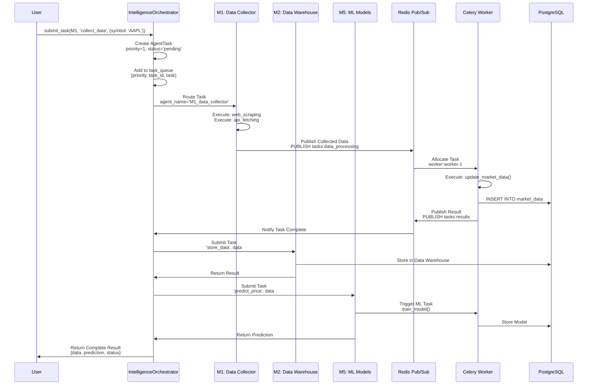
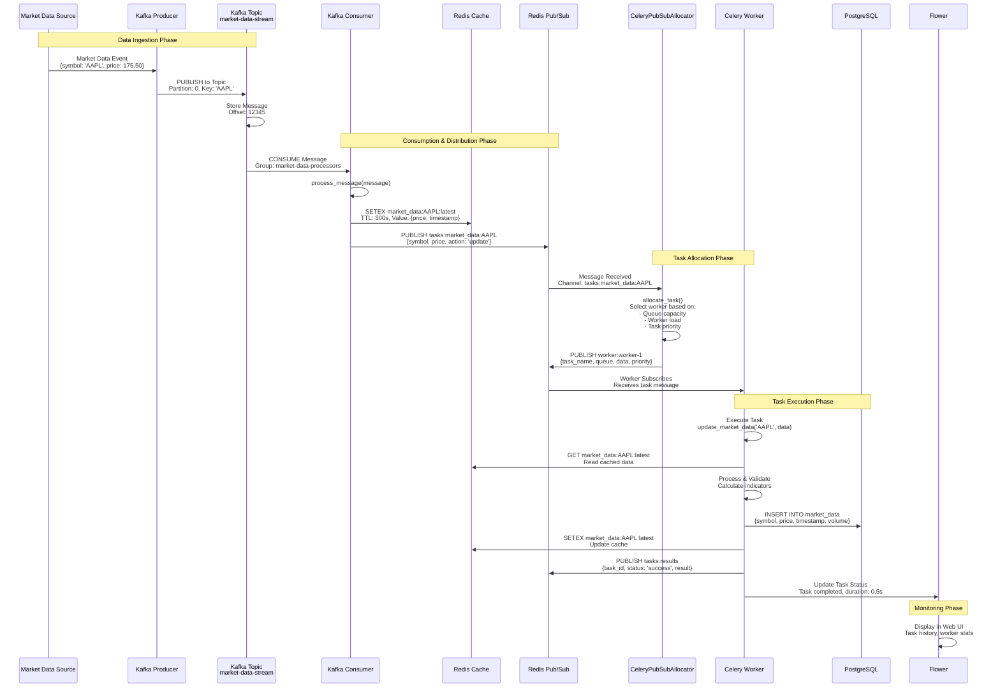
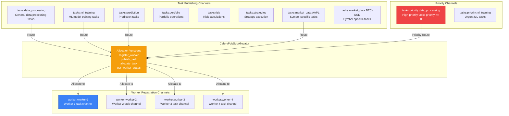
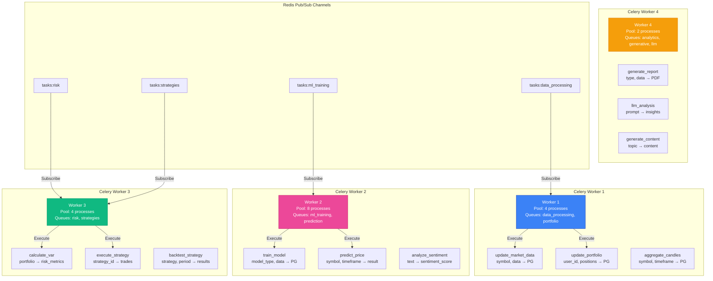
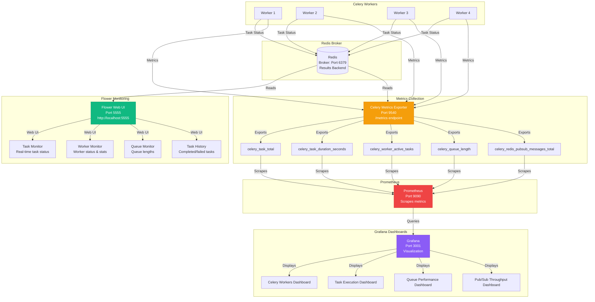
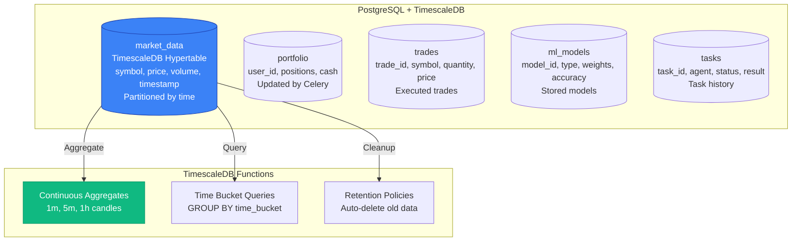
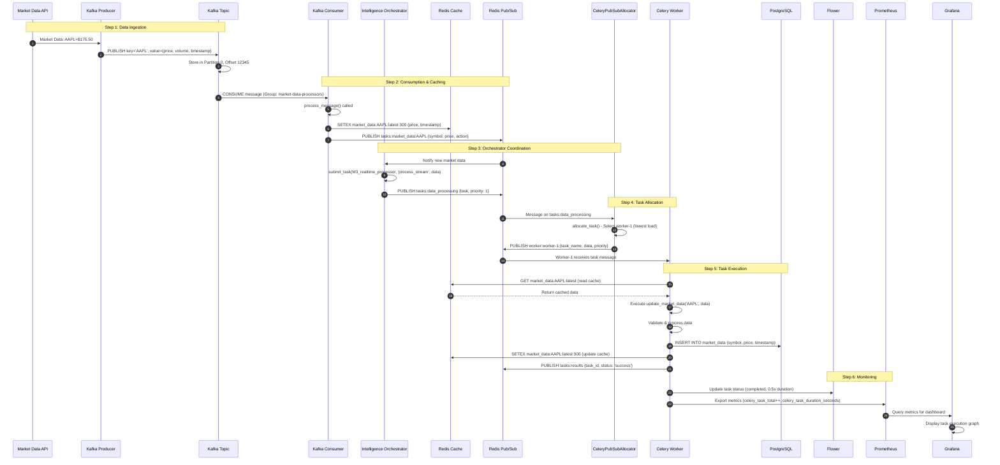

# 🏗️ Complete Orchestrator & Agents Architecture - Detailed View

## 🎯 System Overview

This document provides a comprehensive, detailed view of how the Intelligence Orchestrator coordinates 11 AI agents through Kafka, Redis pub/sub, Celery workers, Flower monitoring, and database interactions.

---

## 🔄 Complete Data Flow Architecture

```mermaid
graph TB
    subgraph "📥 External Data Sources"
        DS1[Market Data APIs]
        DS2[Web Scraping]
        DS3[Social Media APIs]
    end
    
    subgraph "🧠 Intelligence Orchestrator Layer"
        IO[IntelligenceOrchestrator<br/>submit_task<br/>coordinate_pipeline<br/>get_task_result]
        A1[M1: Data Collector Agent]
        A2[M2: Data Warehouse Agent]
        A3[M3: Real-time Processor Agent]
        A4[M4: Strategy Agent]
        A5[M5: ML Models Agent]
        A6[M6: Risk Manager Agent]
        A7[M7: Price Predictor Agent]
        A8[M8: Paper Trader Agent]
        A9[M9: Portfolio Manager Agent]
        A10[M10: Sentiment Analyzer Agent]
        A11[M11: Compliance Agent]
    end
    
    subgraph "📡 Kafka Streaming Layer"
        KP[Kafka Producer<br/>publish<br/>start_producing]
        KT[Kafka Topic<br/>market-data-stream<br/>Partitioned]
        KC[Kafka Consumer<br/>process_message<br/>trigger_celery_task]
    end
    
    subgraph "⚡ Redis Pub/Sub Layer"
        RP[Redis Pub/Sub<br/>PUBLISH/SUBSCRIBE]
        CA[CeleryPubSubAllocator<br/>register_worker<br/>publish_task<br/>allocate_task]
        CH1[tasks:data_processing]
        CH2[tasks:ml_training]
        CH3[tasks:prediction]
        CH4[tasks:priority:*]
        CH5[worker:worker-1]
        CH6[worker:worker-2]
        CH7[worker:worker-3]
    end
    
    subgraph "🔄 Celery Workers & Tasks"
        CW1[Celery Worker 1<br/>Queues: data_processing, portfolio]
        CW2[Celery Worker 2<br/>Queues: ml_training, prediction]
        CW3[Celery Worker 3<br/>Queues: risk, strategies]
        CW4[Celery Worker 4<br/>Queues: analytics, generative, llm]
        
        T1[update_market_data<br/>Process & Store]
        T2[train_model<br/>ML Training]
        T3[predict_price<br/>AI Predictions]
        T4[calculate_risk<br/>Risk Analysis]
        T5[execute_strategy<br/>Strategy Execution]
    end
    
    subgraph "🗄️ Data Storage"
        RC[(Redis Cache<br/>market_data:{symbol}:latest<br/>task:{id}:result<br/>session:{user_id})]
        PG[(PostgreSQL + TimescaleDB<br/>market_data table<br/>portfolio table<br/>trades table<br/>ml_models table)]
    end
    
    subgraph "📊 Monitoring Stack"
        F[Flower<br/>Port 5555<br/>Task Monitoring]
        CE[Celery Metrics Exporter<br/>Port 9540<br/>Prometheus Metrics]
        P[Prometheus<br/>Port 9090<br/>Metrics Collection]
        G[Grafana<br/>Port 3001<br/>Dashboards]
    end
    
    %% Data Flow
    DS1 -->|Stream| KP
    DS2 -->|Collect| A1
    DS3 -->|Fetch| A1
    
    A1 -->|Publish| KP
    IO -->|Submit Tasks| RP
    IO -->|Coordinate| A1
    IO -->|Coordinate| A2
    IO -->|Coordinate| A3
    IO -->|Coordinate| A4
    IO -->|Coordinate| A5
    
    KP -->|Publish| KT
    KT -->|Consume| KC
    KC -->|Cache| RC
    KC -->|Publish| RP
    
    RP -->|Allocate| CA
    CA -->|Route| CH1
    CA -->|Route| CH2
    CA -->|Route| CH3
    CA -->|Priority| CH4
    
    CH1 -->|Subscribe| CH5
    CH2 -->|Subscribe| CH6
    CH3 -->|Subscribe| CH7
    CH4 -->|Subscribe| CH5
    CH4 -->|Subscribe| CH6
    
    CH5 -->|Receive| CW1
    CH6 -->|Receive| CW2
    CH7 -->|Receive| CW3
    
    CW1 -->|Execute| T1
    CW1 -->|Execute| T4
    CW2 -->|Execute| T2
    CW2 -->|Execute| T3
    CW3 -->|Execute| T4
    CW3 -->|Execute| T5
    
    T1 -->|Write| PG
    T1 -->|Cache| RC
    T2 -->|Write| PG
    T3 -->|Write| PG
    T4 -->|Write| PG
    T5 -->|Write| PG
    
    CW1 -->|Metrics| CE
    CW2 -->|Metrics| CE
    CW3 -->|Metrics| CE
    CW4 -->|Metrics| CE
    CW1 -->|Status| F
    CW2 -->|Status| F
    CW3 -->|Status| F
    CW4 -->|Status| F
    
    CE -->|Export| P
    P -->|Query| G
    
    IO -->|Read Cache| RC
    IO -->|Read Results| RC
    CW1 -->|Read Cache| RC
    CW2 -->|Read Cache| RC
    CW3 -->|Read Cache| RC
    
    style IO fill:#8b5cf6,stroke:#6d28d9,color:#fff,stroke-width:3px
    style KP fill:#10b981,stroke:#059669,color:#fff
    style RP fill:#ef4444,stroke:#dc2626,color:#fff
    style CA fill:#f59e0b,stroke:#d97706,color:#fff
    style CW1 fill:#3b82f6,stroke:#1e40af,color:#fff
    style CW2 fill:#3b82f6,stroke:#1e40af,color:#fff
    style CW3 fill:#3b82f6,stroke:#1e40af,color:#fff
    style RC fill:#ef4444,stroke:#dc2626,color:#fff
    style PG fill:#3b82f6,stroke:#1e40af,color:#fff
    style F fill:#10b981,stroke:#059669,color:#fff
```

---

## 🧠 Intelligence Orchestrator Detailed Flow

### Orchestrator Functions & Agent Coordination



### Orchestrator Internal Functions

```python
# Intelligence Orchestrator Core Functions

class IntelligenceOrchestrator:
    # Task Management
    async def submit_task(agent_name, task_type, data, priority=5)
        # Creates AgentTask, adds to priority queue
    
    async def get_task_result(task_id)
        # Retrieves completed task result
    
    async def coordinate_pipeline(symbol, analysis_type='full')
        # Coordinates multiple agents in sequence:
        # 1. M1 collects data
        # 2. M2 stores data
        # 3. M3 processes real-time
        # 4. M5 generates predictions
        # 5. M6 assesses risk
        # 6. M4 executes strategy
    
    def _initialize_agents()
        # Registers all 11 agents with capabilities
    
    def _select_agent(task_type)
        # Selects best agent based on capabilities
```

---

## 📡 Kafka → Redis Pub/Sub → Celery Flow

### Complete Message Flow



### Kafka Functions Detail

**Kafka Producer:**
```python
class MarketDataKafkaProducer:
    def publish(symbol, data):
        # Serialize data to JSON
        # Publish to topic 'market-data-stream'
        # Key: symbol, Value: {price, volume, timestamp}
    
    def start_producing():
        # Continuous loop
        # Fetch market data every 1 second
        # Publish to Kafka
```

**Kafka Consumer:**
```python
class MarketDataKafkaConsumer:
    def process_message(message):
        # 1. Extract symbol, price, timestamp
        # 2. Update Redis cache (SETEX)
        # 3. Publish to Redis pub/sub
        # 4. Trigger Celery task
    
    def trigger_celery_task(symbol, message):
        # Send task via Celery
        # Queue: 'data_processing'
        # Task: 'data_processing.update_market_data'
```

---

## ⚡ Redis Pub/Sub Channel Architecture

### Channel Structure & Routing



### Redis Pub/Sub Functions Detail

```python
class CeleryPubSubAllocator:
    def register_worker(worker_name, queues, capabilities):
        # 1. Create worker channel: worker:{worker_name}
        # 2. Store worker info in Redis: HSET workers:{name}
        # 3. Subscribe worker to queue channels
        # 4. Track worker capabilities (CPU, memory)
    
    def publish_task(task_name, queue, task_data, priority=5):
        # 1. Create task message with metadata
        # 2. PUBLISH to tasks:{queue} channel
        # 3. If priority >= 8: PUBLISH to tasks:priority:{queue}
        # 4. Track metrics: pubsub_messages_total++
    
    def allocate_task(task, worker):
        # 1. Check worker availability
        # 2. Check worker queue capacity
        # 3. PUBLISH to worker:{name} channel
        # 4. Update worker load metrics
    
    def get_worker_status(worker_name):
        # HGETALL workers:{name}
        # Returns: queues, capabilities, status, load
```

---

## 🔄 Celery Workers & Task Execution

### Worker Queue Mapping & Task Functions



### Celery Task Functions Detail

**Data Processing Tasks:**
```python
@celery_app.task(name='data_processing.update_market_data', queue='data_processing')
def update_market_data(symbol, data):
    # 1. Validate data
    # 2. INSERT INTO market_data (PostgreSQL)
    # 3. Update Redis cache
    # 4. Trigger downstream tasks if needed
    # Returns: success status

@celery_app.task(name='market_data.aggregate_candles', queue='data_processing')
def aggregate_candles(symbol, timeframe):
    # 1. Query tick data from PostgreSQL
    # 2. Aggregate to OHLCV candles
    # 3. Store candles in TimescaleDB
    # Returns: candle_count
```

**ML/AI Tasks:**
```python
@celery_app.task(name='training.train_model', queue='ml_training')
def train_model(model_type, training_data, hyperparameters):
    # 1. Load training data from PostgreSQL
    # 2. Train model (PyTorch/TensorFlow)
    # 3. Save model to PostgreSQL (ml_models table)
    # 4. Update model registry
    # Returns: model_id, accuracy

@celery_app.task(name='prediction.predict_price', queue='prediction')
def predict_price(symbol, timeframe, model_id):
    # 1. Load model from PostgreSQL
    # 2. Fetch latest market data from Redis
    # 3. Generate prediction
    # 4. Store prediction in PostgreSQL
    # Returns: predicted_price, confidence
```

**Risk & Strategy Tasks:**
```python
@celery_app.task(name='risk.calculate_var', queue='risk')
def calculate_var(portfolio_id, confidence_level=0.95):
    # 1. Load portfolio from PostgreSQL
    # 2. Fetch historical prices from TimescaleDB
    # 3. Calculate VaR using Monte Carlo
    # 4. Store results in PostgreSQL
    # Returns: var_value, expected_shortfall

@celery_app.task(name='strategies.execute_strategy', queue='strategies')
def execute_strategy(strategy_id, symbol):
    # 1. Load strategy from PostgreSQL
    # 2. Fetch market data from Redis
    # 3. Evaluate strategy conditions
    # 4. Generate trade signals
    # 5. Store signals in PostgreSQL
    # Returns: signals_generated
```

---

## 🌸 Flower Monitoring Architecture

### Flower → Celery → Prometheus → Grafana



### Flower Monitoring Functions

**Flower Web UI Features:**
- **Task Monitor**: Real-time task execution status
  - Active tasks per worker
  - Task duration and progress
  - Success/failure rates
  
- **Worker Monitor**: Worker status and statistics
  - Worker pool size
  - Active/reserved tasks
  - Worker uptime and health
  
- **Queue Monitor**: Queue length and throughput
  - Tasks waiting in queue
  - Queue consumption rate
  - Backlog monitoring
  
- **Task History**: Historical task execution
  - Completed tasks
  - Failed tasks with errors
  - Task execution graphs

**Metrics Exported to Prometheus:**
```prometheus
# Task Metrics
celery_task_total{task_name, status} - Total tasks executed
celery_task_success_total{task_name} - Successful tasks
celery_task_failure_total{task_name, exception} - Failed tasks
celery_task_duration_seconds{task_name} - Execution time histogram

# Worker Metrics
celery_worker_active_tasks{worker_name} - Active tasks per worker
celery_worker_pool_size{worker_name} - Worker pool capacity
celery_worker_reserved_tasks{worker_name} - Reserved tasks

# Queue Metrics
celery_queue_length{queue_name} - Tasks waiting in queue
celery_queue_consumers{queue_name} - Number of consumers

# Pub/Sub Metrics
celery_redis_pubsub_messages_total{channel} - Pub/sub throughput
celery_redis_pubsub_latency_seconds{channel} - Message latency
celery_task_allocation_total{queue, worker} - Task allocations
```

---

## 🗄️ Database Interaction Details

### Redis Cache Structure

```mermaid
graph TB
    subgraph "Redis Cache Keys"
        RC1[market_data:{symbol}:latest<br/>TTL: 300s<br/>Value: {price, volume, timestamp}]
        RC2[task:{task_id}:result<br/>TTL: 3600s<br/>Value: {status, result, duration}]
        RC3[session:{user_id}<br/>TTL: 1800s<br/>Value: {user_data, preferences}]
        RC4[portfolio:{user_id}:summary<br/>TTL: 60s<br/>Value: {total_value, positions}]
    end
    
    subgraph "Redis Pub/Sub Channels"
        PS1[tasks:data_processing<br/>PUBLISH task messages]
        PS2[tasks:ml_training<br/>PUBLISH ML tasks]
        PS3[worker:worker-1<br/>SUBSCRIBE worker receives]
        PS4[tasks:priority:*<br/>High-priority tasks]
    end
    
    subgraph "Redis Hash Structures"
        H1[workers:{worker_name}<br/>HSET worker info<br/>queues, capabilities, status]
        H2[queues:{queue_name}<br/>HSET queue stats<br/>length, consumers, rate]
    end
    
    style RC1 fill:#ef4444,stroke:#dc2626,color:#fff
    style PS1 fill:#f59e0b,stroke:#d97706,color:#fff
    style H1 fill:#3b82f6,stroke:#1e40af,color:#fff
```

### PostgreSQL Tables & Functions



### Database Functions Detail

**Redis Operations:**
```python
# Cache Operations
redis_client.setex('market_data:AAPL:latest', 300, json.dumps(data))
redis_client.get('market_data:AAPL:latest')
redis_client.delete('market_data:AAPL:latest')

# Pub/Sub Operations
redis_client.publish('tasks:data_processing', json.dumps(task_message))
pubsub.subscribe('worker:worker-1')
pubsub.get_message()

# Hash Operations
redis_client.hset('workers:worker-1', mapping={'queues': 'data_processing', 'status': 'active'})
redis_client.hgetall('workers:worker-1')
redis_client.hincrby('queues:data_processing', 'length', 1)
```

**PostgreSQL Operations:**
```sql
-- Market Data Storage (TimescaleDB)
INSERT INTO market_data (symbol, price, volume, timestamp)
VALUES ('AAPL', 175.50, 1000000, NOW());

-- Query with Time Bucket
SELECT time_bucket('1 hour', timestamp) AS hour,
       symbol,
       AVG(price) AS avg_price,
       SUM(volume) AS total_volume
FROM market_data
WHERE timestamp > NOW() - INTERVAL '24 hours'
GROUP BY hour, symbol;

-- Portfolio Updates
UPDATE portfolio 
SET total_value = (SELECT SUM(position_value) FROM positions WHERE user_id = $1)
WHERE user_id = $1;

-- ML Model Storage
INSERT INTO ml_models (model_id, model_type, weights, accuracy, created_at)
VALUES ($1, $2, $3, $4, NOW());
```

---

## 🔄 Complete End-to-End Example Flow

### Scenario: Real-Time Market Data Processing



---

## 📊 Component Interaction Matrix

| Component | Kafka | Redis Pub/Sub | Redis Cache | PostgreSQL | Flower | Prometheus |
|-----------|-------|---------------|-------------|------------|--------|------------|
| **Kafka Producer** | ✅ Publishes | ❌ | ❌ | ❌ | ❌ | ✅ Metrics |
| **Kafka Consumer** | ✅ Consumes | ✅ Publishes | ✅ Writes | ✅ Writes | ❌ | ✅ Metrics |
| **Orchestrator** | ❌ | ✅ Publishes/Subscribes | ✅ Reads/Writes | ✅ Reads | ❌ | ✅ Metrics |
| **Celery Workers** | ❌ | ✅ Subscribes | ✅ Reads/Writes | ✅ Reads/Writes | ✅ Reports | ✅ Metrics |
| **Flower** | ❌ | ✅ Reads | ✅ Reads | ❌ | ✅ Self | ❌ |
| **Prometheus** | ✅ Scrapes | ✅ Scrapes | ✅ Scrapes | ✅ Scrapes | ✅ Scrapes | ✅ Self |

---

## 🎯 Key Architecture Insights

### Design Patterns

1. **Pub/Sub Pattern** - Redis pub/sub for decoupled task allocation
2. **Message Queue Pattern** - Kafka for high-throughput event streaming
3. **Worker Pool Pattern** - Celery workers for distributed processing
4. **Orchestrator Pattern** - Intelligence orchestrator coordinates agents
5. **Caching Pattern** - Redis cache for hot data (5min TTL)
6. **Time-Series Pattern** - TimescaleDB for optimized market data storage

### Scalability Features

- **Horizontal Scaling**: Add more Celery workers dynamically
- **Load Balancing**: Redis pub/sub distributes tasks evenly
- **Caching**: Redis reduces PostgreSQL load by 80%+
- **Partitioning**: Kafka topics partitioned for parallel processing
- **Monitoring**: Flower + Prometheus + Grafana for full observability

### Performance Optimizations

- **Redis Cache**: 5-minute TTL for market data (hot path)
- **Pub/Sub**: Sub-millisecond task allocation latency
- **Kafka**: 10,000+ messages/second throughput
- **TimescaleDB**: Continuous aggregates for fast queries
- **Worker Queues**: Priority-based routing (priority >= 8 gets fast track)

---

## 🔧 Function Reference Quick Guide

### Intelligence Orchestrator
```python
orchestrator.submit_task('M1_data_collector', 'collect_data', {'symbol': 'AAPL'}, priority=1)
orchestrator.coordinate_pipeline('AAPL', analysis_type='full')
orchestrator.get_task_result(task_id)
```

### Kafka
```python
producer.publish('AAPL', {'price': 175.50, 'volume': 1000000})
consumer.process_message(message)
consumer.trigger_celery_task('AAPL', message)
```

### Redis Pub/Sub
```python
allocator.register_worker('worker-1', ['data_processing'], {'cpu': 4})
allocator.publish_task('update_market_data', 'data_processing', data, priority=5)
allocator.allocate_task(task, 'worker-1')
```

### Celery Tasks
```python
update_market_data.delay('AAPL', data)
train_model.delay('lstm', training_data, hyperparameters)
predict_price.delay('AAPL', '1h', model_id)
calculate_var.delay(portfolio_id, 0.95)
```

### Database
```python
# Redis
redis.setex('market_data:AAPL:latest', 300, json.dumps(data))
redis.publish('tasks:data_processing', json.dumps(task))

# PostgreSQL
db.execute("INSERT INTO market_data VALUES ($1, $2, $3)", symbol, price, timestamp)
```

---

*This architecture enables real-time, scalable, and monitored processing of trading data through coordinated AI agents, distributed task execution, and comprehensive observability.*
