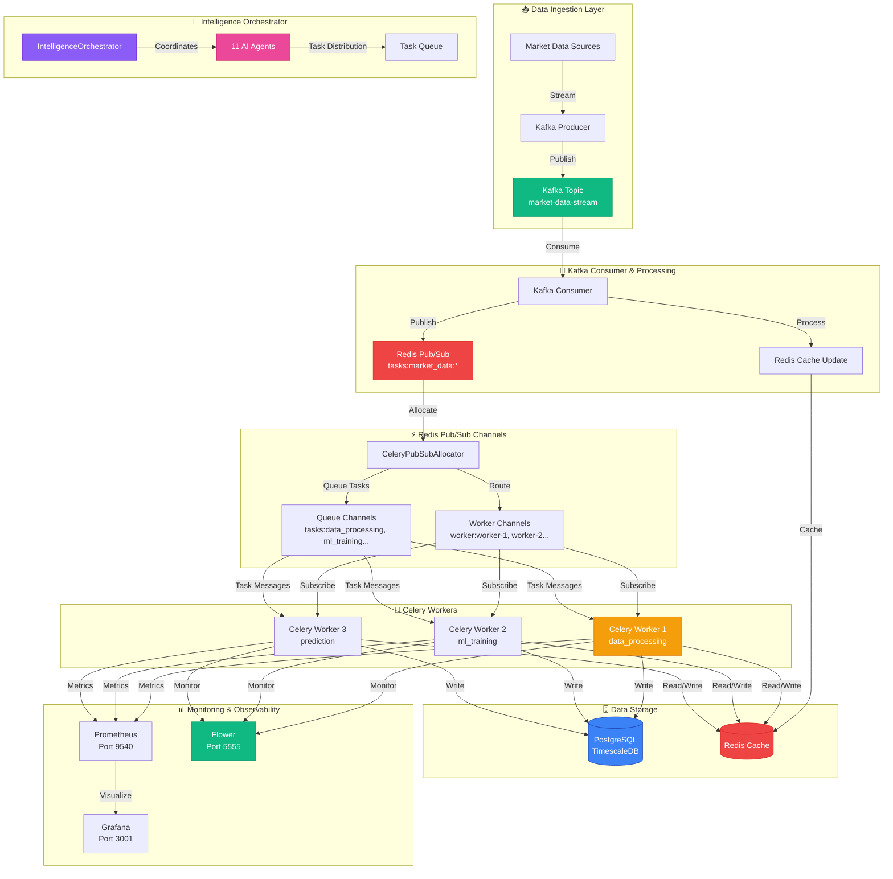
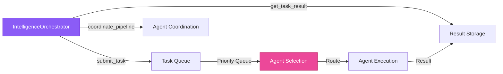
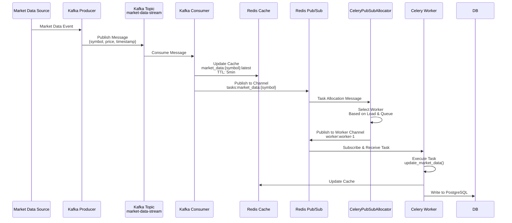
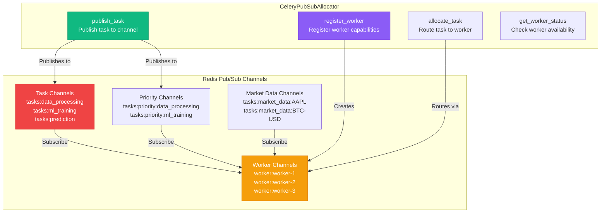
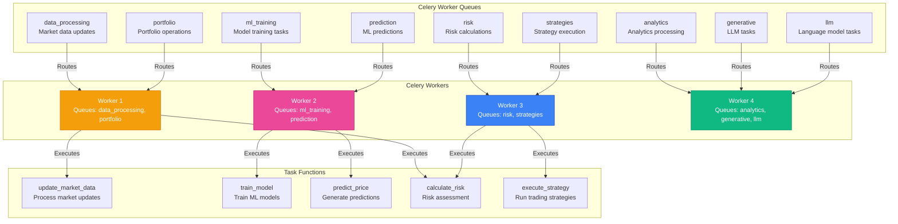
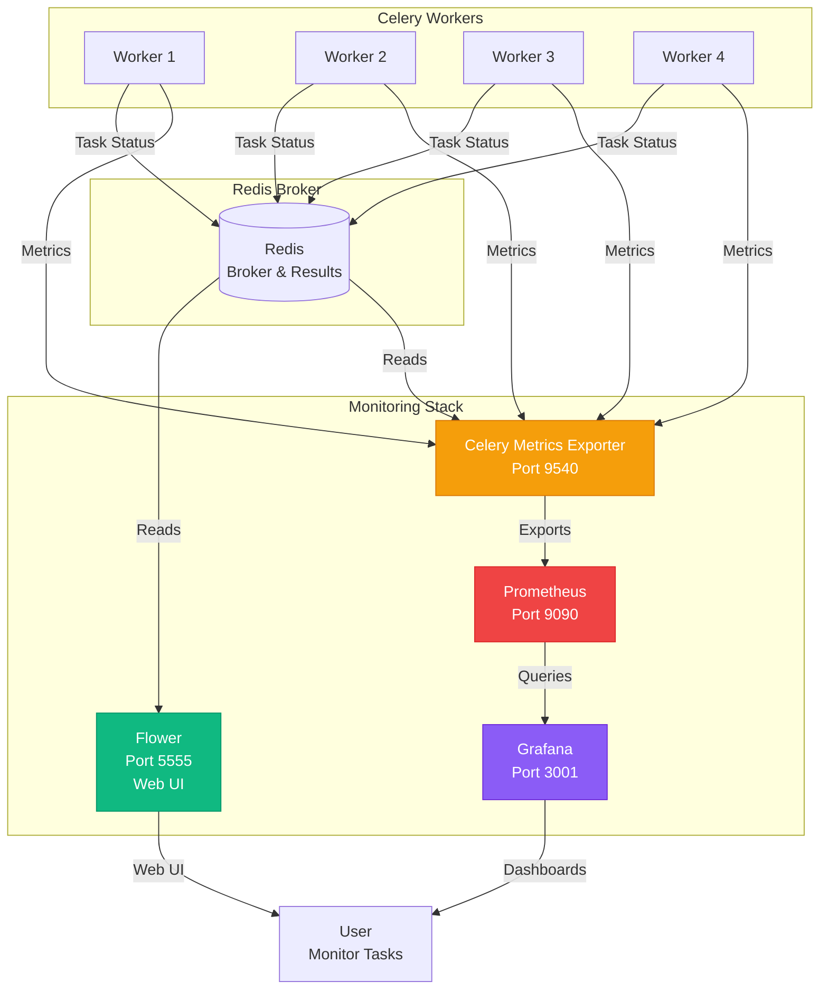
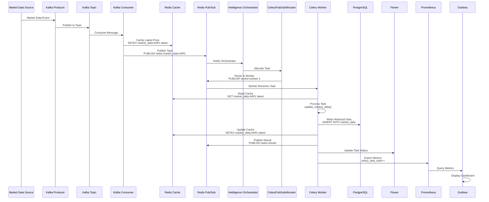

# 🏗️ Octopus Trading Platform - Orchestrator & Agents Architecture

## Complete System Architecture Overview

This document provides a comprehensive view of the orchestrator, agents, Kafka, Redis pub/sub, Celery workers, Flower monitoring, and database interactions.

---

## 🎯 High-Level Architecture Flow



---

## 🧠 Intelligence Orchestrator & 11 AI Agents

### Orchestrator Functions



### 11 AI Agents & Their Functions

```mermaid
graph TB
    subgraph "Agent Layer"
        A1[M1: Data Collector<br/>Web Scraping, API Fetching]
        A2[M2: Data Warehouse<br/>Storage, Retrieval, Validation]
        A3[M3: Real-time Processor<br/>Stream Processing, Alerts]
        A4[M4: Strategy Agent<br/>Execution, Signals, Backtesting]
        A5[M5: ML Models<br/>Prediction, Classification]
        A6[M6: Risk Manager<br/>Assessment, Optimization]
        A7[M7: Price Predictor<br/>Forecasting, Neural Networks]
        A8[M8: Paper Trader<br/>Simulation, Performance]
        A9[M9: Portfolio Manager<br/>Allocation, Rebalancing]
        A10[M10: Sentiment Analyzer<br/>NLP, Sentiment Analysis]
        A11[M11: Compliance Agent<br/>Regulatory, Reporting]
    end
    
    subgraph "Orchestrator"
        O[IntelligenceOrchestrator<br/>Task Distribution & Coordination]
    end
    
    O -->|Routes Tasks| A1
    O -->|Routes Tasks| A2
    O -->|Routes Tasks| A3
    O -->|Routes Tasks| A4
    O -->|Routes Tasks| A5
    O -->|Routes Tasks| A6
    O -->|Routes Tasks| A7
    O -->|Routes Tasks| A8
    O -->|Routes Tasks| A9
    O -->|Routes Tasks| A10
    O -->|Routes Tasks| A11
    
    style O fill:#8b5cf6,stroke:#6d28d9,color:#fff
    style A1 fill:#ec4899,stroke:#be185d,color:#fff
    style A5 fill:#f59e0b,stroke:#d97706,color:#fff
    style A6 fill:#ef4444,stroke:#dc2626,color:#fff
```



---

## 📡 Kafka Integration Flow

### Kafka Producer → Consumer → Redis Pub/Sub



### Kafka Functions

**Producer Functions:**
- `MarketDataKafkaProducer.publish()` - Publishes market data to Kafka
- `MarketDataKafkaProducer.start_producing()` - Continuous data streaming

**Consumer Functions:**
- `MarketDataKafkaConsumer.process_message()` - Processes incoming messages
- `MarketDataKafkaConsumer.trigger_celery_task()` - Triggers Celery tasks via pub/sub
- `MarketDataKafkaConsumer.start_consuming()` - Main consumption loop

---

## ⚡ Redis Pub/Sub Channels Architecture

### Channel Structure



### Redis Pub/Sub Functions

**CeleryPubSubAllocator Functions:**
- `register_worker()` - Register worker with queues and capabilities
- `publish_task()` - Publish task to Redis pub/sub channel
- `allocate_task()` - Allocate task to available worker
- `get_worker_status()` - Get worker availability and load
- `subscribe_to_queue()` - Subscribe worker to queue channel
- `unregister_worker()` - Remove worker registration

**Channel Patterns:**
- `tasks:{queue_name}` - General task channel for queue
- `tasks:priority:{queue_name}` - High-priority tasks (priority >= 8)
- `tasks:market_data:{symbol}` - Symbol-specific market data tasks
- `worker:{worker_name}` - Worker-specific channel for task allocation

---

## 🔄 Celery Workers & Task Processing

### Worker Queues & Task Routing



### Celery Task Functions

**Data Processing Tasks:**
- `data_processing.update_market_data()` - Updates market data in database
- `market_data.process_tick_data()` - Processes tick-by-tick data
- `market_data.aggregate_candles()` - Creates OHLCV candles

**ML/AI Tasks:**
- `training.train_model()` - Trains ML models
- `prediction.predict_price()` - Generates price predictions
- `prediction.analyze_sentiment()` - Sentiment analysis

**Trading Tasks:**
- `strategies.execute_strategy()` - Executes trading strategies
- `portfolio.update_portfolio()` - Updates portfolio positions
- `risk.calculate_var()` - Calculates Value at Risk

---

## 🌸 Flower Monitoring Architecture

### Flower → Celery Workers → Prometheus → Grafana



### Flower Monitoring Functions

**Flower Features:**
- Real-time task monitoring
- Worker status and statistics
- Task history and results
- Queue length monitoring
- Task execution graphs
- Worker resource usage

**Metrics Exported:**
- `celery_task_total` - Total tasks executed
- `celery_task_success_total` - Successful tasks
- `celery_task_failure_total` - Failed tasks
- `celery_task_duration_seconds` - Task execution time
- `celery_worker_active_tasks` - Active tasks per worker
- `celery_queue_length` - Queue backlog
- `celery_redis_pubsub_messages_total` - Pub/sub throughput

---

## 🗄️ Database Interactions

### PostgreSQL & Redis Data Flow

```mermaid
graph TB
    subgraph "Data Sources"
        K[Kafka Consumer]
        C[Celery Workers]
        O[Orchestrator]
    end
    
    subgraph "Redis Cache Layer"
        RC1[Market Data Cache<br/>market_data:{symbol}:latest]
        RC2[Task Results Cache<br/>task:{task_id}:result]
        RC3[Pub/Sub Channels<br/>tasks:*, worker:*]
        RC4[Session Cache<br/>session:{user_id}]
    end
    
    subgraph "PostgreSQL Database"
        PG1[(Market Data Table<br/>TimescaleDB)]
        PG2[(User Data Table)]
        PG3[(Trades Table)]
        PG4[(Portfolio Table)]
        PG5[(ML Models Table)]
    end
    
    K -->|Cache Latest| RC1
    K -->|Write Historical| PG1
    C -->|Read Cache| RC1
    C -->|Write Results| RC2
    C -->|Write Data| PG1
    C -->|Write Trades| PG3
    C -->|Update Portfolio| PG4
    C -->|Store Models| PG5
    O -->|Read Cache| RC1
    O -->|Read Results| RC2
    O -->|Query Data| PG1
    
    style RC1 fill:#ef4444,stroke:#dc2626,color:#fff
    style RC3 fill:#ef4444,stroke:#dc2626,color:#fff
    style PG1 fill:#3b82f6,stroke:#1e40af,color:#fff
    style PG4 fill:#3b82f6,stroke:#1e40af,color:#fff
```

### Database Functions

**Redis Functions:**
- `SETEX market_data:{symbol}:latest` - Cache latest market data (5min TTL)
- `PUBLISH tasks:{queue}` - Publish task to pub/sub channel
- `SUBSCRIBE worker:{name}` - Subscribe worker to channel
- `HSET workers:{name}` - Store worker registration info
- `LLEN queue:{queue}` - Get queue length

**PostgreSQL Functions:**
- `INSERT INTO market_data` - Store historical market data
- `SELECT * FROM portfolio` - Query portfolio data
- `UPDATE trades SET status` - Update trade status
- `INSERT INTO ml_models` - Store trained models
- TimescaleDB continuous aggregates for time-series queries

---

## 🔄 Complete End-to-End Flow

### Market Data → Processing → Storage → Monitoring



---

## 📊 Component Interaction Matrix

| Component | Kafka | Redis Pub/Sub | Redis Cache | PostgreSQL | Flower | Prometheus |
|-----------|-------|---------------|-------------|------------|--------|------------|
| **Kafka Producer** | ✅ Publishes | ❌ | ❌ | ❌ | ❌ | ✅ Metrics |
| **Kafka Consumer** | ✅ Consumes | ✅ Publishes | ✅ Writes | ✅ Writes | ❌ | ✅ Metrics |
| **Orchestrator** | ❌ | ✅ Publishes/Subscribes | ✅ Reads/Writes | ✅ Reads | ❌ | ✅ Metrics |
| **Celery Workers** | ❌ | ✅ Subscribes | ✅ Reads/Writes | ✅ Reads/Writes | ✅ Reports | ✅ Metrics |
| **Flower** | ❌ | ✅ Reads | ✅ Reads | ❌ | ✅ Self | ❌ |
| **Prometheus** | ✅ Scrapes | ✅ Scrapes | ✅ Scrapes | ✅ Scrapes | ✅ Scrapes | ✅ Self |

---

## 🔧 Key Functions Reference

### Intelligence Orchestrator Functions
- `submit_task(agent_name, task_type, data, priority)` - Submit task to agent
- `coordinate_pipeline(symbol, analysis_type)` - Coordinate multi-agent pipeline
- `get_task_result(task_id)` - Retrieve task result
- `get_agent_status(agent_name)` - Get agent status

### Kafka Functions
- `MarketDataKafkaProducer.publish(symbol, data)` - Publish to Kafka
- `MarketDataKafkaConsumer.process_message(message)` - Process message
- `MarketDataKafkaConsumer.trigger_celery_task(symbol, message)` - Trigger task

### Redis Pub/Sub Functions
- `CeleryPubSubAllocator.register_worker(name, queues, capabilities)` - Register worker
- `CeleryPubSubAllocator.publish_task(task_name, queue, data, priority)` - Publish task
- `CeleryPubSubAllocator.allocate_task(task, worker)` - Allocate to worker

### Celery Task Functions
- `data_processing.update_market_data(symbol, data)` - Update market data
- `training.train_model(model_type, data)` - Train ML model
- `prediction.predict_price(symbol, timeframe)` - Predict price
- `risk.calculate_var(portfolio)` - Calculate VaR
- `strategies.execute_strategy(strategy_id)` - Execute strategy

### Database Functions
- `Redis: SETEX key ttl value` - Cache with TTL
- `Redis: PUBLISH channel message` - Publish to channel
- `Redis: SUBSCRIBE channel` - Subscribe to channel
- `PostgreSQL: INSERT INTO market_data` - Store data
- `PostgreSQL: SELECT * FROM portfolio` - Query data

---

## 🎯 Architecture Insights

### Design Patterns Used

1. **Pub/Sub Pattern** - Redis pub/sub for task allocation
2. **Message Queue Pattern** - Kafka for event streaming
3. **Worker Pool Pattern** - Celery workers for distributed processing
4. **Orchestrator Pattern** - Intelligence orchestrator coordinates agents
5. **Caching Pattern** - Redis cache for hot data
6. **Time-Series Pattern** - TimescaleDB for market data

### Scalability Features

- **Horizontal Scaling**: Multiple Celery workers can be added
- **Load Balancing**: Redis pub/sub distributes tasks evenly
- **Caching**: Redis reduces database load
- **Partitioning**: Kafka topics can be partitioned
- **Monitoring**: Flower and Prometheus track performance

### Performance Optimizations

- **Redis Cache**: 5-minute TTL for market data
- **Pub/Sub**: Low-latency task allocation
- **Kafka**: High-throughput message streaming
- **TimescaleDB**: Optimized time-series queries
- **Worker Queues**: Priority-based task routing

---

*This architecture enables real-time market data processing, distributed task execution, and comprehensive monitoring for the Octopus Trading Platform.*
