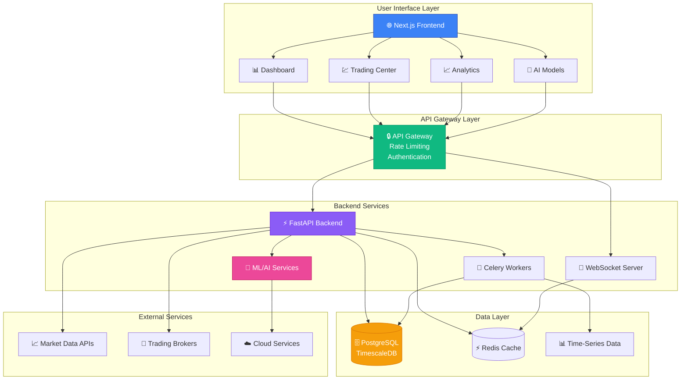
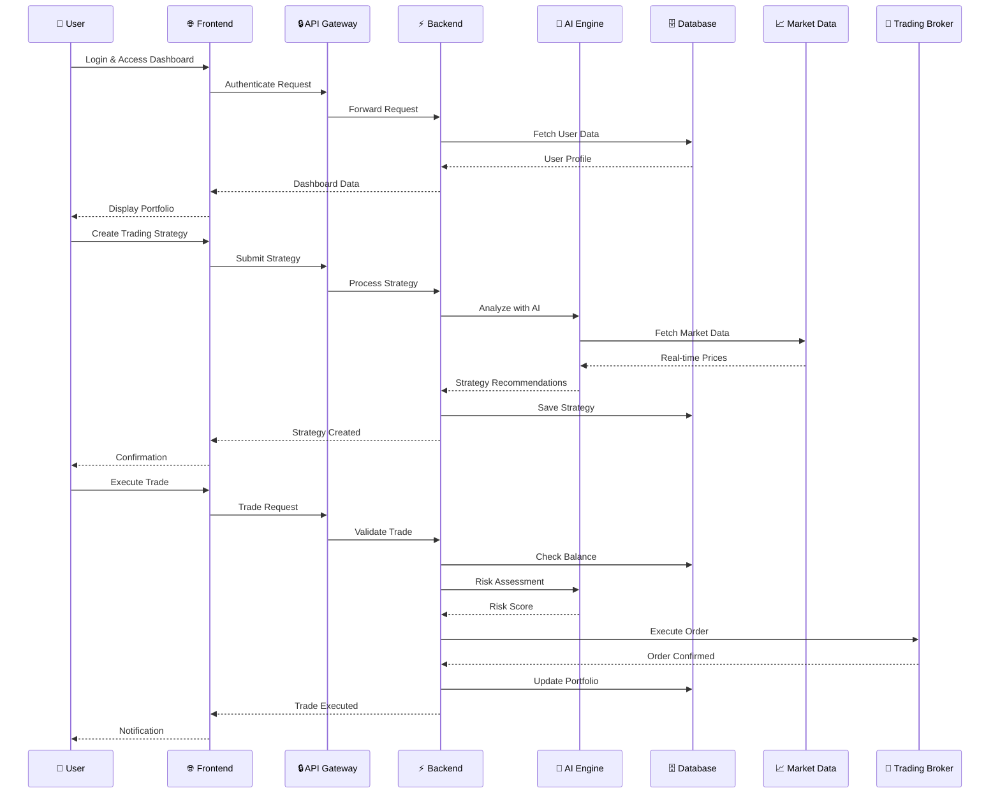
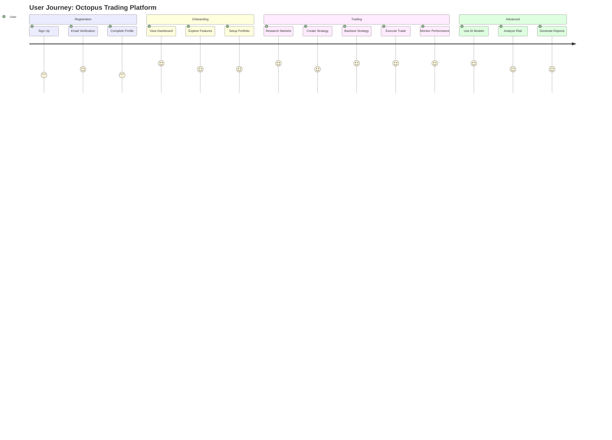
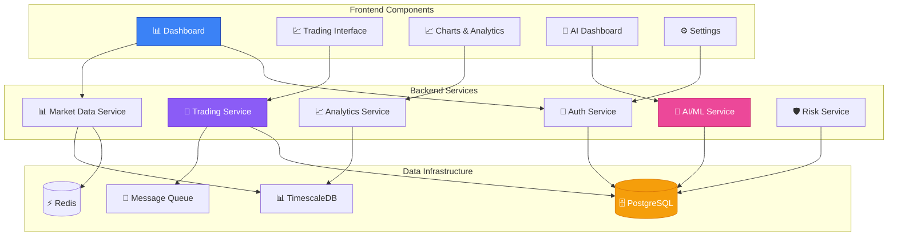
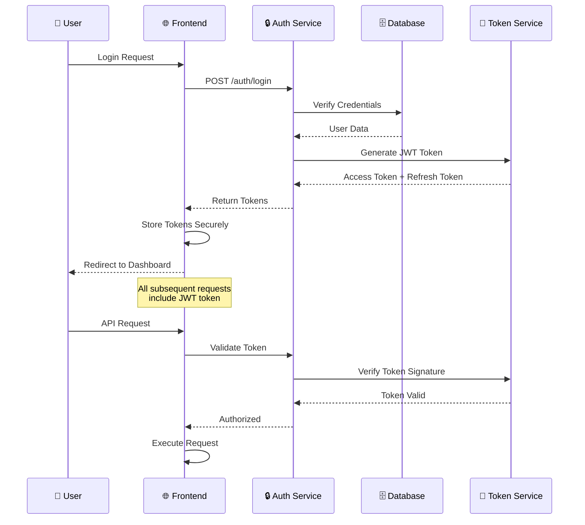
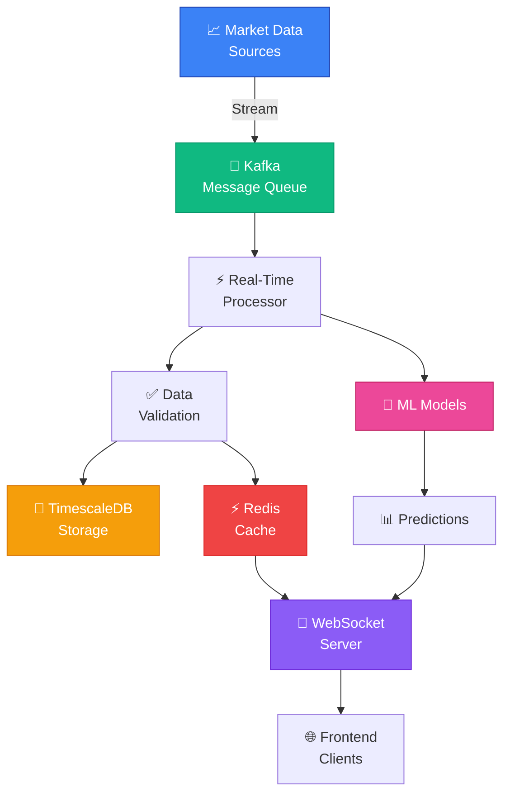

# 🐙 Octopus Trading Platform - Workflow Infographic

## System Architecture Workflow

## Trading Workflow

## Data Processing Pipeline

```mermaid
flowchart LR
    A[📥 Market Data<br/>Ingestion] --> B[🔄 Data<br/>Normalization]
    B --> C[✅ Data<br/>Validation]
    C --> D[💾 Store in<br/>TimescaleDB]
    D --> E[⚡ Cache in<br/>Redis]
    E --> F[🧠 ML Model<br/>Processing]
    F --> G[📊 Generate<br/>Insights]
    G --> H[📡 WebSocket<br/>Broadcast]
    H --> I[🌐 Frontend<br/>Display]
    
    style A fill:#3b82f6,stroke:#1e40af,color:#fff
    style D fill:#f59e0b,stroke:#d97706,color:#fff
    style E fill:#ef4444,stroke:#dc2626,color:#fff
    style F fill:#ec4899,stroke:#be185d,color:#fff
    style H fill:#10b981,stroke:#059669,color:#fff
```

## User Journey Map

## Component Architecture

## Security & Authentication Flow

## Real-Time Data Flow

---

## 📊 Visual Legend

| Icon | Component | Description |
|------|-----------|-------------|
| 🌐 | Frontend | Next.js React Application |
| ⚡ | Backend | FastAPI Python Services |
| 🗄️ | Database | PostgreSQL/TimescaleDB |
| ⚡ | Cache | Redis In-Memory Cache |
| 🔒 | Security | Authentication & Authorization |
| 🧠 | AI/ML | Machine Learning Services |
| 📈 | Market Data | Real-time Market Feeds |
| 🏦 | Broker | Trading Execution |
| 📡 | WebSocket | Real-time Communication |
| 🔄 | Queue | Message Queue System |

---

## 🎨 Design Principles

- **Color Coding**: Each component type has a distinct color for easy identification
- **Flow Direction**: Arrows indicate data flow and dependencies
- **Grouping**: Related components are grouped in subgraphs
- **Icons**: Visual icons make components instantly recognizable
- **Layering**: Clear separation between frontend, backend, and data layers

---

*Generated for Octopus Trading Platform - Professional Trading Infrastructure*
