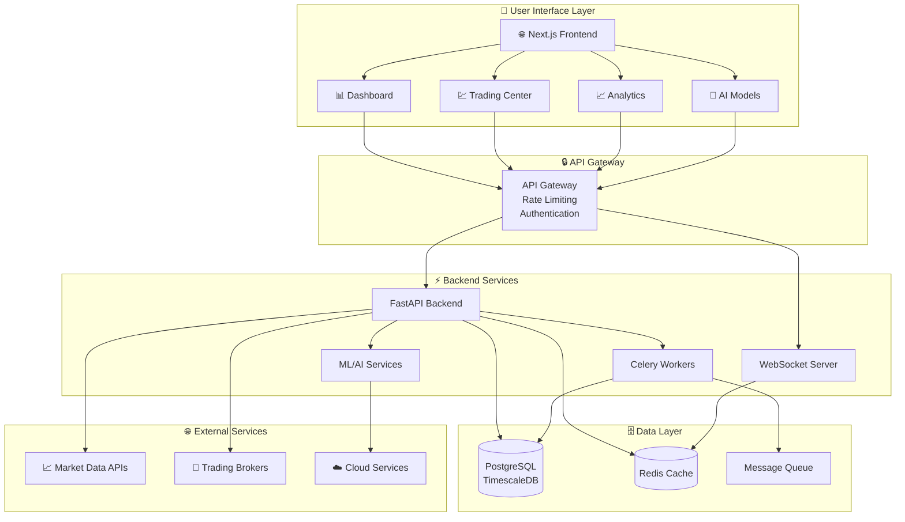
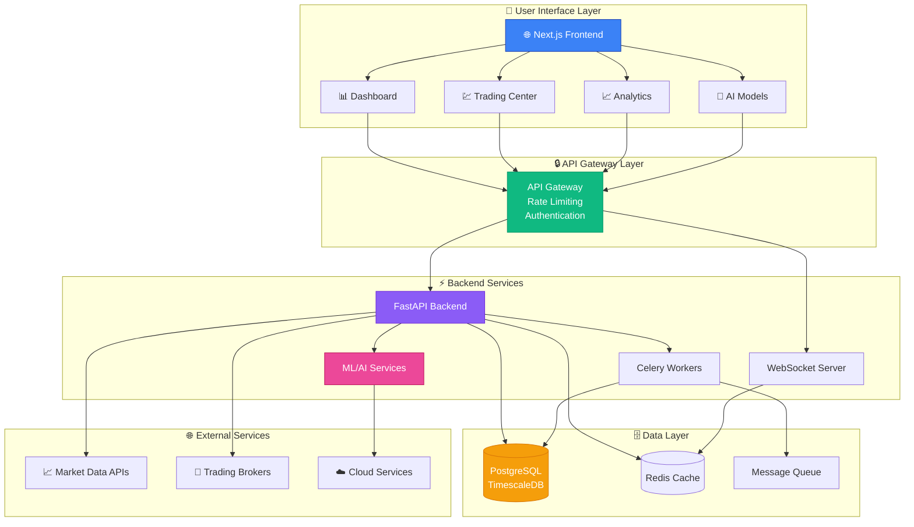
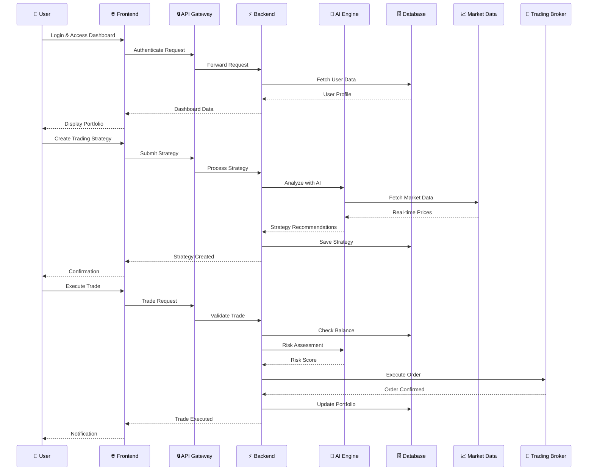
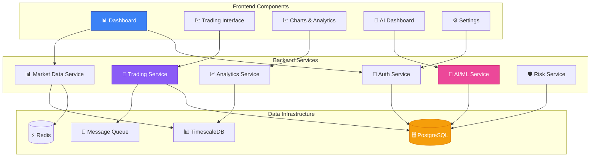
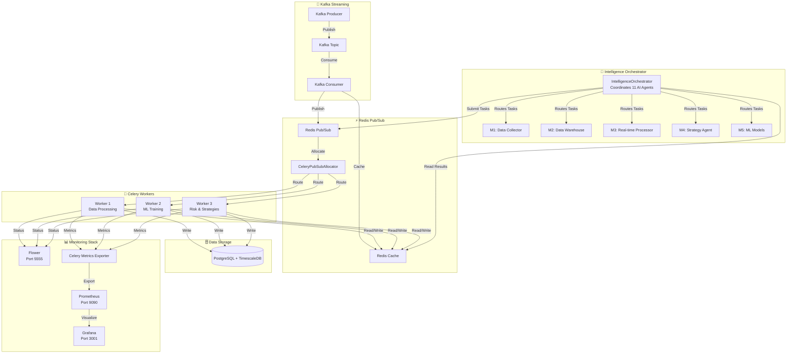
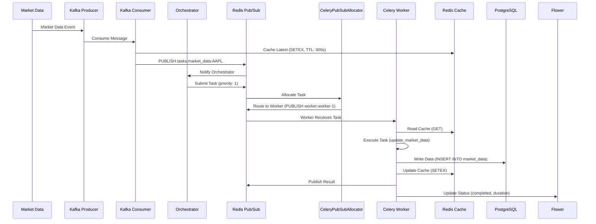
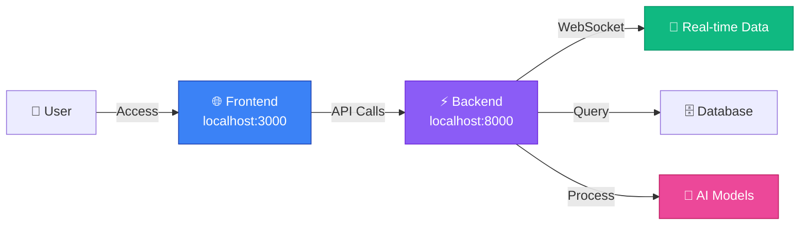

# 🐙 Octopus Trading Platform

<div align="center">


**Advanced AI-Powered Trading Platform with Real-Time Analytics**

[](https://www.typescriptlang.org/)
[](https://nextjs.org/)
[](https://www.python.org/)
[](https://fastapi.tiangolo.com/)
[](https://www.postgresql.org/)

[Features](#-features) • [Demo](#-live-demo) • [Workflow](#-system-architecture--workflow) • [Installation](#-installation) • [Documentation](#-documentation) • [Contributing](#-contributing)

</div>

---

## 🎯 Overview

Octopus Trading Platform is a comprehensive, AI-powered trading system designed for professional traders and institutions. It combines real-time market data, advanced analytics, machine learning models, and automated trading capabilities in a unified, modern interface.

## 📊 System Architecture & Workflow

### Visual Architecture Overview



### System Architecture Flow



### Trading Workflow Sequence



### Data Processing Pipeline

```mermaid
flowchart LR
    A[📥 Market Data<br/>Ingestion] --> B[🔄 Data<br/>Normalization]
    B --> C[✅ Data<br/>Validation]
    C --> D[💾 Store in<br/>TimescaleDB]
    D --> E[⚡ Cache in<br/>Redis]
    E --> F[🧠 ML Model<br/>Processing]
    F --> G[📊 Generate<br/>Insights]
    G --> H[📡 WebSocket<br/>Broadcast]
    H --> I[🌐 Frontend<br/>Display]
    
    style A fill:#3b82f6,stroke:#1e40af,color:#fff
    style D fill:#f59e0b,stroke:#d97706,color:#fff
    style E fill:#ef4444,stroke:#dc2626,color:#fff
    style F fill:#ec4899,stroke:#be185d,color:#fff
    style H fill:#10b981,stroke:#059669,color:#fff
```



### Component Architecture



> 📖 **For more detailed workflow diagrams**, see [Architecture Documentation](docs/archive/COMPREHENSIVE_ARCHITECTURE_DIAGRAM.md)

### 🏗️ Orchestrator & Agents Architecture



### Complete Data Flow Sequence



> 🏗️ **For complete orchestrator architecture with all functions and details**, see [Detailed Orchestrator Architecture](docs/orchestrator-architecture-detailed.md) | [Quick Reference](docs/orchestrator-architecture.md)

### Key Highlights

- 🤖 **AI-Powered**: Machine learning models for market prediction and strategy optimization
- 📊 **Real-Time Analytics**: Live market data, orderbook, and sentiment analysis
- 🎯 **Multi-Asset Trading**: Stocks, options, crypto, and derivatives
- 🔒 **Risk Management**: Advanced risk assessment and portfolio optimization
- 🚀 **Automated Trading**: Bot framework with backtesting and paper trading
- 📈 **Advanced Visualization**: Interactive charts and data visualization tools

---

## ✨ Features

### Core Trading Features

- **📊 Dashboard**: Comprehensive trading overview with portfolio analytics
- **💹 Real-Time Market Data**: Live price feeds, orderbook, and tick data
- **🎯 Options Trading**: Advanced options chain analysis and strategies
- **🤖 Trading Bots**: Automated trading with customizable rules and strategies
- **📈 Portfolio Management**: Multi-asset portfolio tracking and optimization
- **🔍 Market Analysis**: Technical, fundamental, and on-chain analysis tools

### AI & Machine Learning

- **🧠 AI Models**: Pre-trained models for price prediction and sentiment analysis
- **📊 ML Training**: Custom model training with your data
- **🎯 Strategy Optimization**: AI-powered strategy backtesting and optimization
- **💡 Insights Generation**: Automated market insights and recommendations

### Risk & Analytics

- **🛡️ Risk Assessment**: VaR, stress testing, and portfolio risk analysis
- **📈 Backtesting**: Historical strategy performance testing
- **📊 Reports**: Comprehensive trading reports and analytics
- **🔍 Data Explorer**: Advanced data querying and exploration tools

### Developer Tools

- **🔌 API Playground**: Interactive API testing and documentation
- **📡 WebSocket Support**: Real-time data streaming
- **🔐 Security**: API key management and session control
- **📝 Audit Logs**: Comprehensive activity logging

---

## 🚀 Live Demo

<div align="center">

### 🎬 Interactive Product Demo

[](http://localhost:3000)
[](http://localhost:8000/docs)
[](docs/demo-showcase.md)

</div>

### 🎯 Quick Demo Overview



### 🚀 Start the Demo

```bash
# Terminal 1: Start Backend
cd Findash
python3 start.py --reload

# Terminal 2: Start Frontend  
cd Findash/frontend-nextjs
npm run dev

# Access:
# Frontend: http://localhost:3000
# API Docs: http://localhost:8000/docs
# WebSocket: ws://localhost:8000/ws
```

### 📊 Demo Features Showcase

> 💡 **Full Demo Guide**: See [Interactive Demo Showcase](docs/demo-showcase.md) for detailed examples and code snippets

#### 1. **Dashboard** (`/`)
- Real-time portfolio overview
- Market watchlists
- Quick actions and shortcuts
- Performance metrics and charts

#### 2. **Real-Time Market Data** (`/market-data`)
- Live price feeds
- Orderbook visualization
- Streaming sentiment analysis
- AI-powered predictions

#### 3. **Trading Center** (`/trading`)
- Order entry and management
- Open orders tracking
- Trade history
- Position management

#### 4. **Portfolio Analytics** (`/portfolios`)
- Multi-asset portfolio tracking
- Performance analytics
- Allocation charts
- Portfolio optimizer

#### 5. **Trading Bots** (`/trading-bots`)
- Bot creation and management
- Strategy rules configuration
- Performance monitoring
- Automated execution

#### 6. **AI Models** (`/agents`)
- Model marketplace
- Custom model training
- Prediction insights
- Model performance metrics

#### 7. **Risk Management** (`/risk`)
- Portfolio risk analysis
- VaR calculations
- Stress testing scenarios
- Risk metrics dashboard

#### 8. **Backtesting** (`/backtesting`)
- Strategy backtesting
- Historical performance analysis
- Parameter optimization
- Results visualization

---

## 📸 Screenshots

<div align="center">

### 🎯 Platform Overview

<table>
<tr>
<td width="50%">
  
**📊 Dashboard**
  

  
*Real-time portfolio overview with market data and analytics*

</td>
<td width="50%">
  
**💹 Trading Center**
  

  
*Advanced order entry and position management*

</td>
</tr>
<tr>
<td width="50%">
  
**📈 Portfolio Analytics**
  

  
*Multi-asset portfolio tracking and optimization*

</td>
<td width="50%">
  
**🤖 Trading Bots**
  

  
*Automated trading bot management and monitoring*

</td>
</tr>
<tr>
<td width="50%">
  
**📉 Backtesting**
  

  
*Historical strategy performance testing*

</td>
<td width="50%">
  
**🧠 AI Models**
  

  
*Machine learning models and predictions*

</td>
</tr>
<tr>
<td width="50%">
  
**📊 Market Data**
  

  
*Live price feeds and orderbook visualization*

</td>
<td width="50%">
  
**⚠️ Risk Management**
  

  
*Portfolio risk analysis and VaR calculations*

</td>
</tr>
</table>

</div>

### 🎬 Interactive Features

- **Real-time Updates**: Live market data streaming via WebSocket
- **Interactive Charts**: Advanced TradingView integration
- **AI-Powered Insights**: Machine learning predictions and recommendations
- **Responsive Design**: Optimized for desktop, tablet, and mobile devices

> 💡 **Note**: Screenshots are placeholders. Replace with actual screenshots from your application for the best presentation.

---

## 🛠️ Installation

### Prerequisites

- Node.js 18+ and npm
- Python 3.10+
- PostgreSQL 14+
- Redis (optional, for caching)

### Quick Start

1. **Clone the repository**
   ```bash
   git clone https://github.com/massoudsh/Findash.git
   cd Findash
   ```

2. **Backend Setup**
   ```bash
   python -m venv venv
   source venv/bin/activate  # On Windows: venv\Scripts\activate
   pip install -r requirements.txt
   ```

3. **Frontend Setup**
   ```bash
   cd frontend-nextjs
   npm install
   ```

4. **Environment Configuration**
   ```bash
   # Copy example env files
   cp .env.example .env
   # Edit .env with your configuration
   ```

5. **Database Setup**
   ```bash
   # Run migrations
   alembic upgrade head
   ```

6. **Start the Application**
   ```bash
   # Terminal 1: Start backend
   python3 start.py --reload

   # Terminal 2: Start frontend
   cd frontend-nextjs
   npm run dev
   ```

7. **Access the Platform**
   - Frontend: http://localhost:3000
   - Backend API: http://localhost:8000
   - API Docs: http://localhost:8000/docs

---

## 📚 Documentation

### API Documentation

- **Swagger UI**: `http://localhost:8000/docs`
- **ReDoc**: `http://localhost:8000/redoc`

### Key Endpoints

- `/api/market-data` - Market data endpoints
- `/api/trades` - Trading operations
- `/api/portfolio` - Portfolio management
- `/api/risk` - Risk analysis
- `/api/ai-models` - AI model endpoints
- `/api/websocket` - WebSocket connections

### Architecture

```
Octopus Trading Platform
├── Frontend (Next.js 14)
│   ├── Dashboard & Analytics
│   ├── Trading Interface
│   ├── Portfolio Management
│   └── AI/ML Integration
│
├── Backend (FastAPI)
│   ├── Market Data Service
│   ├── Trading Engine
│   ├── Risk Management
│   ├── AI/ML Services
│   └── WebSocket Server
│
└── Database (PostgreSQL)
    ├── Market Data
    ├── User Data
    ├── Trading History
    └── ML Models
```

---

## 🎨 Tech Stack

### Frontend
- **Framework**: Next.js 14 (Pages Router)
- **Language**: TypeScript
- **Styling**: CSS Modules, Tailwind CSS
- **Charts**: Recharts
- **State Management**: React Hooks

### Backend
- **Framework**: FastAPI
- **Language**: Python 3.10+
- **Database**: PostgreSQL (TimescaleDB)
- **Caching**: Redis
- **ML/AI**: PyTorch, TensorFlow, scikit-learn
- **WebSockets**: FastAPI WebSockets

### Infrastructure
- **Containerization**: Docker
- **Monitoring**: Prometheus, Grafana
- **Logging**: Structured logging with Python logging

---

## 🔐 Security

- 🔒 API key authentication
- 🛡️ Session management
- 🔐 Two-factor authentication support
- 📝 Comprehensive audit logging
- 🚫 IP whitelisting
- 🔒 Encrypted data storage

---

## 🤝 Contributing

We welcome contributions! Please see our [Contributing Guidelines](CONTRIBUTING.md) for details.

1. Fork the repository
2. Create your feature branch (`git checkout -b feature/AmazingFeature`)
3. Commit your changes (`git commit -m 'Add some AmazingFeature'`)
4. Push to the branch (`git push origin feature/AmazingFeature`)
5. Open a Pull Request

---

## 📄 License

This project is licensed under the MIT License - see the [LICENSE](LICENSE) file for details.

---

## 🙏 Acknowledgments

- Built with [Next.js](https://nextjs.org/)
- Powered by [FastAPI](https://fastapi.tiangolo.com/)
- Charts by [Recharts](https://recharts.org/)

---

## 📞 Support

- 📧 Email: support@octopus-trading.com
- 💬 Discord: [Join our community](https://discord.gg/octopus-trading)
- 📖 Documentation: [docs.octopus-trading.com](https://docs.octopus-trading.com)
- 🐛 Issues: [GitHub Issues](https://github.com/massoudsh/Findash/issues)

---

<div align="center">

**Made with ❤️ by the Octopus Trading Team**

[⭐ Star us on GitHub](https://github.com/massoudsh/Findash) • [📖 Read the Docs](https://docs.octopus-trading.com) • [🐛 Report Bug](https://github.com/massoudsh/Findash/issues)

</div>
