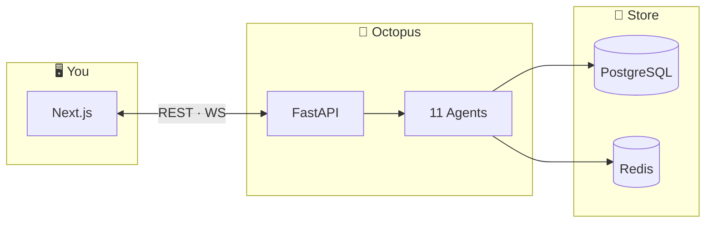

# Octopus Trading Platform

<div align="center">

**AI-powered trading platform with real-time analytics and 11 orchestrated agents**

[](https://www.typescriptlang.org/)
[](https://nextjs.org/)
[](https://www.python.org/)
[](https://fastapi.tiangolo.com/)

[Features](#-features) · [Agents](#-ai-agents) · [Installation](#-installation) · [Docs](#-documentation)

</div>

---

## Overview

Octopus is an AI-powered trading system that combines real-time market data, analytics, ML models, and automated trading in a single interface. The backend coordinates **11 AI agents** (M1–M11) for data collection, strategy, risk, sentiment, and reporting.

---

## System architecture


```mermaid
flowchart LR
    subgraph You["🖥️ You"]
        UI[Next.js]
    end

    subgraph Octopus["🐙 Octopus"]
        API[FastAPI]
        Agents[11 Agents]
        API --> Agents
    end

    subgraph Store["💾 Store"]
        DB[(PostgreSQL)]
        Cache[(Redis)]
    end

    UI <-->|REST · WS| API
    Agents --> DB
    Agents --> Cache
```

*Data in → Agents think → You decide.*

---

## AI Agents

The platform uses **11 orchestrated agents** (M1–M11) with distinct roles and personas. Each has a character name used across the UI (Command Center, Risk, Reports, etc.).

| ID  | Character | Role | Responsibility |
|-----|-----------|------|----------------|
| M1  | **Nexus** | Data Collection | Market data, news, alternative data pipelines |
| M2  | **Vault** | Data Warehouse | Storage, validation, historical datasets |
| M3  | **Pulse** | Real-time Processor | Streaming data, live analytics, alerts |
| M4  | **Atlas** | Strategy Agent | Signals, strategy execution, backtesting |
| M5  | **Neuron** | ML Models | Prediction, classification, deep learning |
| M6  | **Guardian** | Risk Management | VaR, position sizing, compliance |
| M7  | **Oracle** | Price Prediction | Time-series and price forecasting |
| M8  | **Shadow** | Paper Trading | Simulated execution, paper portfolio |
| M9  | **Echo** | Market Sentiment | News and social sentiment analysis |
| M10 | **Chronicle** | Backtesting | Historical testing, strategy validation |
| M11 | **Lens** | Visualization | Charts, dashboards, report insights |

Pipeline flow: **Data (M1, M3, M9)** → **ML & prediction (M5, M7)** → **Risk & strategy (M6, M4)** → **Backtest & viz (M10, M11)**. The orchestrator routes tasks via `submit_task()` and runs full pipelines via `coordinate_pipeline()`.

---

## Features

- **Dashboard** – Portfolio overview, market watchlists, live data
- **Command Center** – Order entry, positions, bots, options
- **Options** – Options chain and strategies
- **Portfolio & Risk** – Multi-asset tracking, VaR, stress tests
- **Strategies & Backtesting** – Strategy builder and historical backtests
- **AI Models** – Training, predictions, insights
- **Reports & Visualization** – AI-powered reports and charts
- **Platform search** – Search anything (pages, commands) via ⌘K

---

## Installation

### Prerequisites

- Node.js 18+, Python 3.10+, PostgreSQL 14+, Redis (optional)

### Quick start

```bash
# Clone
git clone https://github.com/massoudsh/Findash.git
cd Findash

# Backend
python -m venv venv
source venv/bin/activate   # Windows: venv\Scripts\activate
pip install -r requirements.txt

# Frontend
cd frontend-nextjs
npm install
```

### Run

```bash
# Terminal 1 – backend
python3 start.py --reload

# Terminal 2 – frontend
cd frontend-nextjs && npm run dev
```

- **Frontend:** http://localhost:3000  
- **API docs:** http://localhost:8000/docs  

### Run with Docker (core stack)

The core stack runs API, frontend, PostgreSQL, Redis, Celery worker/beat, Prometheus, and Grafana. **Redis is exposed on port 6380 by default** to avoid conflict with a local Redis on 6379.

```bash
# Core only (no LLM services)
docker compose -f docker-compose-core.yml up -d

# Optional: run a smoke test after bring-up
./scripts/healthcheck-core.sh
```

- **API:** http://localhost:8011 (mapped from 8000 in container)  
- **Frontend:** http://localhost:3000  
- **Grafana:** http://localhost:3001  

### Run with Docker + LLM profile (optional)

LLM services (Falcon TGI, FinGPT inference) are under the `llm` profile. Use them for report generation; see [docs/llm-report-models.md](docs/llm-report-models.md).

```bash
# Core + LLM services (TGI Falcon, FinGPT inference)
docker compose -f docker-compose-core.yml --profile llm up -d
```

Set in your env (or `.env`): `FALCON_TGI_URL=http://localhost:8080`, `FINGPT_LOCAL_URL=http://localhost:8081`, and optionally `HF_TOKEN` for HuggingFace. See **env.example** for all LLM variables.

For production, use a `docker-compose.override.yml` (or env file) to set `ENVIRONMENT=production`, secure secrets, and correct database/Redis hosts.

---

## Documentation

- **API:** Swagger at `/docs`, ReDoc at `/redoc`
- **Architecture:** See `docs/ARCHITECTURE_DIAGRAMS.md` and `docs/orchestrator-architecture.md` for detailed diagrams

---

## Tech stack

| Layer      | Stack |
|-----------|--------|
| Frontend  | Next.js 14, TypeScript, Tailwind CSS, Shadcn UI |
| Backend   | FastAPI, Python 3.10+ |
| Data      | PostgreSQL (TimescaleDB), Redis |
| ML/AI     | PyTorch, scikit-learn, Celery workers |

---

## License

MIT – see [LICENSE](LICENSE).
