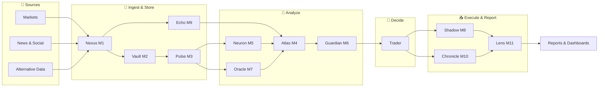
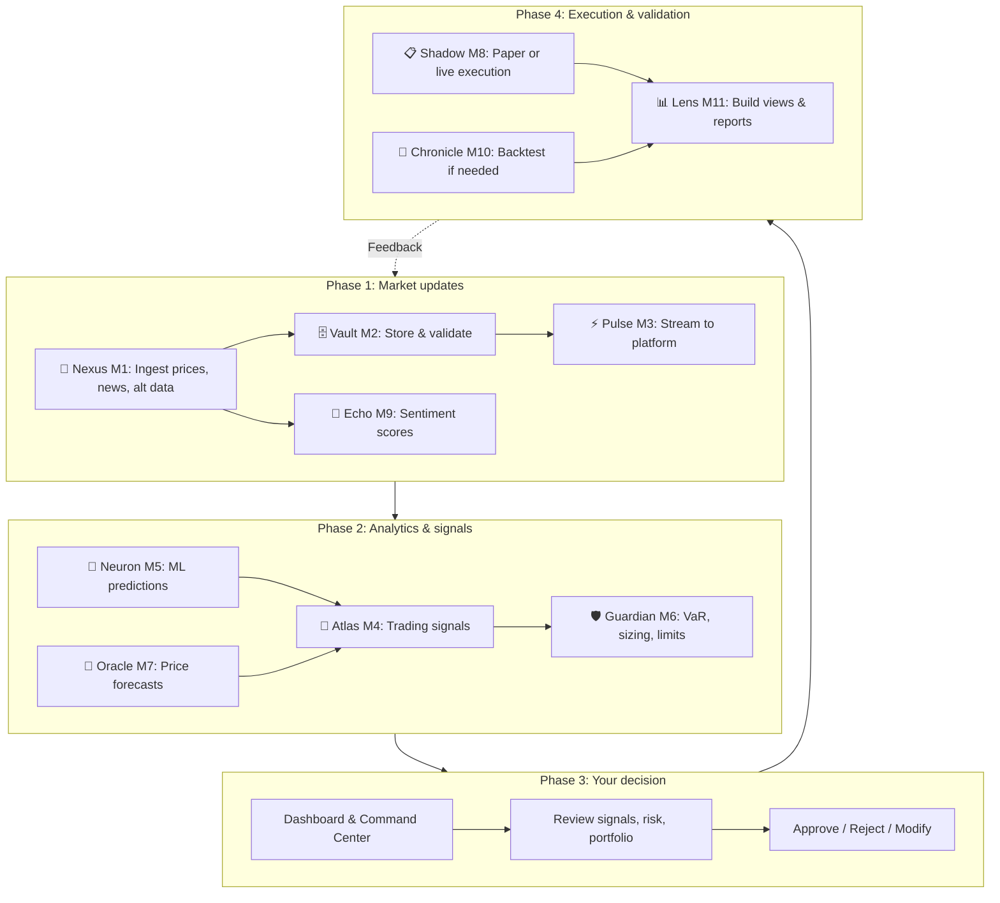
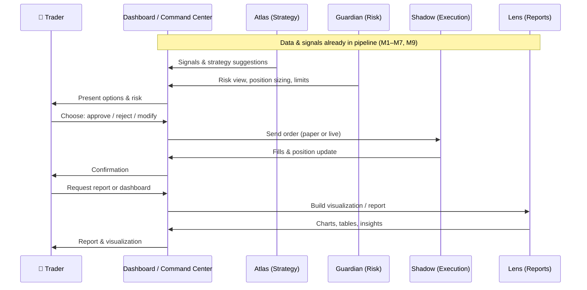
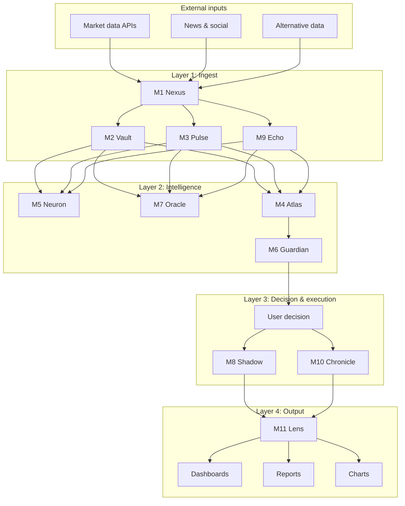

# Agent–User Decision Workflow

**From market updates to visualizations and reports** — a step-by-step view of how Octopus agents and users collaborate for investment decisions (Aladdin-style decision support).

---

## Overview

The platform combines **continuous data ingestion**, **agent-driven analytics**, and **human decisions** in a single loop: data flows in → agents analyze and recommend → the user decides → execution and reporting close the loop.

```
┌─────────────────────────────────────────────────────────────────────────────────┐
│  MARKET DATA  →  ENRICHMENT  →  SIGNALS & RISK  →  YOUR DECISION  →  EXECUTION   │
│       ↑              ↑                ↑                ↑                ↑       │
│     M1,M3,M9       M2,M5,M7         M4,M6           👤 You           M8,M11     │
│                                                          ↓                       │
│  REPORTS & VISUALIZATION  ←  LENS (M11)  ←  Results & attribution                │
└─────────────────────────────────────────────────────────────────────────────────┘
```

---

## 1. End-to-end pipeline (high level)



---

## 2. Decision workflow by phase (swimlane)



---

## 3. Step-by-step: from market update to report

| Step | Phase | Who / What | Action | Output |
|------|--------|------------|--------|--------|
| **1** | Market updates | **Nexus (M1)** | Ingest prices, fundamentals, news, social | Normalized market & alternative data |
| **2** | Market updates | **Vault (M2)** | Store, validate, index | Historical + real-time datasets |
| **3** | Market updates | **Pulse (M3)** | Stream live data, compute live metrics | WebSocket feeds, live P&amp;L |
| **4** | Market updates | **Echo (M9)** | Score news/social sentiment | Sentiment signals per asset/theme |
| **5** | Analytics | **Neuron (M5)** | Run ML models (classification, prediction) | Scores, predictions, regime labels |
| **6** | Analytics | **Oracle (M7)** | Time-series & price forecasting | Price targets, scenarios |
| **7** | Signals | **Atlas (M4)** | Fuse signals, generate ideas | Trading signals, strategy suggestions |
| **8** | Risk | **Guardian (M6)** | VaR, limits, position sizing, compliance | Approved size, risk view, alerts |
| **9** | **Decision** | **👤 You** | View Dashboard / Command Center; approve, reject, or adjust | Your order / no-trade / strategy choice |
| **10** | Execution | **Shadow (M8)** | Paper or live execution, track fills | Fills, position updates |
| **11** | Validation | **Chronicle (M10)** | Backtest strategy if needed | Backtest report, metrics |
| **12** | Reporting | **Lens (M11)** | Build charts, dashboards, AI reports | Visualizations & reports |

---

## 4. User–agent interaction (sequence)



---

## 5. Where you see each agent in the UI

| Agent | Where in the platform | What you get |
|-------|------------------------|--------------|
| **Nexus (M1)** | Data Explorer, Command Center (data pipeline) | Live feeds, export, data quality |
| **Vault (M2)** | Data Explorer, exports | Historical data, validated series |
| **Pulse (M3)** | Dashboard, live charts, alerts | Real-time prices, live analytics |
| **Atlas (M4)** | Command Center → Strategies, Trading Bots | Signals, strategy ideas, bot config |
| **Neuron (M5)** | AI Models | Predictions, model outputs |
| **Guardian (M6)** | Command Center → Risk | VaR, limits, risk dashboard |
| **Oracle (M7)** | Options, predictions | Price forecasts, scenarios |
| **Shadow (M8)** | Paper trading, Portfolio (sim) | Simulated execution, paper P&amp;L |
| **Echo (M9)** | Command Center (sentiment), Social | Sentiment scores, news impact |
| **Chronicle (M10)** | Command Center → Strategies → Backtesting | Backtest results, strategy validation |
| **Lens (M11)** | Reports, Visualization, Dashboard | Charts, dashboards, AI report insights |

---

## 6. Data flow: market data → visualization



---

## 7. One-page reference: “From market update to report”

```
  MARKET UPDATES          ENRICHMENT              SIGNALS & RISK           YOUR DECISION           EXECUTION & REPORT
  ───────────────        ───────────             ───────────────          ─────────────           ───────────────────

  Prices, news,          Stored & validated       Fused into signals       You see:                Orders executed
  alternative data  →    (Vault M2)          →   (Atlas M4)           →   risk (Guardian M6)  →   (Shadow M8)
       │                        │                        │                        │                        │
  Nexus M1, Pulse M3,     Neuron M5,             Atlas M4,              Command Center,          Chronicle M10
  Echo M9                  Oracle M7              Guardian M6             Dashboard                 backtests
       │                        │                        │                        │                        │
       └────────────────────────┴────────────────────────┴────────────────────────┴────────────────────────┘
                                                                                              │
                                                                                              ▼
                                                                                    Lens M11 → Visualizations
                                                                                              & Reports
```

---

## Summary

- **Agents** handle: ingestion (M1, M2, M3, M9), analytics (M5, M7), signals and risk (M4, M6), execution and backtest (M8, M10), and reporting (M11).
- **You** decide: approve, reject, or modify in the Command Center and Dashboard, using agent outputs and risk views.
- **Flow**: Market updates → enrichment → signals & risk → your decision → execution → visualizations and reports (Aladdin-style decision support).

For technical orchestration details, see [AI-Agents](../wiki-content/AI-Agents.md) and [Architecture](../wiki-content/Architecture.md).
