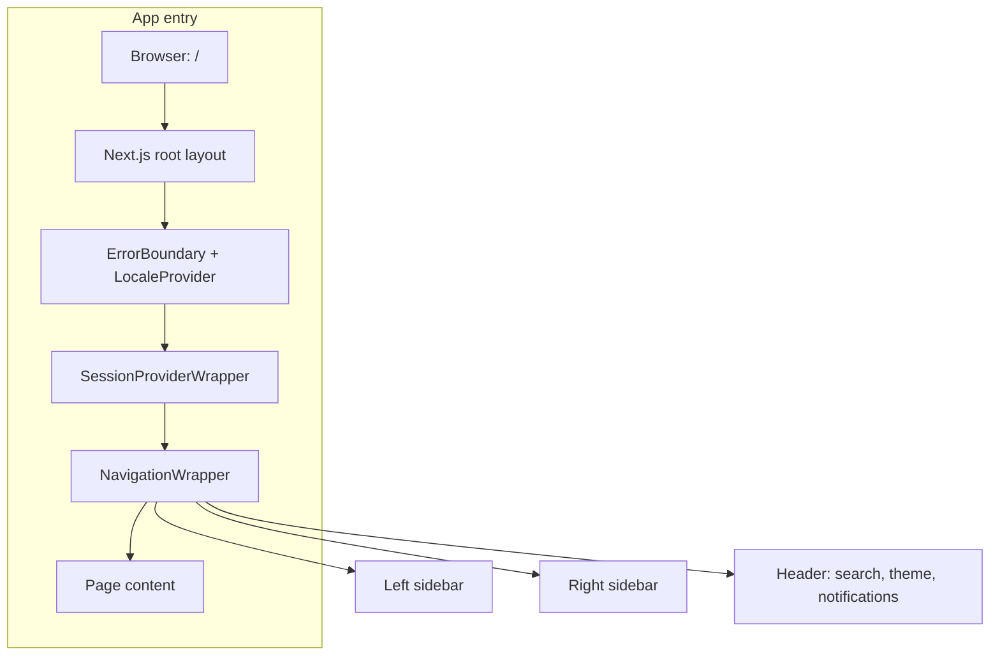
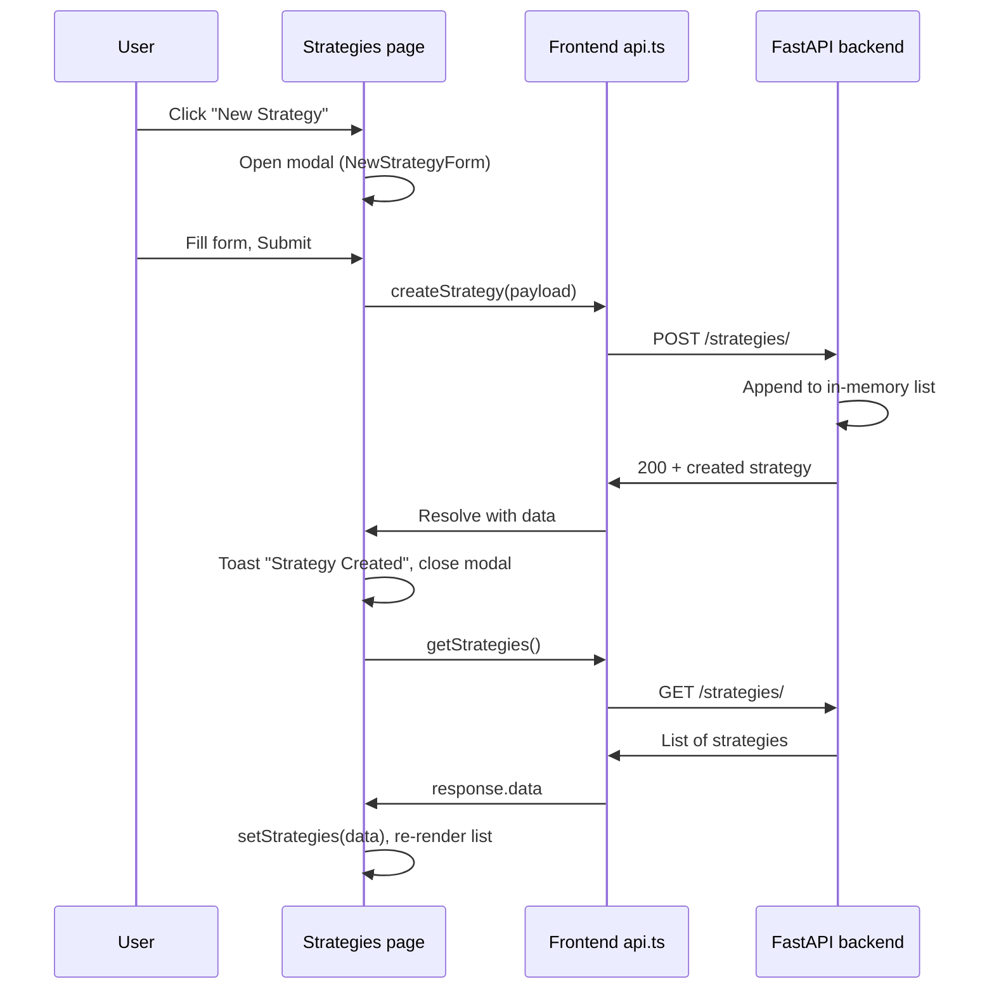

# App flow – Octopus Trading Platform (Findash)

How the app is structured and how key flows work.

---

## 1. App entry and layout



- **Root:** `app/layout.tsx` wraps all pages with `NavigationWrapper`, session, locale, and toaster.
- **Navigation:** `NavigationWrapper` renders left sidebar, right sidebar, and header; `children` is the current page.

---

## 2. Navigation → pages

```mermaid
flowchart LR
    subgraph Left["Left sidebar – Trading & Portfolio"]
        L1[/dashboard]
        L2[/realtime]
        L3[/options]
        L4[/trades]
        L5[/trading-bots]
        L6[/backtesting]
        L7[/portfolio]
        L8[/strategies]
        L9[/risk]
    end
    subgraph Right["Right sidebar – Analysis & Tools"]
        R1[/technical]
        R2[/fundamental-data]
        R3[/macro]
        R4[/on-chain]
        R5[/social]
        R6[/ai-models]
        R7[/data-explorer]
        R8[/visualization]
        R9[/reports]
        R10[/api-playground]
        R11[/notifications]
        R12[/admin]
    end
```

| Route | Page / content |
|-------|-----------------|
| `/` | Home (redirect or landing) |
| `/dashboard` | Dashboard (bar, waterfall, pie, line charts; wallet cards; tabs) |
| `/options` | Options: **Trade** tab (terminal) + **Strategies** tab (options strategy library) |
| `/strategies` | Strategies: list, create, details, mini-charts; “Options Strategies” link |
| `/trades` | Trading center (order entry, open orders) |
| `/trading-bots` | Trading bots list and control |
| `/backtesting` | Backtest config and results |
| `/portfolio` | Portfolio view |
| `/risk` | Risk assessment |
| Others | Technical, Fundamental, Macro, On-chain, Social, AI Models, Data Explorer, Visualization, Reports, API Playground, Notifications, Admin |

---

## 3. Create-strategy flow (end-to-end)



- **Frontend:** `StrategiesContent` → `NewStrategyForm` submit → `createStrategy(strategyData)` from `lib/services/api.ts`.
- **Backend:** `POST /strategies/` handled by `strategies_crud.py`; stores in memory and returns the new strategy.
- **Refresh:** After create, `handleNewStrategySuccess()` calls `getStrategies()` and `setStrategies(response.data)` so the new strategy appears in the list.

---

## 4. Options flow (Trade vs Strategies)

```mermaid
flowchart TB
    O[/options] --> Tabs{Tabs}
    Tabs --> Trade[Trade tab]
    Tabs --> Strat[Strategies tab]
    Trade --> OT[OptionTradingTerminal]
    Strat --> OST[OptionsStrategiesTab]
    OST --> Cards[Strategy cards: Long Call, Iron Condor, etc.]
    Cards --> Deploy[Deploy / Open in Terminal]
    Deploy --> Tabs
```

- **Options page:** Two tabs – **Trade** (terminal) and **Strategies** (options strategy library).
- **Strategies tab:** Renders strategy cards; “Terminal” / “Deploy” can switch to the Trade tab or open the terminal for execution.

---

## 5. Dashboard data flow

```mermaid
flowchart LR
    D[Dashboard page] --> DC[DashboardContent]
    DC --> Wallet[Wallet cards]
    DC --> Summary[Summary cards]
    DC --> Tabs[Overview / Holdings / Markets / Activity / Analytics]
    Tabs --> Charts[Bar, Waterfall, Pie, Line]
    DC --> API[getPortfolios, getTrades]
    API --> Backend[FastAPI]
    Backend --> DB[(DB) or mock]
```

- Dashboard uses **Overview** (one bar, one waterfall, one pie, one line), **Holdings**, **Markets**, **Activity**, **Analytics**.
- Portfolio/trade data comes from `api.ts` (e.g. `getPortfolios`, `getTrades`) when available; some cards use local/mock data.

---

## 6. API base URL and backend

- Frontend calls the backend using **`NEXT_PUBLIC_API_URL`** (e.g. `http://localhost:8000`).
- **`lib/services/api.ts`** uses axios with that base URL for portfolios, strategies, trades, etc.
- Backend is the FastAPI app in `src/main_refactored.py`; routes include `/strategies/`, `/portfolios/`, `/api/trading-bots/`, `/api/backtesting/`, and others.

---

## 7. Quick reference – where things live

| What | Where |
|------|--------|
| Layout + sidebars | `frontend-nextjs/src/components/navigation/navigation-wrapper.tsx` |
| Dashboard charts | `frontend-nextjs/src/components/dashboard/dashboard-content.tsx` + `dashboard-charts.tsx` |
| Strategies list + create | `frontend-nextjs/src/components/strategies/strategies-content.tsx` |
| Strategies API (frontend) | `frontend-nextjs/src/lib/services/api.ts` → `getStrategies`, `createStrategy` |
| Strategies API (backend) | `src/api/endpoints/strategies_crud.py` → GET/POST `/strategies/` |
| Options page | `frontend-nextjs/src/app/options/page.tsx` (tabs: Trade, Strategies) |
| App layout | `frontend-nextjs/src/app/layout.tsx` |
