# Findash Architecture Diagrams

## Table of Contents
1. [High-Level System Overview](#1-high-level-system-overview)
2. [Mid-Level Component Architecture](#2-mid-level-component-architecture)
3. [Low-Level Flow Diagrams](#3-low-level-flow-diagrams)
4. [Data Lineage Diagrams](#4-data-lineage-diagrams)
5. [Class Structure Diagrams](#5-class-structure-diagrams)
6. [Sequence Diagrams](#6-sequence-diagrams)

---

## 1. High-Level System Overview

### 1.1 Complete System Architecture

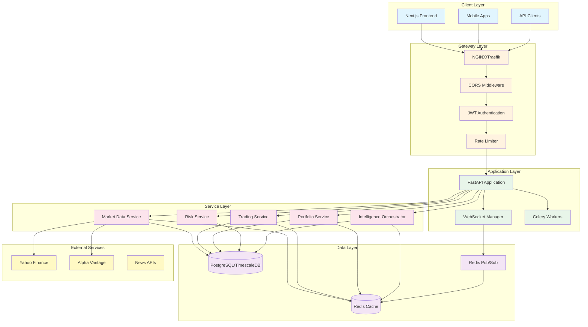
```mermaid
graph TD
    subgraph "Client Layer"
        WEB[Next.js Frontend]
        MOBILE[Mobile Apps]
        API_CLIENT[API Clients]
    end

    subgraph "Gateway Layer"
        NGINX[NGINX/Traefik]
        CORS[CORS Middleware]
        AUTH[JWT Authentication]
        RATE[Rate Limiter]
    end

    subgraph "Application Layer"
        FASTAPI[FastAPI Application]
        WS[WebSocket Manager]
        CELERY[Celery Workers]
    end

    subgraph "Service Layer"
        MARKET[Market Data Service]
        TRADING[Trading Service]
        PORTFOLIO[Portfolio Service]
        RISK[Risk Service]
        AI[Intelligence Orchestrator]
    end

    subgraph "Data Layer"
        PG[(PostgreSQL/TimescaleDB)]
        REDIS[(Redis Cache)]
        PUBSUB[Redis Pub/Sub]
    end

    subgraph "External Services"
        YAHOO[Yahoo Finance]
        ALPHA[Alpha Vantage]
        NEWS[News APIs]
    end

    WEB --> NGINX
    MOBILE --> NGINX
    API_CLIENT --> NGINX
    
    NGINX --> CORS --> AUTH --> RATE --> FASTAPI
    FASTAPI --> WS
    FASTAPI --> CELERY
    
    FASTAPI --> MARKET
    FASTAPI --> TRADING
    FASTAPI --> PORTFOLIO
    FASTAPI --> RISK
    FASTAPI --> AI
    
    MARKET --> REDIS
    MARKET --> PG
    MARKET --> YAHOO
    MARKET --> ALPHA
    
    TRADING --> REDIS
    TRADING --> PG
    
    PORTFOLIO --> REDIS
    PORTFOLIO --> PG
    
    RISK --> PG
    
    AI --> REDIS
    AI --> PG
    
    WS --> PUBSUB
    PUBSUB --> REDIS

    classDef client fill:#e1f5fe
    classDef gateway fill:#fff3e0
    classDef app fill:#e8f5e9
    classDef service fill:#fce4ec
    classDef data fill:#f3e5f5
    classDef external fill:#fff9c4
    
    class WEB,MOBILE,API_CLIENT client
    class NGINX,CORS,AUTH,RATE gateway
    class FASTAPI,WS,CELERY app
    class MARKET,TRADING,PORTFOLIO,RISK,AI service
    class PG,REDIS,PUBSUB data
    class YAHOO,ALPHA,NEWS external
```

### 1.2 Simplified System Map

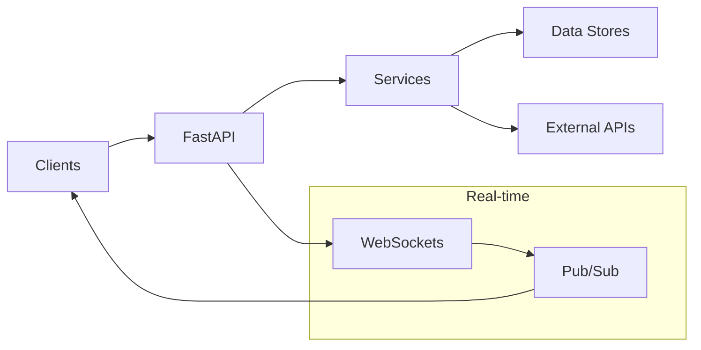
```mermaid
graph LR
    CLIENT[Clients] --> API[FastAPI]
    API --> SERVICES[Services]
    SERVICES --> DATA[Data Stores]
    SERVICES --> EXTERNAL[External APIs]
    
    subgraph Real-time
        WS[WebSockets]
        PUBSUB[Pub/Sub]
    end
    
    API --> WS
    WS --> PUBSUB
    PUBSUB --> CLIENT
```

---

## 2. Mid-Level Component Architecture

### 2.1 API Endpoints Structure

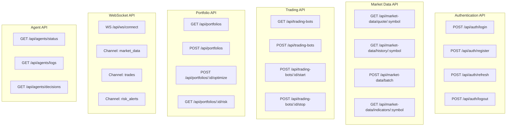
```mermaid
flowchart TB
    subgraph "Authentication API"
        AUTH_LOGIN[POST /api/auth/login]
        AUTH_REG[POST /api/auth/register]
        AUTH_REFRESH[POST /api/auth/refresh]
        AUTH_LOGOUT[POST /api/auth/logout]
    end

    subgraph "Market Data API"
        MD_QUOTE[GET /api/market-data/quote/:symbol]
        MD_HISTORY[GET /api/market-data/history/:symbol]
        MD_BATCH[POST /api/market-data/batch]
        MD_INDICATORS[GET /api/market-data/indicators/:symbol]
    end

    subgraph "Trading API"
        BOT_LIST[GET /api/trading-bots]
        BOT_CREATE[POST /api/trading-bots]
        BOT_START[POST /api/trading-bots/:id/start]
        BOT_STOP[POST /api/trading-bots/:id/stop]
    end

    subgraph "Portfolio API"
        PORT_LIST[GET /api/portfolios]
        PORT_CREATE[POST /api/portfolios]
        PORT_OPTIMIZE[POST /api/portfolios/:id/optimize]
        PORT_RISK[GET /api/portfolios/:id/risk]
    end

    subgraph "WebSocket API"
        WS_CONNECT[WS /api/ws/connect]
        WS_MARKET[Channel: market_data]
        WS_TRADES[Channel: trades]
        WS_ALERTS[Channel: risk_alerts]
    end

    subgraph "Agent API"
        AGENT_STATUS[GET /api/agents/status]
        AGENT_LOGS[GET /api/agents/logs]
        AGENT_DECISIONS[GET /api/agents/decisions]
    end
```

### 2.2 Core Services Architecture

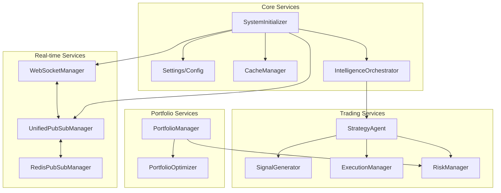
```mermaid
flowchart TB
    subgraph "Core Services"
        INIT[SystemInitializer]
        CONFIG[Settings/Config]
        CACHE[CacheManager]
        ORCH[IntelligenceOrchestrator]
    end

    subgraph "Trading Services"
        STRATEGY[StrategyAgent]
        SIGNAL[SignalGenerator]
        EXEC[ExecutionManager]
        RISK[RiskManager]
    end

    subgraph "Portfolio Services"
        PM[PortfolioManager]
        PO[PortfolioOptimizer]
    end

    subgraph "Real-time Services"
        WSM[WebSocketManager]
        UPS[UnifiedPubSubManager]
        RPS[RedisPubSubManager]
    end

    INIT --> CONFIG
    INIT --> CACHE
    INIT --> WSM
    INIT --> UPS
    INIT --> ORCH

    ORCH --> STRATEGY
    STRATEGY --> SIGNAL
    STRATEGY --> EXEC
    STRATEGY --> RISK

    PM --> PO
    PM --> RISK
    
    WSM <--> UPS
    UPS <--> RPS
```

### 2.3 AI Agents Architecture

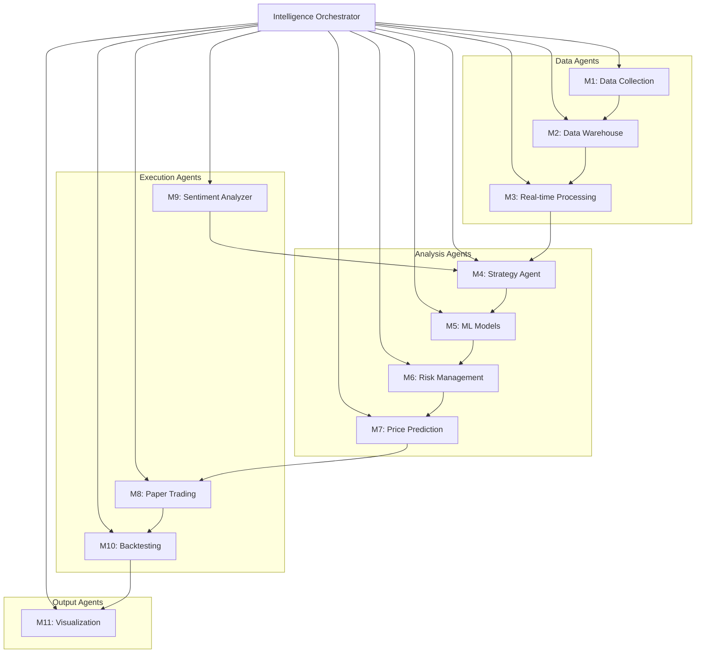
```mermaid
flowchart TB
    ORCH[Intelligence Orchestrator]
    
    subgraph "Data Agents"
        M1[M1: Data Collection]
        M2[M2: Data Warehouse]
        M3[M3: Real-time Processing]
    end

    subgraph "Analysis Agents"
        M4[M4: Strategy Agent]
        M5[M5: ML Models]
        M6[M6: Risk Management]
        M7[M7: Price Prediction]
    end

    subgraph "Execution Agents"
        M8[M8: Paper Trading]
        M9[M9: Sentiment Analyzer]
        M10[M10: Backtesting]
    end

    subgraph "Output Agents"
        M11[M11: Visualization]
    end

    ORCH --> M1
    ORCH --> M2
    ORCH --> M3
    ORCH --> M4
    ORCH --> M5
    ORCH --> M6
    ORCH --> M7
    ORCH --> M8
    ORCH --> M9
    ORCH --> M10
    ORCH --> M11

    M1 --> M2
    M2 --> M3
    M3 --> M4
    M4 --> M5
    M5 --> M6
    M6 --> M7
    M7 --> M8
    M8 --> M10
    M9 --> M4
    M10 --> M11
```

---

## 3. Low-Level Flow Diagrams

### 3.1 Request Flow: Controller to Database

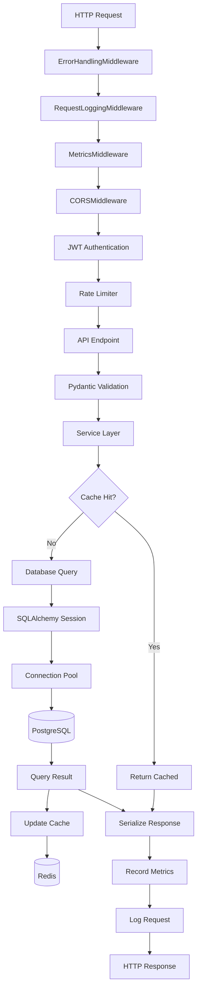
```mermaid
flowchart TD
    REQ[HTTP Request] --> MW1[ErrorHandlingMiddleware]
    MW1 --> MW2[RequestLoggingMiddleware]
    MW2 --> MW3[MetricsMiddleware]
    MW3 --> MW4[CORSMiddleware]
    MW4 --> AUTH[JWT Authentication]
    AUTH --> RATE[Rate Limiter]
    RATE --> ENDPOINT[API Endpoint]
    
    ENDPOINT --> VALIDATE[Pydantic Validation]
    VALIDATE --> SERVICE[Service Layer]
    
    SERVICE --> CACHE_CHECK{Cache Hit?}
    CACHE_CHECK -->|Yes| CACHE_RETURN[Return Cached]
    CACHE_CHECK -->|No| DB_QUERY[Database Query]
    
    DB_QUERY --> SESSION[SQLAlchemy Session]
    SESSION --> POOL[Connection Pool]
    POOL --> PG[(PostgreSQL)]
    
    PG --> RESULT[Query Result]
    RESULT --> CACHE_SET[Update Cache]
    CACHE_SET --> REDIS[(Redis)]
    
    CACHE_RETURN --> SERIALIZE[Serialize Response]
    RESULT --> SERIALIZE
    
    SERIALIZE --> METRICS[Record Metrics]
    METRICS --> LOG[Log Request]
    LOG --> RESPONSE[HTTP Response]
```

### 3.2 Trading Bot Execution Flow

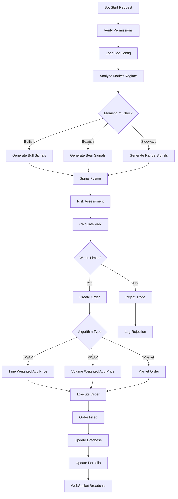
```mermaid
flowchart TD
    START[Bot Start Request] --> AUTH[Verify Permissions]
    AUTH --> CONFIG[Load Bot Config]
    CONFIG --> REGIME[Analyze Market Regime]
    
    REGIME --> MOMENTUM{Momentum Check}
    MOMENTUM -->|Bullish| BULL_SIGNAL[Generate Bull Signals]
    MOMENTUM -->|Bearish| BEAR_SIGNAL[Generate Bear Signals]
    MOMENTUM -->|Sideways| RANGE_SIGNAL[Generate Range Signals]
    
    BULL_SIGNAL --> SIGNAL_FUSION[Signal Fusion]
    BEAR_SIGNAL --> SIGNAL_FUSION
    RANGE_SIGNAL --> SIGNAL_FUSION
    
    SIGNAL_FUSION --> RISK_CHECK[Risk Assessment]
    RISK_CHECK --> VAR[Calculate VaR]
    VAR --> LIMIT_CHECK{Within Limits?}
    
    LIMIT_CHECK -->|No| REJECT[Reject Trade]
    LIMIT_CHECK -->|Yes| ORDER[Create Order]
    
    ORDER --> ALGO{Algorithm Type}
    ALGO -->|TWAP| TWAP[Time Weighted Avg Price]
    ALGO -->|VWAP| VWAP[Volume Weighted Avg Price]
    ALGO -->|Market| MARKET[Market Order]
    
    TWAP --> EXECUTE[Execute Order]
    VWAP --> EXECUTE
    MARKET --> EXECUTE
    
    EXECUTE --> FILL[Order Filled]
    FILL --> UPDATE_DB[Update Database]
    UPDATE_DB --> UPDATE_PORTFOLIO[Update Portfolio]
    UPDATE_PORTFOLIO --> BROADCAST[WebSocket Broadcast]
    
    REJECT --> LOG_REJECT[Log Rejection]
```

### 3.3 Real-time Data Flow

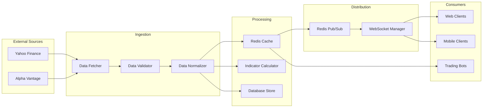
```mermaid
flowchart LR
    subgraph "External Sources"
        YAHOO[Yahoo Finance]
        ALPHA[Alpha Vantage]
    end

    subgraph "Ingestion"
        FETCH[Data Fetcher]
        VALIDATE[Data Validator]
        NORMALIZE[Data Normalizer]
    end

    subgraph "Processing"
        CACHE[Redis Cache]
        CALC[Indicator Calculator]
        STORE[Database Store]
    end

    subgraph "Distribution"
        PUBSUB[Redis Pub/Sub]
        WSM[WebSocket Manager]
    end

    subgraph "Consumers"
        WEB[Web Clients]
        MOBILE[Mobile Clients]
        BOTS[Trading Bots]
    end

    YAHOO --> FETCH
    ALPHA --> FETCH
    FETCH --> VALIDATE
    VALIDATE --> NORMALIZE
    
    NORMALIZE --> CACHE
    NORMALIZE --> CALC
    NORMALIZE --> STORE
    
    CACHE --> PUBSUB
    PUBSUB --> WSM
    
    WSM --> WEB
    WSM --> MOBILE
    CACHE --> BOTS
```

---

## 4. Data Lineage Diagrams

### 4.1 Market Data Lineage

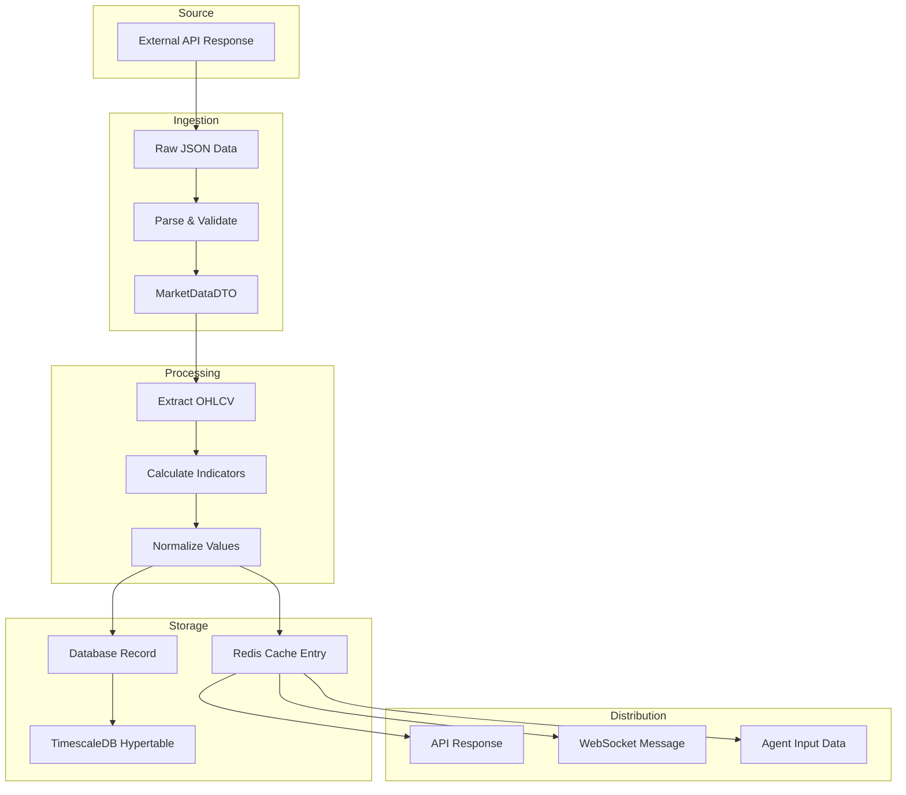
```mermaid
flowchart TB
    subgraph "Source"
        EXT_API[External API Response]
    end

    subgraph "Ingestion"
        RAW[Raw JSON Data]
        PARSE[Parse & Validate]
        DTO[MarketDataDTO]
    end

    subgraph "Processing"
        OHLCV[Extract OHLCV]
        INDICATORS[Calculate Indicators]
        NORMALIZE[Normalize Values]
    end

    subgraph "Storage"
        CACHE_ENTRY[Redis Cache Entry]
        DB_RECORD[Database Record]
        TS_DATA[TimescaleDB Hypertable]
    end

    subgraph "Distribution"
        API_RESPONSE[API Response]
        WS_MESSAGE[WebSocket Message]
        AGENT_INPUT[Agent Input Data]
    end

    EXT_API --> RAW
    RAW --> PARSE
    PARSE --> DTO
    
    DTO --> OHLCV
    OHLCV --> INDICATORS
    INDICATORS --> NORMALIZE
    
    NORMALIZE --> CACHE_ENTRY
    NORMALIZE --> DB_RECORD
    DB_RECORD --> TS_DATA
    
    CACHE_ENTRY --> API_RESPONSE
    CACHE_ENTRY --> WS_MESSAGE
    CACHE_ENTRY --> AGENT_INPUT
```

### 4.2 Trade Execution Data Lineage

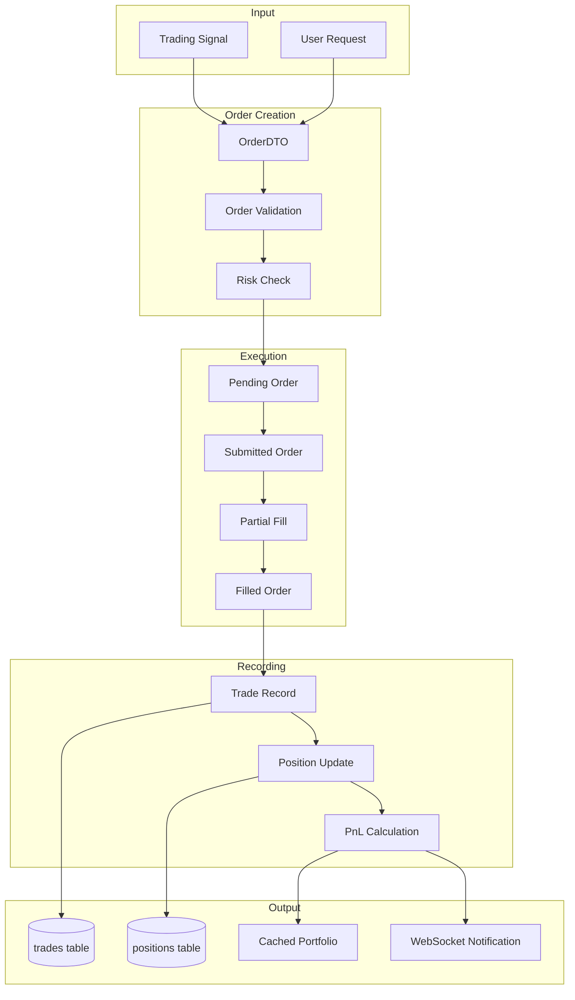
```mermaid
flowchart TB
    subgraph "Input"
        SIGNAL[Trading Signal]
        USER_REQ[User Request]
    end

    subgraph "Order Creation"
        ORDER_DTO[OrderDTO]
        VALIDATION[Order Validation]
        RISK_CHECK[Risk Check]
    end

    subgraph "Execution"
        PENDING[Pending Order]
        SUBMITTED[Submitted Order]
        PARTIAL[Partial Fill]
        FILLED[Filled Order]
    end

    subgraph "Recording"
        TRADE_RECORD[Trade Record]
        POSITION_UPDATE[Position Update]
        PNL_CALC[PnL Calculation]
    end

    subgraph "Output"
        DB_TRADE[(trades table)]
        DB_POSITION[(positions table)]
        CACHE_PORTFOLIO[Cached Portfolio]
        WS_NOTIFICATION[WebSocket Notification]
    end

    SIGNAL --> ORDER_DTO
    USER_REQ --> ORDER_DTO
    ORDER_DTO --> VALIDATION
    VALIDATION --> RISK_CHECK
    
    RISK_CHECK --> PENDING
    PENDING --> SUBMITTED
    SUBMITTED --> PARTIAL
    PARTIAL --> FILLED
    
    FILLED --> TRADE_RECORD
    TRADE_RECORD --> POSITION_UPDATE
    POSITION_UPDATE --> PNL_CALC
    
    TRADE_RECORD --> DB_TRADE
    POSITION_UPDATE --> DB_POSITION
    PNL_CALC --> CACHE_PORTFOLIO
    PNL_CALC --> WS_NOTIFICATION
```

### 4.3 User Authentication Data Lineage

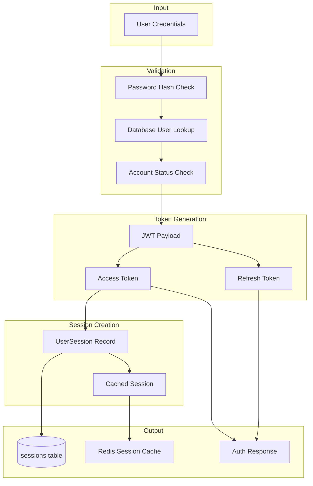
```mermaid
flowchart TB
    subgraph "Input"
        CREDS[User Credentials]
    end

    subgraph "Validation"
        HASH_CHECK[Password Hash Check]
        USER_LOOKUP[Database User Lookup]
        STATUS_CHECK[Account Status Check]
    end

    subgraph "Token Generation"
        PAYLOAD[JWT Payload]
        ACCESS[Access Token]
        REFRESH[Refresh Token]
    end

    subgraph "Session Creation"
        SESSION[UserSession Record]
        CACHE_SESSION[Cached Session]
    end

    subgraph "Output"
        DB_SESSION[(sessions table)]
        REDIS_SESSION[Redis Session Cache]
        RESPONSE[Auth Response]
    end

    CREDS --> HASH_CHECK
    HASH_CHECK --> USER_LOOKUP
    USER_LOOKUP --> STATUS_CHECK
    
    STATUS_CHECK --> PAYLOAD
    PAYLOAD --> ACCESS
    PAYLOAD --> REFRESH
    
    ACCESS --> SESSION
    SESSION --> CACHE_SESSION
    
    SESSION --> DB_SESSION
    CACHE_SESSION --> REDIS_SESSION
    ACCESS --> RESPONSE
    REFRESH --> RESPONSE
```

---

## 5. Class Structure Diagrams

### 5.1 Core Domain Models

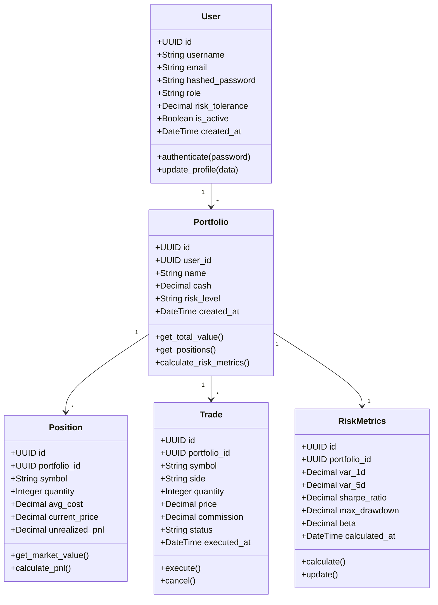
```mermaid
classDiagram
    class User {
        +UUID id
        +String username
        +String email
        +String hashed_password
        +String role
        +Decimal risk_tolerance
        +Boolean is_active
        +DateTime created_at
        +authenticate(password)
        +update_profile(data)
    }

    class Portfolio {
        +UUID id
        +UUID user_id
        +String name
        +Decimal cash
        +String risk_level
        +DateTime created_at
        +get_total_value()
        +get_positions()
        +calculate_risk_metrics()
    }

    class Position {
        +UUID id
        +UUID portfolio_id
        +String symbol
        +Integer quantity
        +Decimal avg_cost
        +Decimal current_price
        +Decimal unrealized_pnl
        +get_market_value()
        +calculate_pnl()
    }

    class Trade {
        +UUID id
        +UUID portfolio_id
        +String symbol
        +String side
        +Integer quantity
        +Decimal price
        +Decimal commission
        +String status
        +DateTime executed_at
        +execute()
        +cancel()
    }

    class RiskMetrics {
        +UUID id
        +UUID portfolio_id
        +Decimal var_1d
        +Decimal var_5d
        +Decimal sharpe_ratio
        +Decimal max_drawdown
        +Decimal beta
        +DateTime calculated_at
        +calculate()
        +update()
    }

    User "1" --> "*" Portfolio
    Portfolio "1" --> "*" Position
    Portfolio "1" --> "*" Trade
    Portfolio "1" --> "1" RiskMetrics
```

### 5.2 Service Layer Classes

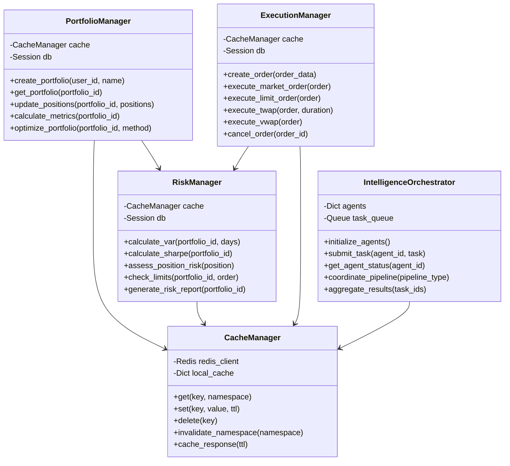
```mermaid
classDiagram
    class CacheManager {
        -Redis redis_client
        -Dict local_cache
        +get(key, namespace)
        +set(key, value, ttl)
        +delete(key)
        +invalidate_namespace(namespace)
        +cache_response(ttl)
    }

    class PortfolioManager {
        -CacheManager cache
        -Session db
        +create_portfolio(user_id, name)
        +get_portfolio(portfolio_id)
        +update_positions(portfolio_id, positions)
        +calculate_metrics(portfolio_id)
        +optimize_portfolio(portfolio_id, method)
    }

    class RiskManager {
        -CacheManager cache
        -Session db
        +calculate_var(portfolio_id, days)
        +calculate_sharpe(portfolio_id)
        +assess_position_risk(position)
        +check_limits(portfolio_id, order)
        +generate_risk_report(portfolio_id)
    }

    class ExecutionManager {
        -CacheManager cache
        -Session db
        +create_order(order_data)
        +execute_market_order(order)
        +execute_limit_order(order)
        +execute_twap(order, duration)
        +execute_vwap(order)
        +cancel_order(order_id)
    }

    class IntelligenceOrchestrator {
        -Dict agents
        -Queue task_queue
        +initialize_agents()
        +submit_task(agent_id, task)
        +get_agent_status(agent_id)
        +coordinate_pipeline(pipeline_type)
        +aggregate_results(task_ids)
    }

    PortfolioManager --> CacheManager
    PortfolioManager --> RiskManager
    RiskManager --> CacheManager
    ExecutionManager --> CacheManager
    ExecutionManager --> RiskManager
    IntelligenceOrchestrator --> CacheManager
```

### 5.3 WebSocket Classes

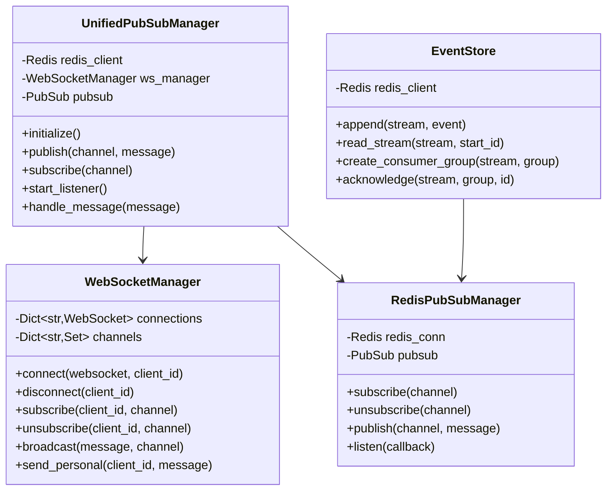
```mermaid
classDiagram
    class WebSocketManager {
        -Dict~str,WebSocket~ connections
        -Dict~str,Set~ channels
        +connect(websocket, client_id)
        +disconnect(client_id)
        +subscribe(client_id, channel)
        +unsubscribe(client_id, channel)
        +broadcast(message, channel)
        +send_personal(client_id, message)
    }

    class UnifiedPubSubManager {
        -Redis redis_client
        -WebSocketManager ws_manager
        -PubSub pubsub
        +initialize()
        +publish(channel, message)
        +subscribe(channel)
        +start_listener()
        +handle_message(message)
    }

    class RedisPubSubManager {
        -Redis redis_conn
        -PubSub pubsub
        +subscribe(channel)
        +unsubscribe(channel)
        +publish(channel, message)
        +listen(callback)
    }

    class EventStore {
        -Redis redis_client
        +append(stream, event)
        +read_stream(stream, start_id)
        +create_consumer_group(stream, group)
        +acknowledge(stream, group, id)
    }

    UnifiedPubSubManager --> WebSocketManager
    UnifiedPubSubManager --> RedisPubSubManager
    EventStore --> RedisPubSubManager
```

---

## 6. Sequence Diagrams

### 6.1 User Authentication Flow

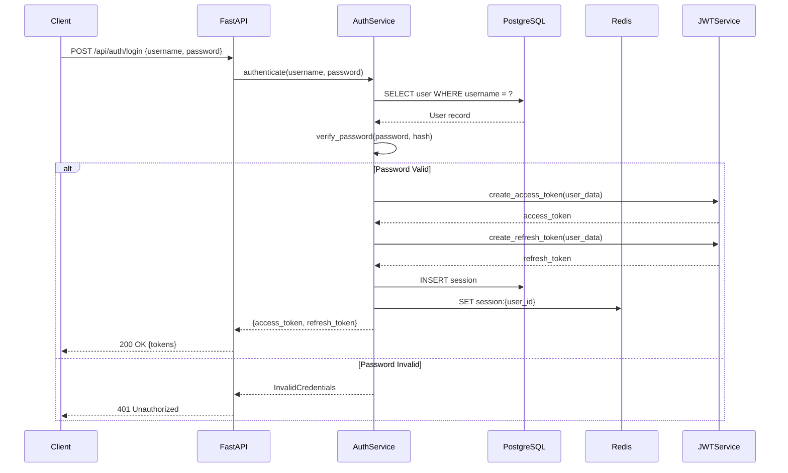
```mermaid
sequenceDiagram
    participant C as Client
    participant API as FastAPI
    participant AUTH as AuthService
    participant DB as PostgreSQL
    participant REDIS as Redis
    participant JWT as JWTService

    C->>API: POST /api/auth/login {username, password}
    API->>AUTH: authenticate(username, password)
    AUTH->>DB: SELECT user WHERE username = ?
    DB-->>AUTH: User record
    AUTH->>AUTH: verify_password(password, hash)
    
    alt Password Valid
        AUTH->>JWT: create_access_token(user_data)
        JWT-->>AUTH: access_token
        AUTH->>JWT: create_refresh_token(user_data)
        JWT-->>AUTH: refresh_token
        AUTH->>DB: INSERT session
        AUTH->>REDIS: SET session:{user_id}
        AUTH-->>API: {access_token, refresh_token}
        API-->>C: 200 OK {tokens}
    else Password Invalid
        AUTH-->>API: InvalidCredentials
        API-->>C: 401 Unauthorized
    end
```

### 6.2 Market Data Request Flow

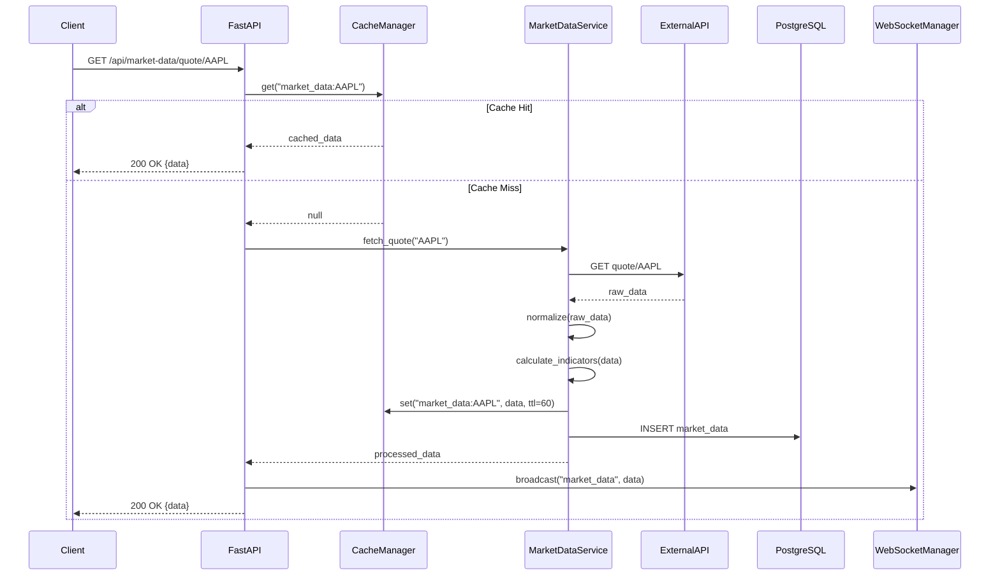
```mermaid
sequenceDiagram
    participant C as Client
    participant API as FastAPI
    participant CACHE as CacheManager
    participant SVC as MarketDataService
    participant EXT as ExternalAPI
    participant DB as PostgreSQL
    participant WS as WebSocketManager

    C->>API: GET /api/market-data/quote/AAPL
    API->>CACHE: get("market_data:AAPL")
    
    alt Cache Hit
        CACHE-->>API: cached_data
        API-->>C: 200 OK {data}
    else Cache Miss
        CACHE-->>API: null
        API->>SVC: fetch_quote("AAPL")
        SVC->>EXT: GET quote/AAPL
        EXT-->>SVC: raw_data
        SVC->>SVC: normalize(raw_data)
        SVC->>SVC: calculate_indicators(data)
        SVC->>CACHE: set("market_data:AAPL", data, ttl=60)
        SVC->>DB: INSERT market_data
        SVC-->>API: processed_data
        API->>WS: broadcast("market_data", data)
        API-->>C: 200 OK {data}
    end
```

### 6.3 Trading Bot Execution Flow

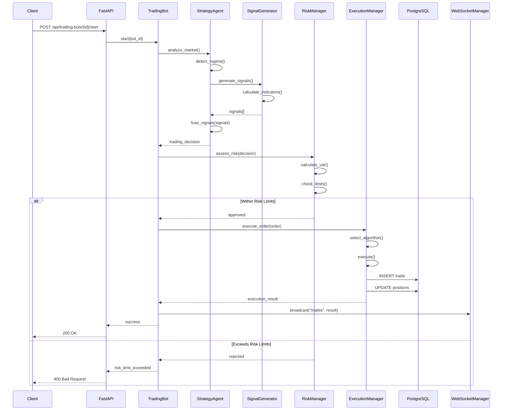
```mermaid
sequenceDiagram
    participant C as Client
    participant API as FastAPI
    participant BOT as TradingBot
    participant STRAT as StrategyAgent
    participant SIGNAL as SignalGenerator
    participant RISK as RiskManager
    participant EXEC as ExecutionManager
    participant DB as PostgreSQL
    participant WS as WebSocketManager

    C->>API: POST /api/trading-bots/{id}/start
    API->>BOT: start(bot_id)
    BOT->>STRAT: analyze_market()
    STRAT->>STRAT: detect_regime()
    STRAT->>SIGNAL: generate_signals()
    SIGNAL->>SIGNAL: calculate_indicators()
    SIGNAL-->>STRAT: signals[]
    
    STRAT->>STRAT: fuse_signals(signals)
    STRAT-->>BOT: trading_decision
    
    BOT->>RISK: assess_risk(decision)
    RISK->>RISK: calculate_var()
    RISK->>RISK: check_limits()
    
    alt Within Risk Limits
        RISK-->>BOT: approved
        BOT->>EXEC: execute_order(order)
        EXEC->>EXEC: select_algorithm()
        EXEC->>EXEC: execute()
        EXEC->>DB: INSERT trade
        EXEC->>DB: UPDATE positions
        EXEC-->>BOT: execution_result
        BOT->>WS: broadcast("trades", result)
        BOT-->>API: success
        API-->>C: 200 OK
    else Exceeds Risk Limits
        RISK-->>BOT: rejected
        BOT-->>API: risk_limit_exceeded
        API-->>C: 400 Bad Request
    end
```

### 6.4 WebSocket Connection Flow

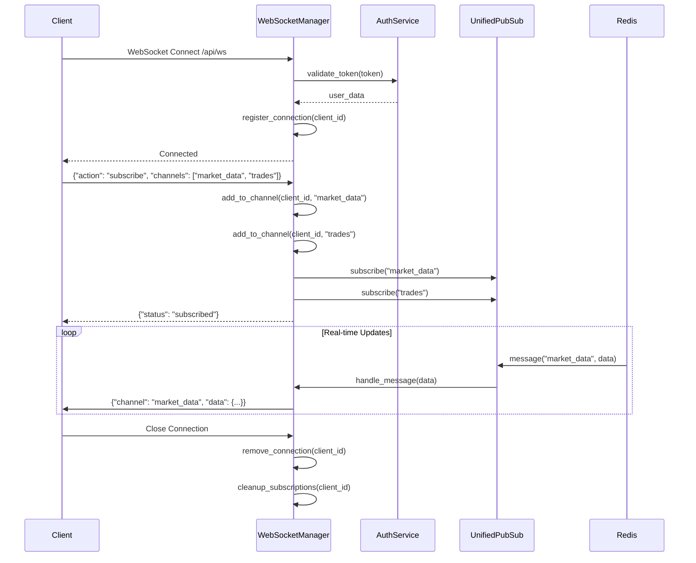
```mermaid
sequenceDiagram
    participant C as Client
    participant WS as WebSocketManager
    participant AUTH as AuthService
    participant PUBSUB as UnifiedPubSub
    participant REDIS as Redis

    C->>WS: WebSocket Connect /api/ws
    WS->>AUTH: validate_token(token)
    AUTH-->>WS: user_data
    WS->>WS: register_connection(client_id)
    WS-->>C: Connected
    
    C->>WS: {"action": "subscribe", "channels": ["market_data", "trades"]}
    WS->>WS: add_to_channel(client_id, "market_data")
    WS->>WS: add_to_channel(client_id, "trades")
    WS->>PUBSUB: subscribe("market_data")
    WS->>PUBSUB: subscribe("trades")
    WS-->>C: {"status": "subscribed"}
    
    loop Real-time Updates
        REDIS->>PUBSUB: message("market_data", data)
        PUBSUB->>WS: handle_message(data)
        WS->>C: {"channel": "market_data", "data": {...}}
    end
    
    C->>WS: Close Connection
    WS->>WS: remove_connection(client_id)
    WS->>WS: cleanup_subscriptions(client_id)
```

### 6.5 Portfolio Optimization Flow

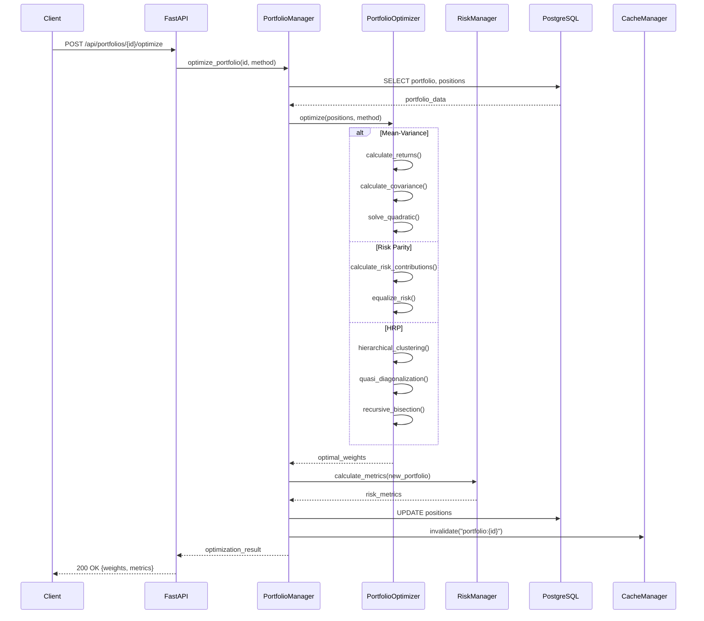
```mermaid
sequenceDiagram
    participant C as Client
    participant API as FastAPI
    participant PM as PortfolioManager
    participant PO as PortfolioOptimizer
    participant RISK as RiskManager
    participant DB as PostgreSQL
    participant CACHE as CacheManager

    C->>API: POST /api/portfolios/{id}/optimize
    API->>PM: optimize_portfolio(id, method)
    PM->>DB: SELECT portfolio, positions
    DB-->>PM: portfolio_data
    
    PM->>PO: optimize(positions, method)
    
    alt Mean-Variance
        PO->>PO: calculate_returns()
        PO->>PO: calculate_covariance()
        PO->>PO: solve_quadratic()
    else Risk Parity
        PO->>PO: calculate_risk_contributions()
        PO->>PO: equalize_risk()
    else HRP
        PO->>PO: hierarchical_clustering()
        PO->>PO: quasi_diagonalization()
        PO->>PO: recursive_bisection()
    end
    
    PO-->>PM: optimal_weights
    PM->>RISK: calculate_metrics(new_portfolio)
    RISK-->>PM: risk_metrics
    
    PM->>DB: UPDATE positions
    PM->>CACHE: invalidate("portfolio:{id}")
    PM-->>API: optimization_result
    API-->>C: 200 OK {weights, metrics}
```

---

## 7. Unified System Map

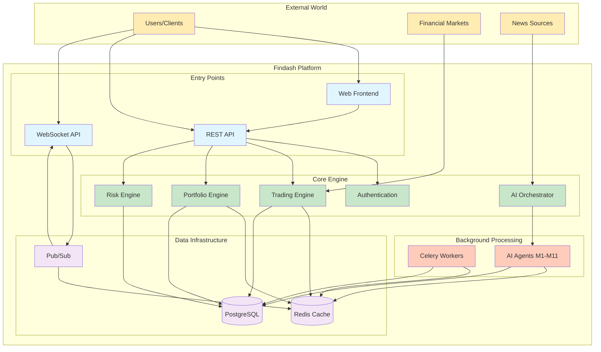
```mermaid
graph TB
    subgraph "External World"
        USERS[Users/Clients]
        MARKETS[Financial Markets]
        NEWS[News Sources]
    end

    subgraph "Findash Platform"
        subgraph "Entry Points"
            WEB[Web Frontend]
            API[REST API]
            WSS[WebSocket API]
        end

        subgraph "Core Engine"
            AUTH[Authentication]
            TRADING[Trading Engine]
            PORTFOLIO[Portfolio Engine]
            RISK[Risk Engine]
            AI[AI Orchestrator]
        end

        subgraph "Data Infrastructure"
            CACHE[(Redis Cache)]
            DB[(PostgreSQL)]
            PUBSUB[Pub/Sub]
        end

        subgraph "Background Processing"
            CELERY[Celery Workers]
            AGENTS[AI Agents M1-M11]
        end
    end

    USERS --> WEB
    USERS --> API
    USERS --> WSS
    
    WEB --> API
    API --> AUTH
    API --> TRADING
    API --> PORTFOLIO
    API --> RISK
    
    WSS --> PUBSUB
    
    TRADING --> CACHE
    TRADING --> DB
    PORTFOLIO --> CACHE
    PORTFOLIO --> DB
    RISK --> DB
    
    AI --> AGENTS
    AGENTS --> CACHE
    AGENTS --> DB
    
    CELERY --> CACHE
    CELERY --> DB
    
    MARKETS --> TRADING
    NEWS --> AI
    
    PUBSUB --> CACHE
    PUBSUB --> WSS
    
    classDef external fill:#ffecb3
    classDef entry fill:#e1f5fe
    classDef core fill:#c8e6c9
    classDef data fill:#f3e5f5
    classDef background fill:#ffccbc
    
    class USERS,MARKETS,NEWS external
    class WEB,API,WSS entry
    class AUTH,TRADING,PORTFOLIO,RISK,AI core
    class CACHE,DB,PUBSUB data
    class CELERY,AGENTS background
```

---

## Usage

To view these diagrams:
1. Use a Markdown viewer with Mermaid support (GitHub, GitLab, VS Code with Mermaid extension)
2. Copy individual diagram code to [Mermaid Live Editor](https://mermaid.live/)
3. Use the Mermaid CLI to generate images: `mmdc -i ARCHITECTURE_DIAGRAMS.md -o diagrams/`

## Diagram Legend

| Symbol | Meaning |
|--------|---------|
| Rectangle | Component/Service |
| Diamond | Decision Point |
| Cylinder | Database/Storage |
| Arrow | Data/Control Flow |
| Dashed Line | Optional/Async Flow |
