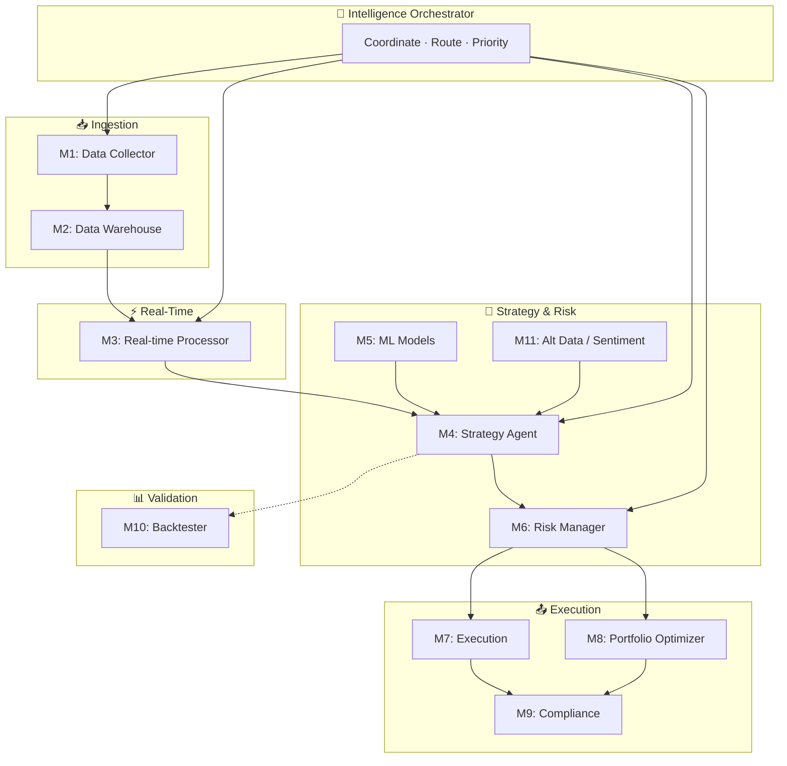
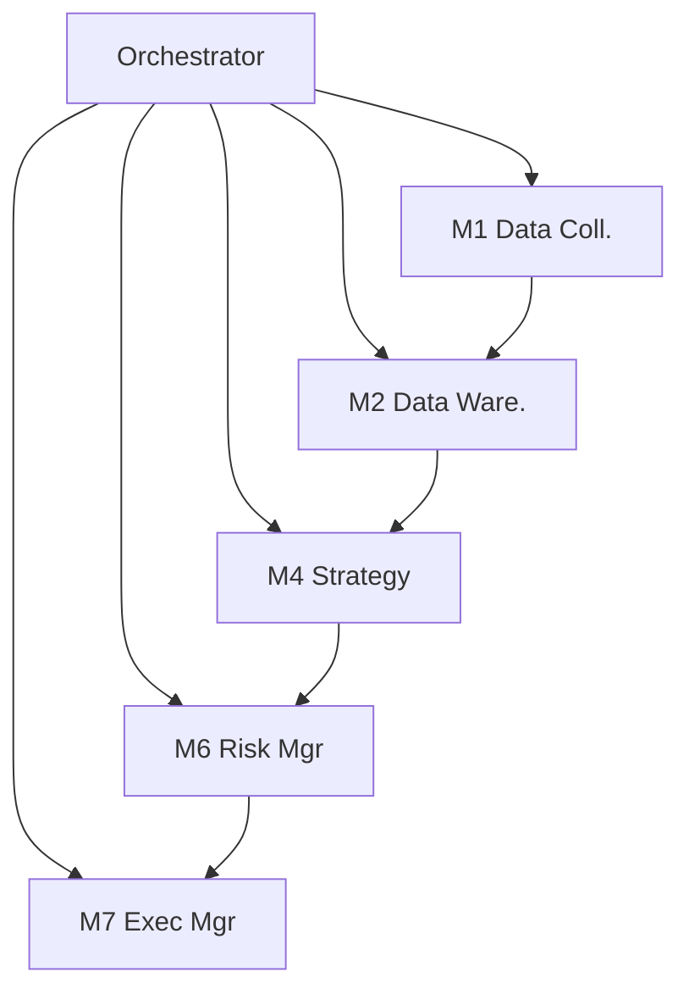

# AI Agents

The Octopus Trading Platform features 11 specialized AI agents orchestrated through an intelligent coordination layer. Each agent has specific responsibilities and communicates through the Intelligence Orchestrator.

## Agent Collaboration Flow (How Agents Work Together)



## Agent Quick Reference Chart

| Agent | Name | Role | Inputs | Outputs |
|-------|------|------|--------|---------|
| M1 | Data Collector | Ingest from APIs, news, social | External APIs | Normalized data |
| M2 | Data Warehouse | Store, index, query | M1 | Historical/OLAP |
| M3 | Real-time Processor | Stream processing | M2, live feeds | WebSocket, events |
| M4 | Strategy Agent | Signals, fusion, regime | M3, M5, M11 | Trading signals |
| M5 | ML Models | Forecast, classification | M2, M3 | Predictions |
| M6 | Risk Manager | VaR, limits, sizing | M4, portfolio | Approved size/orders |
| M7 | Execution Manager | Order routing | M6 | Fills, confirmations |
| M8 | Portfolio Optimizer | Allocation, rebalance | M6, M4 | Target weights |
| M9 | Compliance | Surveillance, audit | M7, M8 | Alerts, logs |
| M10 | Backtester | Historical validation | M4, M2 | Backtest results |
| M11 | Alternative Data | Sentiment, news, ESG | News, social | Sentiment scores |

## Intelligence Orchestrator

The central coordinator that manages all AI agents:

```python
class IntelligenceOrchestrator:
    """Orchestrates the 11 AI agents in the Octopus Trading Platform"""
    
    async def coordinate_pipeline(self, symbol: str, analysis_type: str) -> Dict[str, Any]:
        # Coordinates data flow between agents
        # Manages task distribution and priority
        # Ensures optimal resource utilization
```

### Key Responsibilities

- **Task Distribution**: Routes tasks to appropriate agents
- **Priority Management**: Handles critical tasks first
- **Resource Optimization**: Balances load across agents
- **Fault Tolerance**: Graceful degradation on failures

---

## The 11 AI Agents

### M1: Data Collector Agent

**Purpose**: Collects and ingests data from multiple sources.

```python
class DataCollectorAgent:
    """Collects financial data from various sources"""
    
    sources = [
        "Yahoo Finance",
        "Alpha Vantage", 
        "News APIs",
        "Social Media",
        "Broker APIs"
    ]
```

| Capability | Description |
|------------|-------------|
| Web Scraping | Financial websites and data sources |
| API Integration | Multiple data provider connections |
| Data Validation | Cleaning and normalization |
| Real-time Ingestion | Live market data feeds |

---

### M2: Data Warehouse Agent

**Purpose**: Manages structured data storage and retrieval.

| Capability | Description |
|------------|-------------|
| Data Storage | Organized financial data storage |
| Indexing | Optimized query performance |
| Historical Management | Long-term data retention |
| Query Optimization | Efficient data retrieval |

**Database Integration:**
- PostgreSQL for relational data
- TimescaleDB for time-series data
- Redis for hot data caching

---

### M3: Real-time Processor Agent

**Purpose**: Processes live market data streams.

```python
class RealtimeProcessorAgent:
    """Processes real-time market data"""
    
    async def process_stream(self, data_stream):
        # Event-driven processing
        # Real-time analytics
        # WebSocket distribution
```

| Capability | Description |
|------------|-------------|
| Stream Processing | Live data transformation |
| Event-driven | Reactive architecture |
| Real-time Analytics | Instant calculations |
| WebSocket Distribution | Client data delivery |

---

### M4: Strategy Agent

**Purpose**: Generates trading signals and strategies.

```python
class StrategyAgent:
    """Multi-strategy signal generation and fusion"""
    
    strategies = [
        "momentum",
        "mean_reversion", 
        "technical_analysis",
        "funding_rate",
        "signal_fusion"
    ]
    
    async def generate_trading_decision(self, symbol: str) -> TradingDecision:
        # 1. Analyze market regime
        # 2. Collect signals from all strategies
        # 3. Apply signal fusion
        # 4. Apply risk management
        # 5. Generate final decision
```

| Strategy | Description |
|----------|-------------|
| Momentum | Trend-following signals |
| Mean Reversion | Counter-trend signals |
| Technical Analysis | Indicator-based signals |
| Funding Rate | Crypto funding arbitrage |
| Signal Fusion | Multi-strategy combination |

---

### M5: ML Models Agent

**Purpose**: Machine learning predictions and inference.

| Model Type | Use Case |
|------------|----------|
| Time Series | Price forecasting with Prophet |
| Classification | Trend direction prediction |
| Regression | Price target estimation |
| Deep Learning | Complex pattern recognition |

**Supported Models:**
- Prophet (time series forecasting)
- Random Forest (classification)
- Gradient Boosting (regression)
- Neural Networks (deep learning)

---

### M6: Risk Manager Agent

**Purpose**: Risk assessment and management.

```python
class RiskManager:
    """Portfolio risk assessment and management"""
    
    async def assess_portfolio_risk(self, portfolio: Dict) -> PortfolioRisk:
        return PortfolioRisk(
            var_95=self.calculate_var(0.95),
            var_99=self.calculate_var(0.99),
            var_999=self.calculate_var(0.999),
            correlation_matrix=self.get_correlations(),
            sector_exposure=self.get_sector_exposure(),
            tail_risk=self.assess_tail_risk()
        )
```

| Metric | Description |
|--------|-------------|
| VaR 95% | Value at Risk (95% confidence) |
| VaR 99% | Value at Risk (99% confidence) |
| Correlation | Asset correlation matrix |
| Sector Exposure | Sector concentration risk |
| Tail Risk | Extreme event assessment |

---

### M7: Execution Manager Agent

**Purpose**: Order management and trade execution.

| Capability | Description |
|------------|-------------|
| Order Routing | Smart order routing |
| Execution Algorithms | TWAP, VWAP, POV |
| Broker Connectivity | Multi-broker support |
| Slippage Control | Execution quality |

**Supported Order Types:**
- Market orders
- Limit orders
- Stop orders
- Trailing stops
- Bracket orders

---

### M8: Portfolio Optimizer Agent

**Purpose**: Portfolio optimization and rebalancing.

| Algorithm | Description |
|-----------|-------------|
| Mean-Variance | Modern Portfolio Theory |
| Risk Parity | Equal risk contribution |
| Black-Litterman | Views-based allocation |
| Maximum Sharpe | Optimal risk-adjusted return |

---

### M9: Compliance Engine Agent

**Purpose**: Regulatory compliance and surveillance.

| Function | Description |
|----------|-------------|
| Trade Surveillance | Pattern detection |
| Audit Trails | Activity logging |
| Risk Limits | Limit enforcement |
| Regulatory Reports | Compliance reporting |

---

### M10: Enhanced Backtester Agent

**Purpose**: Historical strategy validation.

```python
class EnhancedBacktester:
    """Comprehensive strategy backtesting"""
    
    async def run_backtest(
        self,
        strategy: str,
        symbol: str,
        start_date: str,
        end_date: str
    ) -> BacktestResult:
        # Historical data replay
        # Transaction cost modeling
        # Performance metrics
        # Monte Carlo simulation
```

| Feature | Description |
|---------|-------------|
| Monte Carlo | Statistical robustness testing |
| Walk-forward | Out-of-sample validation |
| Multi-asset | Cross-asset testing |
| Attribution | Performance decomposition |

---

### M11: Alternative Data Agent

**Purpose**: Alternative data processing.

| Data Source | Analysis |
|-------------|----------|
| News | Sentiment analysis |
| Social Media | Twitter/Reddit signals |
| ESG Data | Environmental, Social, Governance |
| Economic | Macro indicators |

---

## Agent Communication

### Message Flow (Diagram)



*ASCII sketch:*
```
                    ┌─────────────────────┐
                    │    Orchestrator     │
                    │   (Coordinator)     │
                    └──────────┬──────────┘
                               │
         ┌─────────┬──────────┼──────────┬─────────┐
         ▼         ▼          ▼          ▼         ▼
      ┌─────┐  ┌─────┐    ┌─────┐    ┌─────┐  ┌─────┐
      │ M1  │  │ M2  │    │ M4  │    │ M6  │  │ M7  │
      │Data │  │Data │    │Strat│    │Risk │  │Exec │
      │Coll.│──│Ware │────│egy  │────│Mgr  │──│Mgr  │
      └─────┘  └─────┘    └─────┘    └─────┘  └─────┘
```

### Task Queue Integration

```python
# Celery task example
@celery_app.task
def process_market_data(symbol: str):
    """Background task for market data processing"""
    orchestrator = IntelligenceOrchestrator()
    return orchestrator.coordinate_pipeline(symbol, "market_data")
```

---

## Configuration

### Agent Settings

```yaml
# config/agents.yaml
agents:
  data_collector:
    enabled: true
    refresh_interval: 60  # seconds
    sources:
      - yahoo_finance
      - alpha_vantage
      
  risk_manager:
    enabled: true
    var_confidence_levels: [0.95, 0.99, 0.999]
    max_portfolio_var: 0.05
    
  strategy_agent:
    enabled: true
    strategies:
      - momentum
      - mean_reversion
    signal_fusion: weighted_average
```

---

## Monitoring

### Agent Metrics

| Metric | Description |
|--------|-------------|
| `agent_tasks_total` | Total tasks processed |
| `agent_task_duration_seconds` | Task processing time |
| `agent_errors_total` | Error count by agent |
| `agent_queue_length` | Pending tasks |

### Grafana Dashboard

The platform includes pre-configured Grafana dashboards for monitoring agent performance.

---

## Next Steps

- [[Architecture]] - Overall system architecture
- [[API Reference]] - API endpoints for agents
- [[Configuration]] - Detailed configuration options
