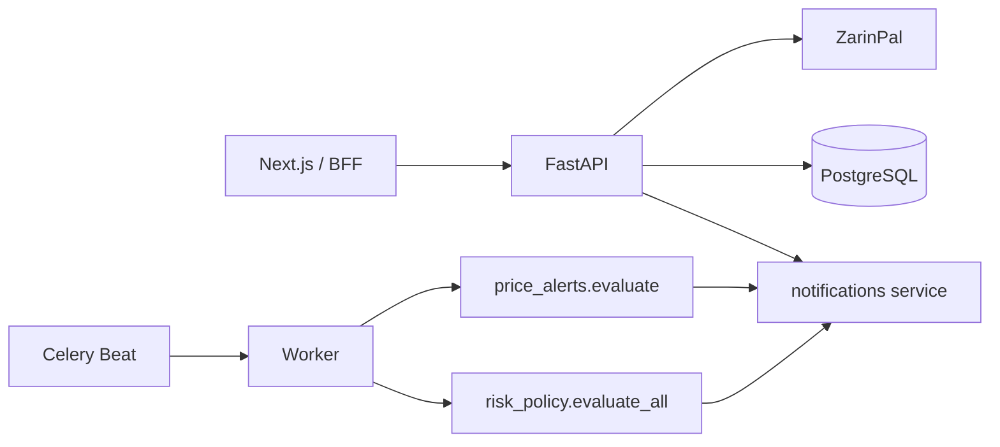

# Account Platform

Engineering reference for payments, IRT wallet, subscriptions, KYC, price alerts, risk policy, admin, OTP, and Persian PDF reports (issues #12–#14, #18–#22).

The full runbook with examples, env vars, and operator steps lives in the repo:

**[docs/ACCOUNT_PLATFORM.md](https://github.com/massoudsh/Findash/blob/main/docs/ACCOUNT_PLATFORM.md)**

Also: [[API Reference]], [[Database]], [[Configuration]], [[Frontend]].

---

## Intent

Findash’s account layer is Iran-market specific: ZarinPal (toman → rial ×10), IRT wallet, Sheba withdrawals, Shamsi/Persian output, and KaveNegar SMS. Side effects of a payment run **only after** ZarinPal verify, via `_dispatch_payment_success` in `src/api/endpoints/payment_zarinpal.py`.

---

## Public interfaces (verified)

Routers are included from `src/main_refactored.py`.

| Prefix | Auth | What to remember |
|--------|------|------------------|
| `/api/payment/zarinpal` | user except callback | `/create` allows `general` \| `wallet_topup` only |
| `/api/wallet` | user | IRT; deposit credits after verify; withdraw locks funds |
| `/api/subscriptions` | plans public | Price from `SubscriptionPlan`; `/me` checks `end_at` |
| `/api/kyc` | user / admin | Checksum + mobile validation; no live registry |
| `/api/alerts` | user / admin evaluate | Symbols from `/api/iran-market/overview`; one-shot |
| `/api/risk-policy` | user / admin evaluate-all | Defaults 5% DD / 30% concentration |
| `/api/admin` | admin | Cannot self-demote |
| `/api/reports` | user | Wrong portfolio → 404; missing Vazirmatn → 503 |
| `/api/auth/send-otp` | public | 3/10min; in-memory store |
| `POST /api/trading-bots/{id}/start` | user + sub | HTTP **402** if no active sub (admin exempt) |

Default plans if the table is empty: `basic` 99k, `pro` 249k, `elite` 499k toman / 30 days.

---

## Frontend

| Page | Role |
|------|------|
| `/account`, `/account/subscription` | Profile + plan |
| `/payment/checkout` → callback → success/failed | ZarinPal loop |
| `/alerts`, `/risk/policy` | Rules and policy UI |
| `/admin`, `/audit-log` | Admin |
| `/auth/otp`, `/auth/phone` | OTP |

Next.js BFF proxies subscriptions, risk-policy, admin, and payment create. Wallet / KYC / alerts / PDF talk to FastAPI with JWT.

---

## Ops pitfalls

- `ZARINPAL_MERCHANT_ID` required in production; missing → 503.
- Paid order + empty wallet/sub → check logs for `Payment success but dispatch failed`.
- Withdrawals stay `pending` until a payout provider exists.
- Alerts/risk need **celery-worker and celery-beat**.
- OTP does not survive multi-worker or restart (process memory).
- PDF needs Vazirmatn + `arabic-reshaper` + `python-bidi`.

Celery schedule: alerts **60s**, risk **300s**. See [[Deployment]] and `docs/CELERY_FLOW.md`.
