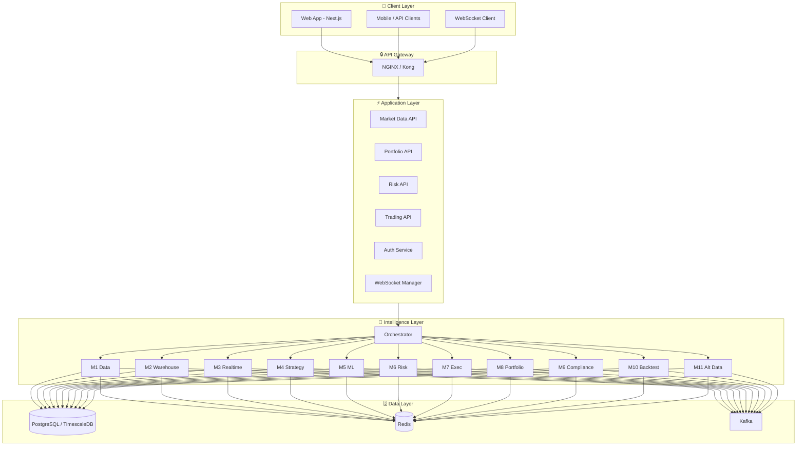
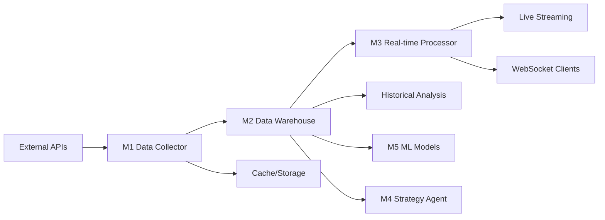
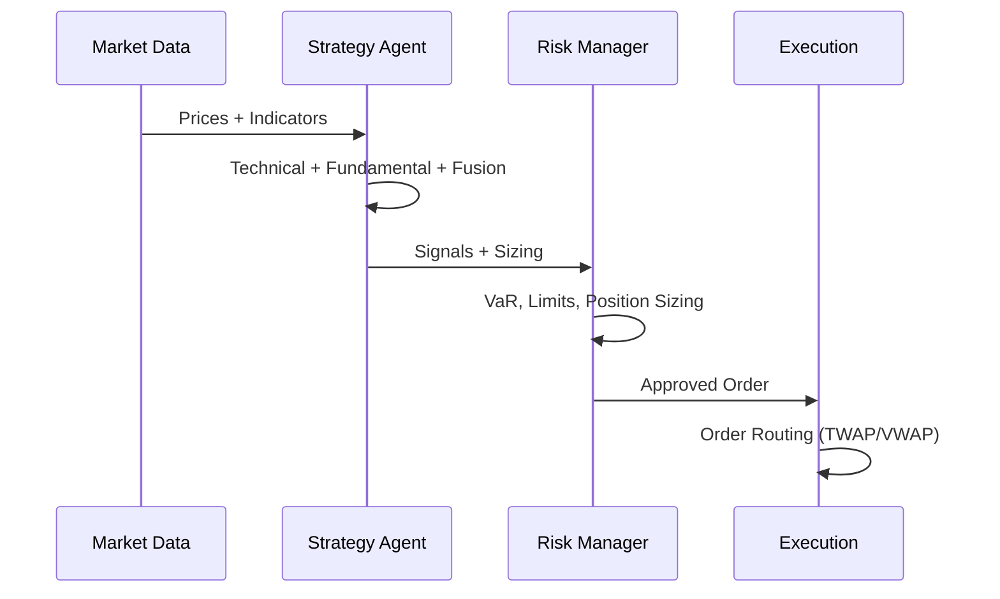
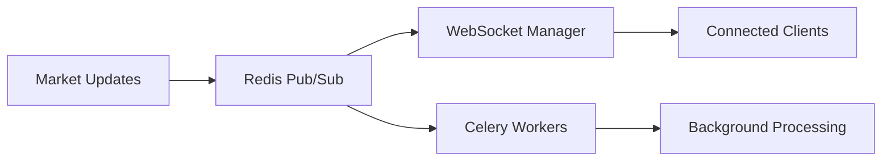
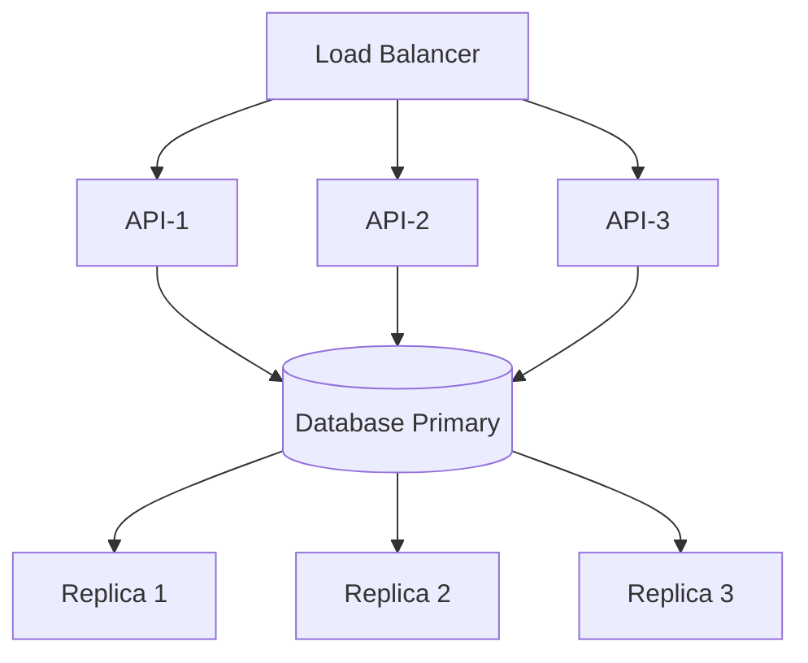
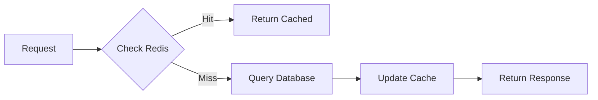
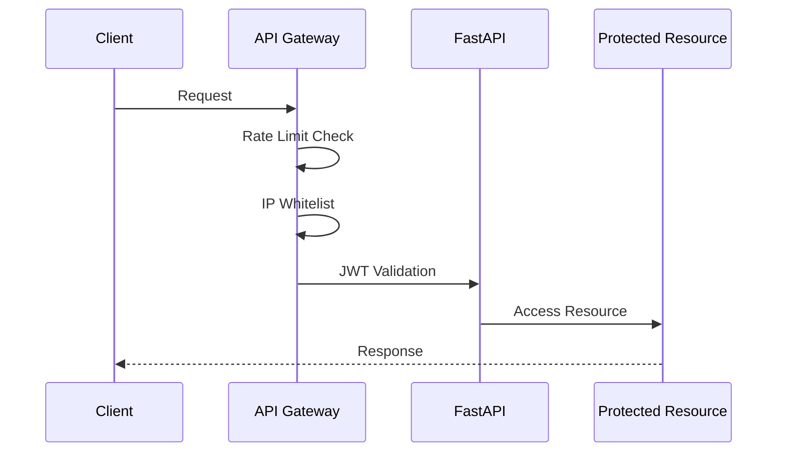
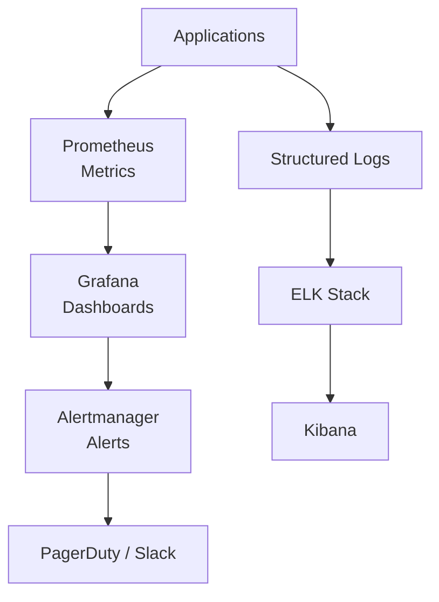

# System Architecture

The Octopus Trading Platform is built on a modern, scalable microservices architecture designed for high-performance financial data processing.

## Architecture Overview

### Layer Diagram (Mermaid)



### ASCII Layer Sketch (Reference)

```
┌─────────────────────────────────────────────────────────────────────────────┐
│                              CLIENT LAYER                                    │
├─────────────────────────────────────────────────────────────────────────────┤
│  ┌─────────────┐  ┌─────────────┐  ┌─────────────┐  ┌─────────────┐        │
│  │  Web App    │  │ Mobile App  │  │  API Client │  │  WebSocket  │        │
│  │ (Next.js)   │  │  (React    │  │  (Python/   │  │   Client    │        │
│  │             │  │   Native)   │  │    JS/Go)   │  │             │        │
│  └──────┬──────┘  └──────┬──────┘  └──────┬──────┘  └──────┬──────┘        │
└─────────┼────────────────┼────────────────┼────────────────┼────────────────┘
          │                │                │                │
          ▼                ▼                ▼                ▼
┌─────────────────────────────────────────────────────────────────────────────┐
│                            API GATEWAY LAYER                                 │
├─────────────────────────────────────────────────────────────────────────────┤
│  ┌─────────────────────────────────────────────────────────────────────┐   │
│  │                     NGINX / Kong API Gateway                         │   │
│  │  • Load Balancing  • Rate Limiting  • SSL Termination  • Auth       │   │
│  └─────────────────────────────────────────────────────────────────────┘   │
└─────────────────────────────────────────────────────────────────────────────┘
          │
          ▼
┌─────────────────────────────────────────────────────────────────────────────┐
│                          APPLICATION LAYER                                   │
├─────────────────────────────────────────────────────────────────────────────┤
│  ┌─────────────────────────────────────────────────────────────────────┐   │
│  │                        FastAPI Backend                               │   │
│  │  ┌───────────┐  ┌───────────┐  ┌───────────┐  ┌───────────┐        │   │
│  │  │  Market   │  │ Portfolio │  │   Risk    │  │    AI     │        │   │
│  │  │  Data API │  │    API    │  │    API    │  │  Models   │        │   │
│  │  └───────────┘  └───────────┘  └───────────┘  └───────────┘        │   │
│  │  ┌───────────┐  ┌───────────┐  ┌───────────┐  ┌───────────┐        │   │
│  │  │  Trading  │  │ WebSocket │  │   Auth    │  │ Analytics │        │   │
│  │  │    API    │  │  Manager  │  │  Service  │  │  Service  │        │   │
│  │  └───────────┘  └───────────┘  └───────────┘  └───────────┘        │   │
│  └─────────────────────────────────────────────────────────────────────┘   │
└─────────────────────────────────────────────────────────────────────────────┘
          │
          ▼
┌─────────────────────────────────────────────────────────────────────────────┐
│                        INTELLIGENCE LAYER                                    │
├─────────────────────────────────────────────────────────────────────────────┤
│  ┌─────────────────────────────────────────────────────────────────────┐   │
│  │              Intelligence Orchestrator (11 AI Agents)                │   │
│  │  ┌─────┐ ┌─────┐ ┌─────┐ ┌─────┐ ┌─────┐ ┌─────┐                   │   │
│  │  │ M1  │ │ M2  │ │ M3  │ │ M4  │ │ M5  │ │ M6  │                   │   │
│  │  │Data │ │Data │ │Real │ │Strat│ │ ML  │ │Risk │                   │   │
│  │  │Coll.│ │Ware.│ │time │ │egy  │ │Model│ │Mgr  │                   │   │
│  │  └─────┘ └─────┘ └─────┘ └─────┘ └─────┘ └─────┘                   │   │
│  │  ┌─────┐ ┌─────┐ ┌─────┐ ┌─────┐ ┌─────┐                           │   │
│  │  │ M7  │ │ M8  │ │ M9  │ │ M10 │ │ M11 │                           │   │
│  │  │Exec.│ │Port.│ │Comp.│ │Back │ │Alt. │                           │   │
│  │  │Mgr  │ │Opt. │ │lianc│ │test │ │Data │                           │   │
│  │  └─────┘ └─────┘ └─────┘ └─────┘ └─────┘                           │   │
│  └─────────────────────────────────────────────────────────────────────┘   │
└─────────────────────────────────────────────────────────────────────────────┘
          │
          ▼
┌─────────────────────────────────────────────────────────────────────────────┐
│                           DATA LAYER                                         │
├─────────────────────────────────────────────────────────────────────────────┤
│  ┌───────────────┐  ┌───────────────┐  ┌───────────────┐                   │
│  │  PostgreSQL   │  │    Redis      │  │   Kafka       │                   │
│  │  TimescaleDB  │  │    Cache      │  │   Streaming   │                   │
│  │  • Market Data│  │  • Sessions   │  │  • Events     │                   │
│  │  • Users      │  │  • Cache      │  │  • Messages   │                   │
│  │  • Portfolios │  │  • Pub/Sub    │  │  • Real-time  │                   │
│  └───────────────┘  └───────────────┘  └───────────────┘                   │
└─────────────────────────────────────────────────────────────────────────────┘
```

---

## Component Details

### 1. Client Layer

| Component | Technology | Purpose |
|-----------|------------|---------|
| Web App | Next.js 14 | Primary trading interface |
| Mobile App | React Native | Mobile trading (planned) |
| API Clients | Python/JS/Go SDKs | Programmatic access |
| WebSocket | Native WS | Real-time data streaming |

### 2. API Gateway Layer

- **NGINX**: Load balancing and SSL termination
- **Kong/APISIX**: API management and rate limiting
- **Authentication**: JWT token validation
- **Rate Limiting**: Request throttling per user/IP

### 3. Application Layer (FastAPI)

```
src/
├── api/
│   ├── endpoints/
│   │   ├── agents.py          # AI agent monitoring
│   │   ├── auth.py            # Authentication
│   │   ├── backtesting.py     # Strategy backtesting
│   │   ├── market_data.py     # Market data endpoints
│   │   ├── portfolio_api.py   # Portfolio management
│   │   ├── risk.py            # Risk analysis
│   │   ├── trading.py         # Trading operations
│   │   └── websocket.py       # WebSocket endpoints
│   └── routes/
│       └── ...                # Route definitions
├── core/
│   ├── config.py              # Configuration management
│   ├── cache.py               # Redis cache manager
│   ├── celery_app.py          # Celery configuration
│   └── security.py            # Security utilities
└── main_refactored.py         # FastAPI application
```

### 4. Intelligence Layer

See [[AI Agents]] for detailed documentation on the 11 AI agents.

### 5. Data Layer

| Database | Purpose | Features |
|----------|---------|----------|
| PostgreSQL | Primary storage | ACID compliance, relations |
| TimescaleDB | Time-series | Hypertables, compression |
| Redis | Caching | Sub-millisecond latency |
| Kafka | Streaming | Event-driven architecture |

---

## Data Flow Patterns

### Market Data Pipeline



*Text version:*
```
External APIs → Data Collector (M1) → Data Warehouse (M2) → Real-time Processor (M3)
                     ↓                         ↓                        ↓
               Cache/Storage              Historical Analysis      Live Streaming
                     ↓                         ↓                        ↓
                ML Models (M5)         Strategy Agent (M4)      WebSocket Clients
```

### Trading Decision Flow



*Text version:*
```
Market Data → Strategy Agent (M4) → Signal Fusion → Risk Manager (M6) → Execution (M7)
      ↓              ↓                    ↓              ↓                    ↓
  Technical      Fundamental         Multi-Strategy   Position           Order
  Analysis       Analysis            Signals          Sizing             Routing
```

### Real-time Communication



---

## Scalability Design

### Horizontal Scaling



*ASCII reference:*
```
                    ┌──────────────┐
                    │ Load Balancer│
                    └──────┬───────┘
           ┌───────────────┼───────────────┐
           ▼               ▼               ▼
    ┌──────────┐    ┌──────────┐    ┌──────────┐
    │  API-1   │    │  API-2   │    │  API-3   │
    └──────────┘    └──────────┘    └──────────┘
           │               │               │
           └───────────────┼───────────────┘
                           ▼
                    ┌──────────────┐
                    │  Database    │
                    │  (Primary)   │
                    └──────┬───────┘
                           │
              ┌────────────┼────────────┐
              ▼            ▼            ▼
        ┌──────────┐ ┌──────────┐ ┌──────────┐
        │ Replica  │ │ Replica  │ │ Replica  │
        │    1     │ │    2     │ │    3     │
        └──────────┘ └──────────┘ └──────────┘
```

### Caching Strategy



---

## Security Architecture

### Authentication Flow



### Security Layers

| Layer | Protection |
|-------|------------|
| Network | Firewall, DDoS protection |
| Transport | TLS 1.3, HSTS |
| Application | JWT, OAuth2, rate limiting |
| Data | Encryption at rest, RLS |

---

## Monitoring Stack



*ASCII:*
```
Applications → Prometheus (Metrics) → Grafana (Dashboards) → Alertmanager (Alerts)
     ↓                                        ↓
Structured Logs → ELK Stack → Kibana         PagerDuty/Slack
```

### Key Metrics

- Request latency (p50, p95, p99)
- Error rates by endpoint
- Database connection pool
- Cache hit/miss ratio
- WebSocket connections
- Celery task queue length

---

## Next Steps

- [[AI Agents]] - Deep dive into the 11 AI agents
- [[API Reference]] - Complete API documentation
- [[Database]] - Database schema details
- [[Deployment]] - Production deployment guide
