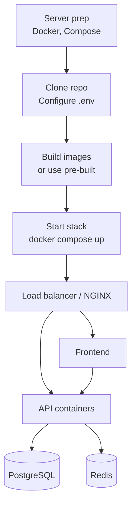

# Production Deployment Guide

Complete guide for deploying the Octopus Trading Platform to production.

## Deployment Flow Overview



## System Requirements

### Hardware

| Resource | Minimum | Recommended |
|----------|---------|-------------|
| CPU | 8 cores | 16+ cores |
| RAM | 16GB | 32GB+ |
| Storage | 500GB SSD | 1TB+ NVMe |
| Network | 1 Gbps | 10 Gbps |

### Software

- **OS**: Ubuntu 22.04 LTS or RHEL 8+
- **Docker**: 24.0+
- **Docker Compose**: 2.20+
- **NGINX**: 1.20+
- **PostgreSQL**: 15+ with TimescaleDB
- **Redis**: 7+

---

## Deployment Methods

### Method 1: Docker Compose (Single Server)

#### 1. Server Preparation

```bash
# Update system
sudo apt update && sudo apt upgrade -y

# Install Docker
curl -fsSL https://get.docker.com -o get-docker.sh
sudo sh get-docker.sh
sudo usermod -aG docker $USER

# Install Docker Compose
sudo apt install docker-compose-plugin

# Create application directory
sudo mkdir -p /opt/octopus-trading
sudo chown $USER:$USER /opt/octopus-trading
```

#### 2. Clone and Configure

```bash
cd /opt/octopus-trading
git clone https://github.com/massoudsh/Findash.git .

# Copy environment file
cp config/env.example .env

# Generate secure secrets
python3 -c "import secrets; print('SECRET_KEY=' + secrets.token_urlsafe(32))" >> .env
python3 -c "import secrets; print('JWT_SECRET_KEY=' + secrets.token_urlsafe(32))" >> .env
```

#### 3. Production Environment

```bash
# Edit .env file
nano .env
```

**Production `.env`:**
```bash
# Environment
ENVIRONMENT=production
DEBUG=false
LOG_LEVEL=INFO

# Security
SECRET_KEY=<generated-secret>
JWT_SECRET_KEY=<generated-jwt-secret>

# Database
DATABASE_URL=postgresql://octopus_app:secure_password@db:5432/trading_db
DB_PASSWORD=secure_database_password

# Redis
REDIS_URL=redis://:secure_redis_password@redis:6379/0
REDIS_PASSWORD=secure_redis_password

# Production Security
FORCE_HTTPS=true
SECURE_COOKIES=true
HSTS_MAX_AGE=31536000

# CORS
CORS_ORIGINS=https://your-domain.com

# Monitoring
GRAFANA_ADMIN_PASSWORD=secure_grafana_password
```

#### 4. SSL Certificate Setup

```bash
# Install Certbot
sudo apt install certbot python3-certbot-nginx

# Generate certificates
sudo certbot certonly --standalone -d your-domain.com -d www.your-domain.com

# Auto-renewal
sudo crontab -e
# Add: 0 12 * * * /usr/bin/certbot renew --quiet
```

#### 5. NGINX Configuration

```bash
sudo nano /etc/nginx/sites-available/octopus-trading
```

**NGINX Config:**
```nginx
upstream api_backend {
    server 127.0.0.1:8000;
    keepalive 32;
}

upstream frontend_backend {
    server 127.0.0.1:3000;
    keepalive 32;
}

# Redirect HTTP to HTTPS
server {
    listen 80;
    server_name your-domain.com www.your-domain.com;
    return 301 https://$server_name$request_uri;
}

# Main HTTPS server
server {
    listen 443 ssl http2;
    server_name your-domain.com www.your-domain.com;

    # SSL Configuration
    ssl_certificate /etc/letsencrypt/live/your-domain.com/fullchain.pem;
    ssl_certificate_key /etc/letsencrypt/live/your-domain.com/privkey.pem;
    ssl_protocols TLSv1.2 TLSv1.3;
    ssl_ciphers ECDHE-RSA-AES256-GCM-SHA512:DHE-RSA-AES256-GCM-SHA512;
    ssl_prefer_server_ciphers off;

    # Security Headers
    add_header Strict-Transport-Security "max-age=63072000" always;
    add_header X-Frame-Options DENY;
    add_header X-Content-Type-Options nosniff;
    add_header X-XSS-Protection "1; mode=block";

    # API Routes
    location /api/ {
        proxy_pass http://api_backend;
        proxy_http_version 1.1;
        proxy_set_header Upgrade $http_upgrade;
        proxy_set_header Connection 'upgrade';
        proxy_set_header Host $host;
        proxy_set_header X-Real-IP $remote_addr;
        proxy_set_header X-Forwarded-For $proxy_add_x_forwarded_for;
        proxy_set_header X-Forwarded-Proto $scheme;
    }

    # WebSocket Routes
    location /ws/ {
        proxy_pass http://api_backend;
        proxy_http_version 1.1;
        proxy_set_header Upgrade $http_upgrade;
        proxy_set_header Connection "upgrade";
        proxy_set_header Host $host;
        proxy_read_timeout 86400;
    }

    # Frontend Routes
    location / {
        proxy_pass http://frontend_backend;
        proxy_http_version 1.1;
        proxy_set_header Host $host;
        proxy_cache_bypass $http_upgrade;
    }

    # Static file caching
    location ~* \.(js|css|png|jpg|jpeg|gif|ico|svg)$ {
        expires 1y;
        add_header Cache-Control "public, immutable";
    }
}
```

```bash
# Enable site
sudo ln -s /etc/nginx/sites-available/octopus-trading /etc/nginx/sites-enabled/
sudo nginx -t
sudo systemctl restart nginx
```

#### 6. Deploy Application

```bash
# Start all services
docker compose -f docker-compose-complete.yml up -d

# Verify deployment
docker compose ps
docker compose logs -f
```

---

### Method 2: Kubernetes

#### Namespace

```yaml
# k8s/namespace.yaml
apiVersion: v1
kind: Namespace
metadata:
  name: octopus-trading
```

#### ConfigMap

```yaml
# k8s/configmap.yaml
apiVersion: v1
kind: ConfigMap
metadata:
  name: octopus-config
  namespace: octopus-trading
data:
  ENVIRONMENT: "production"
  LOG_LEVEL: "INFO"
  API_HOST: "0.0.0.0"
  API_PORT: "8000"
```

#### API Deployment

```yaml
# k8s/api-deployment.yaml
apiVersion: apps/v1
kind: Deployment
metadata:
  name: octopus-api
  namespace: octopus-trading
spec:
  replicas: 3
  selector:
    matchLabels:
      app: octopus-api
  template:
    metadata:
      labels:
        app: octopus-api
    spec:
      containers:
      - name: api
        image: octopus-trading-api:latest
        ports:
        - containerPort: 8000
        envFrom:
        - configMapRef:
            name: octopus-config
        - secretRef:
            name: octopus-secrets
        resources:
          requests:
            memory: "1Gi"
            cpu: "500m"
          limits:
            memory: "2Gi"
            cpu: "1000m"
        livenessProbe:
          httpGet:
            path: /health
            port: 8000
          initialDelaySeconds: 30
          periodSeconds: 10
        readinessProbe:
          httpGet:
            path: /health
            port: 8000
          initialDelaySeconds: 5
          periodSeconds: 5
```

---

## Database Setup

### PostgreSQL Configuration

```bash
# Create database user
sudo -u postgres psql
CREATE ROLE octopus_app WITH LOGIN PASSWORD 'secure_password';
CREATE DATABASE trading_db OWNER octopus_app;

# Enable TimescaleDB
\c trading_db
CREATE EXTENSION IF NOT EXISTS timescaledb;
```

### Run Migrations

```bash
docker compose exec api python -m alembic upgrade head
```

---

## Monitoring Setup

### Prometheus

```yaml
# monitoring/prometheus.yml
global:
  scrape_interval: 15s

scrape_configs:
  - job_name: 'octopus-api'
    static_configs:
      - targets: ['api:8000']
    metrics_path: '/metrics'

  - job_name: 'postgres'
    static_configs:
      - targets: ['postgres-exporter:9187']

  - job_name: 'redis'
    static_configs:
      - targets: ['redis-exporter:9121']

alerting:
  alertmanagers:
    - static_configs:
        - targets: ['alertmanager:9093']
```

### Alert Rules

```yaml
# monitoring/alert_rules.yml
groups:
- name: octopus_alerts
  rules:
  - alert: HighErrorRate
    expr: sum(rate(http_requests_total{status=~"5.."}[5m])) > 0.1
    for: 5m
    annotations:
      summary: "High error rate detected"
      
  - alert: DatabaseDown
    expr: up{job="postgres"} == 0
    for: 1m
    annotations:
      summary: "Database is down"
      
  - alert: HighMemoryUsage
    expr: container_memory_usage_bytes / container_spec_memory_limit_bytes > 0.9
    for: 10m
    annotations:
      summary: "High memory usage"
```

---

## Security Hardening

### Firewall

```bash
sudo ufw default deny incoming
sudo ufw default allow outgoing
sudo ufw allow ssh
sudo ufw allow 80
sudo ufw allow 443
sudo ufw enable
```

### Container Security

```dockerfile
# Run as non-root
RUN groupadd -r octopus && useradd -r -g octopus octopus
USER octopus
```

---

## Backup Strategy

### Automated Backup Script

```bash
#!/bin/bash
# /opt/scripts/backup-octopus.sh

BACKUP_DIR="/opt/backups/octopus"
DATE=$(date +%Y%m%d_%H%M%S)
DB_BACKUP="$BACKUP_DIR/db_backup_$DATE.sql"

# Create backup directory
mkdir -p $BACKUP_DIR

# Database backup
docker compose exec -T db pg_dump -U octopus_app trading_db > $DB_BACKUP

# Compress
gzip $DB_BACKUP

# Upload to S3 (optional)
aws s3 cp $DB_BACKUP.gz s3://your-backup-bucket/database/

# Cleanup old backups (keep 30 days)
find $BACKUP_DIR -name "*.sql.gz" -mtime +30 -delete

echo "Backup completed: $DATE"
```

```bash
# Schedule backup
chmod +x /opt/scripts/backup-octopus.sh
sudo crontab -e
# Add: 0 2 * * * /opt/scripts/backup-octopus.sh
```

---

## Health Checks

### Endpoints

| Endpoint | Description |
|----------|-------------|
| `GET /health` | Basic health check |
| `GET /health/db` | Database health |
| `GET /health/redis` | Redis health |
| `GET /health/all` | Comprehensive check |

---

## Troubleshooting

### Common Issues

**1. API Not Responding**
```bash
docker compose ps
docker compose logs api
docker stats
```

**2. Database Connection Issues**
```bash
docker compose exec api python -c "
from src.database.postgres_connection import init_db_connection
init_db_connection()
print('Connection successful')
"
```

**3. SSL Certificate Issues**
```bash
sudo certbot renew
sudo systemctl reload nginx
```

### Log Analysis

```bash
# Application logs
docker compose logs -f api

# NGINX logs
sudo tail -f /var/log/nginx/access.log
sudo tail -f /var/log/nginx/error.log

# System logs
sudo journalctl -f -u docker
```

---

## Maintenance

### Regular Tasks

| Frequency | Task |
|-----------|------|
| Daily | Monitor resources, check logs, verify backups |
| Weekly | Review security logs, update packages |
| Monthly | SSL renewal check, security audit, performance review |

### Update Procedure

```bash
# Pull latest code
git pull origin main

# Rebuild and restart
docker compose build
docker compose up -d

# Verify
docker compose ps
curl https://your-domain.com/health
```

---

## Next Steps

- [[Configuration]] - Environment configuration
- [[Architecture]] - System architecture
- [[Database]] - Database schema
