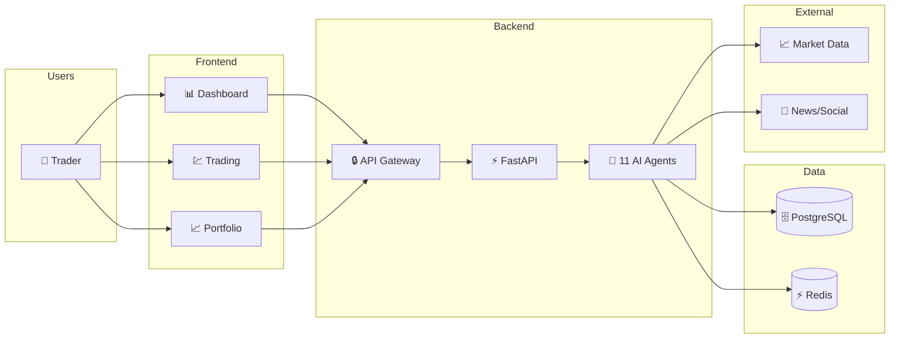
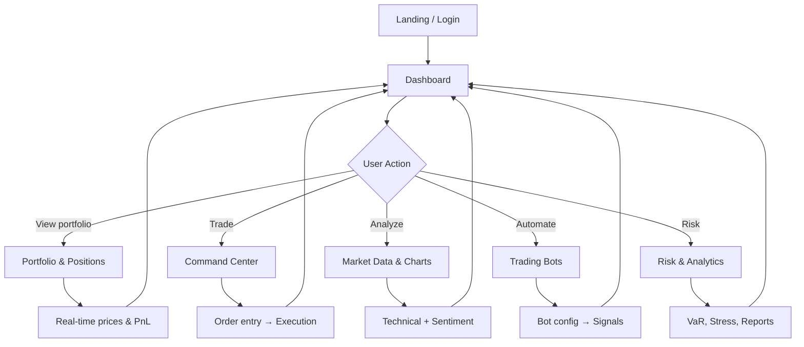
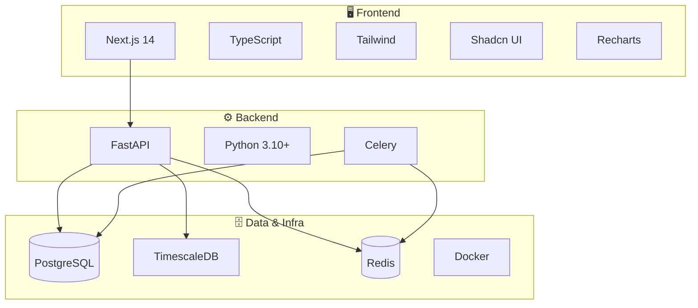

# Octopus Trading Platform – Findash Wiki

<p align="center">
  <strong>Elaborate project wiki: onboarding, architecture, development, and operations</strong>
</p>

<p align="center">
  <a href="https://www.typescriptlang.org/"></a>
  <a href="https://nextjs.org/"></a>
  <a href="https://www.python.org/"></a>
  <a href="https://fastapi.tiangolo.com/"></a>
  <a href="https://www.postgresql.org/"></a>
</p>

---

## Start here

| If you want to… | Go to |
|------------------|--------|
| **Get the platform running quickly** | [[Onboarding]] |
| **Understand the repo layout** | [[Project Structure]] |
| **Full installation options** | [[Getting Started]] |
| **Configure env and API keys** | [[Configuration]], [[Data Sources]] |
| **See how the system is built** | [[Architecture]], [[AI Agents]] |
| **Fix common problems** | [[Troubleshooting]] |
| **Deploy to production** | [[Deployment]] |
| **Use or extend the API** | [[API Reference]] |
| **Work on the frontend** | [[Frontend]] |
| **Contribute** | [[Contributing]] |

---

## Overview

The **Octopus Trading Platform (Findash)** is an AI-powered trading system that combines real-time market data, analytics, machine learning, and automated trading in a single interface. The backend coordinates **11 AI agents** (M1–M11) for data collection, strategy, risk, sentiment, and reporting.

### Platform flow (high-level)



### User journey



---

## Wiki pages (full index)

### Onboarding & setup
| Page | Description |
|------|-------------|
| [[Onboarding]] | Step-by-step first-time setup and “where to go next” |
| [[Getting Started]] | All installation methods (local, Docker, Makefile) |
| [[Configuration]] | Environment variables, security, Docker, frontend config |
| [[Project Structure]] | Repo layout, backend folders, quick commands |

### Architecture & data
| Page | Description |
|------|-------------|
| [[Architecture]] | System layers, data flow, scaling, auth, monitoring |
| [[AI Agents]] | The 11 agents (M1–M11), roles, and collaboration |
| [[Database]] | Schema, entity-relationship, migrations |
| [[Data Sources]] | Market/news providers, API keys, free tiers |

### Development
| Page | Description |
|------|-------------|
| [[API Reference]] | REST API overview and request lifecycle |
| [[Frontend]] | Next.js app structure, pages, components |
| [[Contributing]] | How to contribute to the project |

### Operations
| Page | Description |
|------|-------------|
| [[Deployment]] | Production and Docker deployment |
| [[Troubleshooting]] | Common issues and fixes |

---

## Features overview

### Core trading
- **Dashboard** – Portfolio overview, watchlists, live data  
- **Real-time market data** – Prices, orderbook, tick data  
- **Options** – Options chain and strategies  
- **Trading bots** – Automated trading with configurable rules  
- **Portfolio** – Multi-asset tracking and optimization  
- **Market analysis** – Technical, fundamental, on-chain tools  

### AI & ML
- **Price prediction** – Pre-trained forecasting models  
- **Sentiment** – News and social sentiment analysis  
- **Strategy optimization** – Backtesting and parameter tuning  
- **Insights** – Automated market recommendations  

### Risk & analytics
- **Risk** – VaR, stress testing, correlation  
- **Backtesting** – Historical strategy testing  
- **Reports** – Trading analytics  
- **Data explorer** – Advanced querying  

---

## Tech stack (overview)



| Layer | Technologies |
|-------|---------------|
| **Frontend** | Next.js 14, TypeScript, Tailwind CSS, Shadcn UI, Recharts |
| **Backend** | FastAPI, Python 3.10+, SQLAlchemy, Celery, Redis |
| **Data** | PostgreSQL, TimescaleDB, Docker, Prometheus, Grafana |

---

## Quick start (copy-paste)

```bash
git clone https://github.com/massoudsh/Findash.git
cd Findash
cp config/env.example .env
# Set SECRET_KEY and JWT_SECRET_KEY in .env
python3 -m venv venv && source venv/bin/activate
pip install -r requirements/requirements.txt
python3 start.py --reload
# Second terminal:
cd frontend-nextjs && npm install && npm run dev
# Frontend: http://localhost:3000  |  API: http://localhost:8000  |  Docs: http://localhost:8000/docs
```

---

## Publishing this wiki

The wiki lives in the **wiki-content/** folder. To publish to GitHub Wiki, see [wiki-content/PUBLISH_WIKI.md](https://github.com/massoudsh/Findash/blob/main/wiki-content/PUBLISH_WIKI.md).

---

## Support

- **Issues**: [GitHub Issues](https://github.com/massoudsh/Findash/issues)  
- **Repo**: [GitHub Repository](https://github.com/massoudsh/Findash)  
- **API docs**: http://localhost:8000/docs (when backend is running)

<p align="center"><strong>Octopus Trading Platform (Findash) – Wiki</strong></p>
