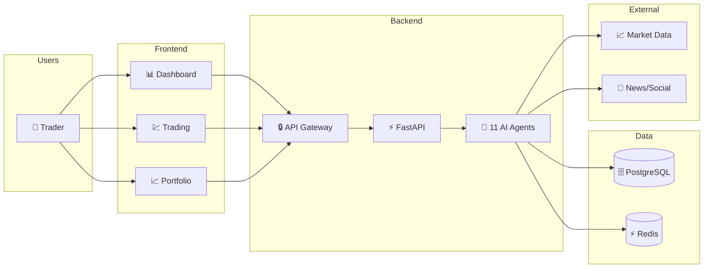
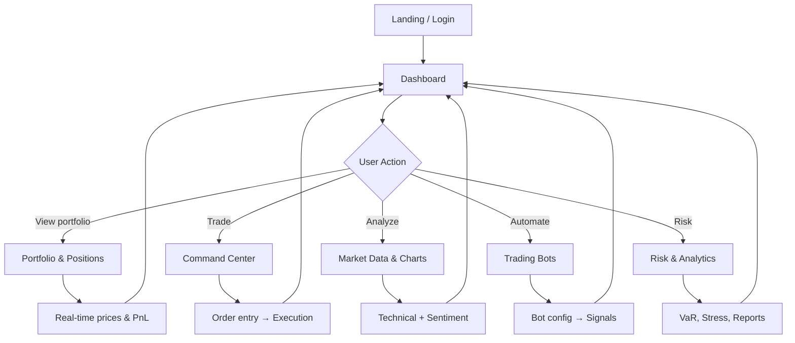
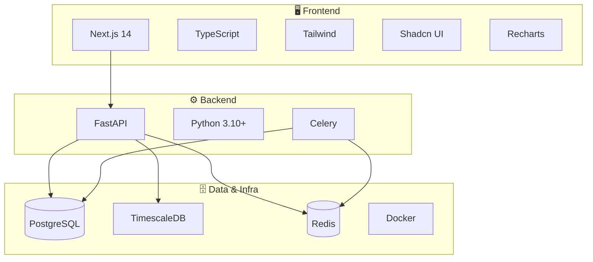

# Octopus Trading Platform - Findash

<p align="center">
  
</p>

<p align="center">
  <strong>Advanced AI-Powered Trading Platform with Real-Time Analytics</strong>
</p>

<p align="center">
  <a href="https://www.typescriptlang.org/"></a>
  <a href="https://nextjs.org/"></a>
  <a href="https://www.python.org/"></a>
  <a href="https://fastapi.tiangolo.com/"></a>
  <a href="https://www.postgresql.org/"></a>
</p>

---

## Overview

The **Octopus Trading Platform (Findash)** is a comprehensive, AI-powered trading system designed for professional traders and institutions. It combines real-time market data, advanced analytics, machine learning models, and automated trading capabilities in a unified, modern interface.

### Platform at a Glance (High-Level Flow)



### User Journey Through the Platform



### Key Highlights

- **AI-Powered**: 11 specialized AI agents orchestrated through an intelligent coordination layer
- **Real-Time Analytics**: Live market data, orderbook, and sentiment analysis
- **Multi-Asset Trading**: Stocks, options, crypto, and derivatives
- **Risk Management**: Advanced risk assessment with VaR, stress testing, and portfolio optimization
- **Automated Trading**: Bot framework with backtesting and paper trading
- **Modern UI**: Beautiful glassmorphism design with responsive layouts

---

## Diagrams in This Wiki

The wiki uses **Mermaid** and **ASCII** diagrams so you can see how the platform fits together:

| Page | What you'll see |
|------|------------------|
| [[Home]] | Platform flow, user journey, tech stack |
| [[Architecture]] | Layers, data flow, trading flow, scaling, auth, monitoring |
| [[AI Agents]] | Agent collaboration flow, quick reference table, message flow |
| [[Getting Started]] | Installation methods, access flow |
| [[Database]] | Schema flow, entity-relationship diagram |
| [[API Reference]] | Request lifecycle |
| [[Frontend]] | App structure, page flow |
| [[Deployment]] | Deployment pipeline |
| [[Configuration]] | Config sources |

---

## Quick Navigation

| Section | Description |
|---------|-------------|
| [[Getting Started]] | Installation and setup guide |
| [[Architecture]] | System architecture overview |
| [[AI Agents]] | Detailed AI agent documentation |
| [[API Reference]] | Complete API documentation |
| [[Database]] | Database schema and models |
| [[Frontend]] | Frontend architecture and components |
| [[Deployment]] | Production deployment guide |
| [[Configuration]] | Environment variables and settings |
| [[Contributing]] | How to contribute to the project |

---

## Features Overview

### Core Trading Features
- **Dashboard**: Comprehensive trading overview with portfolio analytics
- **Real-Time Market Data**: Live price feeds, orderbook, and tick data
- **Options Trading**: Advanced options chain analysis and strategies
- **Trading Bots**: Automated trading with customizable rules
- **Portfolio Management**: Multi-asset portfolio tracking and optimization
- **Market Analysis**: Technical, fundamental, and on-chain analysis tools

### AI & Machine Learning
- **Price Prediction**: Pre-trained models for market forecasting
- **Sentiment Analysis**: Real-time news and social media sentiment
- **Strategy Optimization**: AI-powered backtesting and parameter tuning
- **Insights Generation**: Automated market recommendations

### Risk & Analytics
- **Risk Assessment**: VaR, stress testing, and correlation analysis
- **Backtesting**: Historical strategy performance testing
- **Reports**: Comprehensive trading analytics
- **Data Explorer**: Advanced data querying tools

---

## Technology Stack (Overview)



### Frontend
| Technology | Purpose |
|------------|---------|
| Next.js 14 | React framework |
| TypeScript | Type-safe JavaScript |
| Tailwind CSS | Utility-first styling |
| Shadcn UI | Component library |
| Recharts | Data visualization |

### Backend
| Technology | Purpose |
|------------|---------|
| FastAPI | High-performance API framework |
| Python 3.10+ | Core programming language |
| SQLAlchemy | ORM and database abstraction |
| Celery | Async task processing |
| Redis | Caching and pub/sub |

### Database & Infrastructure
| Technology | Purpose |
|------------|---------|
| PostgreSQL | Primary database |
| TimescaleDB | Time-series data |
| Docker | Containerization |
| Prometheus | Metrics collection |
| Grafana | Monitoring dashboards |

---

## Quick Start

```bash
# Clone the repository
git clone https://github.com/massoudsh/Findash.git
cd Findash

# Backend setup
python -m venv venv
source venv/bin/activate
pip install -r requirements.txt

# Frontend setup
cd frontend-nextjs
npm install

# Start the application
# Terminal 1: Backend
python3 start.py --reload

# Terminal 2: Frontend
npm run dev

# Access
# Frontend: http://localhost:3000
# API Docs: http://localhost:8000/docs
```

---

## Support

- **Issues**: [GitHub Issues](https://github.com/massoudsh/Findash/issues)
- **Documentation**: This Wiki
- **Email**: support@octopus-trading.com

---

<p align="center">
  <strong>Made with ❤️ by the Octopus Trading Team</strong>
</p>
